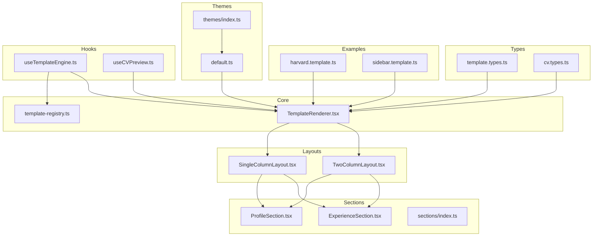
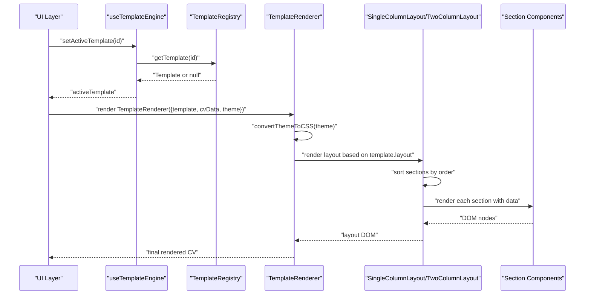
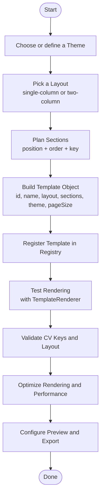
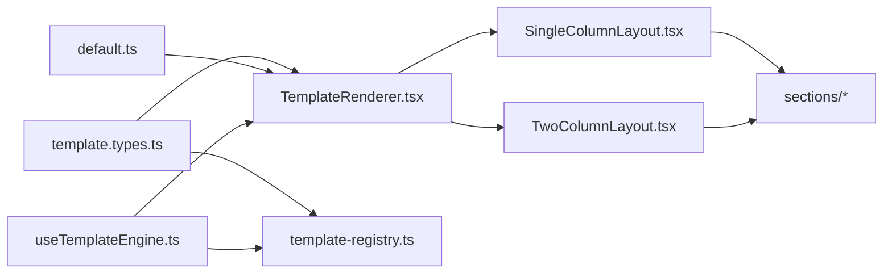

# Custom Template Development

<cite>
**Referenced Files in This Document**
- [template.types.ts](file://src/templates/types/template.types.ts)
- [cv.types.ts](file://src/templates/types/cv.types.ts)
- [harvard.template.ts](file://src/templates/examples/harvard.template.ts)
- [sidebar.template.ts](file://src/templates/examples/sidebar.template.ts)
- [template-registry.ts](file://src/templates/core/template-registry.ts)
- [TemplateRenderer.tsx](file://src/templates/core/TemplateRenderer.tsx)
- [SingleColumnLayout.tsx](file://src/templates/layouts/SingleColumnLayout.tsx)
- [TwoColumnLayout.tsx](file://src/templates/layouts/TwoColumnLayout.tsx)
- [default.ts](file://src/templates/themes/default.ts)
- [index.ts (themes)](file://src/templates/themes/index.ts)
- [index.ts (sections)](file://src/templates/sections/index.ts)
- [ProfileSection.tsx](file://src/templates/sections/ProfileSection.tsx)
- [ExperienceSection.tsx](file://src/templates/sections/ExperienceSection.tsx)
- [useTemplateEngine.ts](file://src/templates/hooks/useTemplateEngine.ts)
- [useCVPreview.ts](file://src/templates/hooks/useCVPreview.ts)
</cite>

## Table of Contents
1. [Introduction](#introduction)
2. [Project Structure](#project-structure)
3. [Core Components](#core-components)
4. [Architecture Overview](#architecture-overview)
5. [Detailed Component Analysis](#detailed-component-analysis)
6. [Dependency Analysis](#dependency-analysis)
7. [Performance Considerations](#performance-considerations)
8. [Troubleshooting Guide](#troubleshooting-guide)
9. [Conclusion](#conclusion)
10. [Appendices](#appendices)

## Introduction
This document explains how to develop custom templates for the CV builder system. It covers template type definitions, section configuration, layout options, theme integration, and the end-to-end workflow from concept to implementation. It also provides step-by-step guidance for creating new templates, configuring sections, testing functionality, validating templates, optimizing performance, and ensuring compatibility with the rendering system. Implementation references include the Harvard-style and sidebar templates.

## Project Structure
The template system is organized around a few core areas:
- Types define the shape of templates, sections, themes, and preview/export controls.
- Examples demonstrate ready-to-use templates.
- Core rendering orchestrates layout selection and section rendering.
- Layouts implement single-column and two-column designs.
- Sections encapsulate domain-specific rendering logic.
- Themes define typography, colors, and spacing.
- Hooks integrate templates and previews into the application state.

**Diagram sources**
- [template.types.ts:1-77](file://src/templates/types/template.types.ts#L1-L77)
- [cv.types.ts:1-16](file://src/templates/types/cv.types.ts#L1-L16)
- [harvard.template.ts:1-52](file://src/templates/examples/harvard.template.ts#L1-L52)
- [sidebar.template.ts:1-55](file://src/templates/examples/sidebar.template.ts#L1-L55)
- [TemplateRenderer.tsx:1-74](file://src/templates/core/TemplateRenderer.tsx#L1-L74)
- [SingleColumnLayout.tsx:1-36](file://src/templates/layouts/SingleColumnLayout.tsx#L1-L36)
- [TwoColumnLayout.tsx:1-55](file://src/templates/layouts/TwoColumnLayout.tsx#L1-L55)
- [ProfileSection.tsx:1-89](file://src/templates/sections/ProfileSection.tsx#L1-L89)
- [ExperienceSection.tsx:1-61](file://src/templates/sections/ExperienceSection.tsx#L1-L61)
- [default.ts:1-103](file://src/templates/themes/default.ts#L1-L103)
- [index.ts (themes):1-2](file://src/templates/themes/index.ts#L1-L2)
- [index.ts (sections):1-6](file://src/templates/sections/index.ts#L1-L6)
- [useTemplateEngine.ts:1-57](file://src/templates/hooks/useTemplateEngine.ts#L1-L57)
- [useCVPreview.ts:1-60](file://src/templates/hooks/useCVPreview.ts#L1-L60)

**Section sources**
- [template.types.ts:1-77](file://src/templates/types/template.types.ts#L1-L77)
- [cv.types.ts:1-16](file://src/templates/types/cv.types.ts#L1-L16)
- [harvard.template.ts:1-52](file://src/templates/examples/harvard.template.ts#L1-L52)
- [sidebar.template.ts:1-55](file://src/templates/examples/sidebar.template.ts#L1-L55)
- [TemplateRenderer.tsx:1-74](file://src/templates/core/TemplateRenderer.tsx#L1-L74)
- [SingleColumnLayout.tsx:1-36](file://src/templates/layouts/SingleColumnLayout.tsx#L1-L36)
- [TwoColumnLayout.tsx:1-55](file://src/templates/layouts/TwoColumnLayout.tsx#L1-L55)
- [default.ts:1-103](file://src/templates/themes/default.ts#L1-L103)
- [index.ts (themes):1-2](file://src/templates/themes/index.ts#L1-L2)
- [index.ts (sections):1-6](file://src/templates/sections/index.ts#L1-L6)
- [useTemplateEngine.ts:1-57](file://src/templates/hooks/useTemplateEngine.ts#L1-L57)
- [useCVPreview.ts:1-60](file://src/templates/hooks/useCVPreview.ts#L1-L60)

## Core Components
- Template type definitions: specify layout, sections, theme reference, page size, and metadata.
- Section configuration: binds a CV data key to a React component, assigns position and order, and passes optional props.
- Theme interface: defines font family, font sizes, color palette, and spacing units.
- Preview settings: control zoom, page size, guide visibility, and render mode.
- Export options: control export format, quality, and metadata inclusion.

Key responsibilities:
- Types define the contract for templates and sections.
- Registry stores and retrieves templates by ID, category, or tags.
- Renderer selects the appropriate layout and renders sections with theme CSS variables.
- Layouts sort and render sections per position and order.
- Sections consume typed CV data and render domain-specific content.
- Themes provide reusable design tokens applied via CSS variables.

**Section sources**
- [template.types.ts:3-77](file://src/templates/types/template.types.ts#L3-L77)
- [cv.types.ts:1-16](file://src/templates/types/cv.types.ts#L1-L16)
- [template-registry.ts:1-92](file://src/templates/core/template-registry.ts#L1-L92)
- [TemplateRenderer.tsx:1-74](file://src/templates/core/TemplateRenderer.tsx#L1-L74)
- [SingleColumnLayout.tsx:1-36](file://src/templates/layouts/SingleColumnLayout.tsx#L1-L36)
- [TwoColumnLayout.tsx:1-55](file://src/templates/layouts/TwoColumnLayout.tsx#L1-L55)
- [ProfileSection.tsx:1-89](file://src/templates/sections/ProfileSection.tsx#L1-L89)
- [ExperienceSection.tsx:1-61](file://src/templates/sections/ExperienceSection.tsx#L1-L61)

## Architecture Overview
The template rendering pipeline:
- Application state holds the active template ID and custom templates.
- The template engine hook resolves the active template from either custom or registry.
- The renderer converts the selected theme into CSS variables and dispatches to the chosen layout.
- Layouts split sections by position, sort by order, and render each section with its data slice.
- Sections receive typed data and render content with semantic markup.

**Diagram sources**
- [useTemplateEngine.ts:1-57](file://src/templates/hooks/useTemplateEngine.ts#L1-L57)
- [template-registry.ts:1-92](file://src/templates/core/template-registry.ts#L1-L92)
- [TemplateRenderer.tsx:1-74](file://src/templates/core/TemplateRenderer.tsx#L1-L74)
- [SingleColumnLayout.tsx:1-36](file://src/templates/layouts/SingleColumnLayout.tsx#L1-L36)
- [TwoColumnLayout.tsx:1-55](file://src/templates/layouts/TwoColumnLayout.tsx#L1-L55)
- [ProfileSection.tsx:1-89](file://src/templates/sections/ProfileSection.tsx#L1-L89)
- [ExperienceSection.tsx:1-61](file://src/templates/sections/ExperienceSection.tsx#L1-L61)

## Detailed Component Analysis

### Template Type System
Template definitions include:
- Identity and metadata: id, name, description.
- Layout: single-column or two-column variants.
- Sections: array of SectionConfig entries.
- Theme: either a theme object or a theme ID string.
- Page size: A4, Letter, or Legal.
- Timestamps: createdAt and updatedAt.

SectionConfig includes:
- key: CV property key or custom string.
- component: React component to render the section.
- position: main, left, or right.
- order: numeric sort key.
- props: optional props passed to the component.

PreviewSettings and ExportOptions enable preview and export customization.

**Section sources**
- [template.types.ts:3-77](file://src/templates/types/template.types.ts#L3-L77)

### Template Registry
The registry is a singleton that:
- Registers templates by ID.
- Retrieves templates by ID, lists all, filters by category, searches by tags, checks existence, removes templates, and lists IDs.

This enables dynamic discovery and filtering of built-in and custom templates.

**Section sources**
- [template-registry.ts:1-92](file://src/templates/core/template-registry.ts#L1-L92)

### Template Renderer
Responsibilities:
- Converts a Theme into CSS variables for global application.
- Splits sections by position (left/main/right).
- Renders the appropriate layout based on template.layout.
- Falls back to single-column if layout is unrecognized.

Rendering is memoized for performance.

**Section sources**
- [TemplateRenderer.tsx:1-74](file://src/templates/core/TemplateRenderer.tsx#L1-L74)

### Layouts
SingleColumnLayout:
- Sorts sections by order.
- Renders all sections in the main area with theme CSS variables.

TwoColumnLayout:
- Sorts left and right sections independently.
- Renders a sidebar and main content area with configurable width.
- Applies theme CSS variables to the container.

Both layouts pass section props to child components.

**Section sources**
- [SingleColumnLayout.tsx:1-36](file://src/templates/layouts/SingleColumnLayout.tsx#L1-L36)
- [TwoColumnLayout.tsx:1-55](file://src/templates/layouts/TwoColumnLayout.tsx#L1-L55)

### Sections
Sections consume typed CV data and render structured content:
- ProfileSection renders personal info, title, summary, and contact links.
- ExperienceSection renders job history with dates, achievements, and tech badges.

Sections are designed to be memoized and handle missing data gracefully.

**Section sources**
- [ProfileSection.tsx:1-89](file://src/templates/sections/ProfileSection.tsx#L1-L89)
- [ExperienceSection.tsx:1-61](file://src/templates/sections/ExperienceSection.tsx#L1-L61)
- [index.ts (sections):1-6](file://src/templates/sections/index.ts#L1-L6)

### Themes
Four predefined themes are provided:
- Modern
- Professional
- Creative
- Minimal

Each theme defines fonts, sizes, colors, and spacing. They are exported individually and as a registry map.

**Section sources**
- [default.ts:1-103](file://src/templates/themes/default.ts#L1-L103)
- [index.ts (themes):1-2](file://src/templates/themes/index.ts#L1-L2)

### Example Templates
Harvard Template:
- Single-column academic layout.
- Focus on education and chronological experience.
- Uses professionalTheme.

Sidebar Template:
- Two-column layout with a compact left sidebar.
- Emphasizes skills and education in the sidebar; experience and projects in the main area.
- Uses modernTheme.

These examples serve as implementation references for building new templates.

**Section sources**
- [harvard.template.ts:1-52](file://src/templates/examples/harvard.template.ts#L1-L52)
- [sidebar.template.ts:1-55](file://src/templates/examples/sidebar.template.ts#L1-L55)

### Template Creation Workflow
Step-by-step process:
1. Define or choose a theme
   - Use an existing theme object or create a new Theme.
   - Reference a theme by ID string or embed the full theme object in the template.

2. Choose a layout
   - Select single-column for linear, readable formats.
   - Choose two-column-left or two-column-right for split layouts.

3. Design section positions and orders
   - Assign each section to position: main, left, or right.
   - Set order to control rendering sequence within each position.

4. Bind sections to CV data
   - Map each section’s key to a CV property (e.g., profile, experience).
   - Pass any required props to customize rendering (e.g., compact mode).

5. Add the template to the registry
   - Register the template so it appears in the UI and can be resolved by ID.

6. Test rendering
   - Use the template engine hook to set the active template.
   - Verify sections render in the correct order and positions.
   - Confirm theme colors, fonts, and spacing are applied.

7. Validate and optimize
   - Ensure all section keys exist on the CV type.
   - Verify layout fallback behavior and responsive behavior.
   - Optimize rendering with memoization and minimal re-renders.

8. Export and preview
   - Configure preview settings (zoom, page size, guides).
   - Validate print/export outputs.

[No sources needed since this diagram shows conceptual workflow, not actual code structure]

### Template Metadata and Categories
Template registry entries include:
- template: the Template definition.
- thumbnail: optional preview image path.
- tags: array of tags for discoverability.
- category: professional, creative, minimal, or academic.

Use categories and tags to organize and filter templates in the UI.

**Section sources**
- [template.types.ts:55-61](file://src/templates/types/template.types.ts#L55-L61)
- [template-registry.ts:42-55](file://src/templates/core/template-registry.ts#L42-L55)

### Section Positioning and Ordering
- Position determines which column or main area a section occupies.
- Order controls intra-position ordering.
- Sorting is performed in layouts before rendering.

Best practices:
- Keep order values dense and unique within each position.
- Prefer consistent ordering across templates for similar sections.

**Section sources**
- [SingleColumnLayout.tsx:13-14](file://src/templates/layouts/SingleColumnLayout.tsx#L13-L14)
- [TwoColumnLayout.tsx:15-17](file://src/templates/layouts/TwoColumnLayout.tsx#L15-L17)
- [template.types.ts:34-40](file://src/templates/types/template.types.ts#L34-L40)

### Theme Integration
- Themes are converted to CSS variables and applied to the container.
- Font families, sizes, colors, and spacing are centralized in the theme object.
- Use theme IDs to reference shared themes or embed full theme objects.

**Section sources**
- [TemplateRenderer.tsx:58-73](file://src/templates/core/TemplateRenderer.tsx#L58-L73)
- [default.ts:1-103](file://src/templates/themes/default.ts#L1-L103)

### Template Validation
- Verify that each section key exists on the CV type.
- Ensure layout values are supported.
- Confirm theme references resolve correctly.
- Validate order uniqueness and range within positions.

**Section sources**
- [cv.types.ts:1-16](file://src/templates/types/cv.types.ts#L1-L16)
- [template.types.ts:4-53](file://src/templates/types/template.types.ts#L4-L53)

### Testing Template Functionality
- Use the template engine hook to set the active template and toggle between built-in and custom templates.
- Use preview hooks to adjust zoom, page size, and mode.
- Inspect rendered DOM to confirm section order and theme application.

**Section sources**
- [useTemplateEngine.ts:1-57](file://src/templates/hooks/useTemplateEngine.ts#L1-L57)
- [useCVPreview.ts:1-60](file://src/templates/hooks/useCVPreview.ts#L1-L60)

### Performance Optimization
- Use memoization in section components and layouts.
- Minimize unnecessary re-renders by keeping props stable.
- Prefer CSS variables for theming to avoid heavy reflows.
- Keep section components pure and avoid side effects.

**Section sources**
- [SingleColumnLayout.tsx:11-33](file://src/templates/layouts/SingleColumnLayout.tsx#L11-L33)
- [TwoColumnLayout.tsx:13-55](file://src/templates/layouts/TwoColumnLayout.tsx#L13-L55)
- [TemplateRenderer.tsx:13-53](file://src/templates/core/TemplateRenderer.tsx#L13-L53)

### Compatibility with Rendering System
- Templates must conform to the Template interface.
- Section components must accept the expected data shape for their key.
- Layouts support single-column and two-column variants; unknown layouts fall back to single-column.

**Section sources**
- [template.types.ts:42-53](file://src/templates/types/template.types.ts#L42-L53)
- [TemplateRenderer.tsx:24-51](file://src/templates/core/TemplateRenderer.tsx#L24-L51)

## Dependency Analysis
The template system exhibits low coupling and high cohesion:
- Types decouple definitions from rendering logic.
- Registry centralizes template discovery.
- Renderer depends on layouts; layouts depend on sections.
- Themes are consumed via CSS variables, minimizing coupling to components.

**Diagram sources**
- [template.types.ts:1-77](file://src/templates/types/template.types.ts#L1-L77)
- [template-registry.ts:1-92](file://src/templates/core/template-registry.ts#L1-L92)
- [TemplateRenderer.tsx:1-74](file://src/templates/core/TemplateRenderer.tsx#L1-L74)
- [SingleColumnLayout.tsx:1-36](file://src/templates/layouts/SingleColumnLayout.tsx#L1-L36)
- [TwoColumnLayout.tsx:1-55](file://src/templates/layouts/TwoColumnLayout.tsx#L1-L55)
- [default.ts:1-103](file://src/templates/themes/default.ts#L1-L103)
- [useTemplateEngine.ts:1-57](file://src/templates/hooks/useTemplateEngine.ts#L1-L57)

**Section sources**
- [template.types.ts:1-77](file://src/templates/types/template.types.ts#L1-L77)
- [template-registry.ts:1-92](file://src/templates/core/template-registry.ts#L1-L92)
- [TemplateRenderer.tsx:1-74](file://src/templates/core/TemplateRenderer.tsx#L1-L74)
- [SingleColumnLayout.tsx:1-36](file://src/templates/layouts/SingleColumnLayout.tsx#L1-L36)
- [TwoColumnLayout.tsx:1-55](file://src/templates/layouts/TwoColumnLayout.tsx#L1-L55)
- [default.ts:1-103](file://src/templates/themes/default.ts#L1-L103)
- [useTemplateEngine.ts:1-57](file://src/templates/hooks/useTemplateEngine.ts#L1-L57)

## Performance Considerations
- Prefer memoization in section components and layouts to prevent unnecessary re-renders.
- Keep section props minimal and stable to reduce downstream recomputations.
- Apply theme via CSS variables to avoid expensive style recalculations.
- Avoid heavy computations inside render paths; precompute where possible.

[No sources needed since this section provides general guidance]

## Troubleshooting Guide
Common issues and resolutions:
- Missing section data: Ensure the CV object contains the section key; sections should handle empty data gracefully.
- Incorrect layout rendering: Verify layout type matches intended design; unknown layouts fall back to single-column.
- Theme not applied: Confirm theme conversion to CSS variables occurs and that containers apply the style map.
- Section ordering incorrect: Check order values and ensure sorting is applied in layouts.
- Registry lookup failure: Confirm template registration and ID correctness.

**Section sources**
- [TemplateRenderer.tsx:58-73](file://src/templates/core/TemplateRenderer.tsx#L58-L73)
- [SingleColumnLayout.tsx:13-14](file://src/templates/layouts/SingleColumnLayout.tsx#L13-L14)
- [TwoColumnLayout.tsx:15-17](file://src/templates/layouts/TwoColumnLayout.tsx#L15-L17)
- [template-registry.ts:27-30](file://src/templates/core/template-registry.ts#L27-L30)

## Conclusion
The CV builder’s template system offers a flexible, type-safe framework for designing custom resumes. By leveraging the type definitions, registry, renderer, layouts, sections, and themes, developers can rapidly prototype and validate new templates. Following the step-by-step workflow, applying best practices for validation and performance, and using the included examples as references ensures robust and maintainable templates.

[No sources needed since this section summarizes without analyzing specific files]

## Appendices

### Step-by-Step: Creating a New Template
1. Define a Theme
   - Use an existing theme or create a new Theme object.
   - Decide whether to reference by ID or embed the full theme.

2. Choose a Layout
   - single-column for linear formats.
   - two-column-left or two-column-right for split layouts.

3. Configure Sections
   - Map each section to a CV key.
   - Assign position (main/left/right) and order.
   - Pass props if needed (e.g., compact).

4. Build the Template Object
   - Provide id, name, description, layout, sections, theme, pageSize.

5. Register the Template
   - Add to the registry so it is discoverable.

6. Test Rendering
   - Use the template engine hook to activate the template.
   - Verify order, positions, and theme application.

7. Validate and Optimize
   - Confirm CV keys exist and layout fallback works.
   - Apply memoization and CSS variable theming.

8. Configure Preview and Export
   - Adjust preview settings and export options.

**Section sources**
- [template.types.ts:42-53](file://src/templates/types/template.types.ts#L42-L53)
- [template-registry.ts:20-22](file://src/templates/core/template-registry.ts#L20-L22)
- [TemplateRenderer.tsx:13-53](file://src/templates/core/TemplateRenderer.tsx#L13-L53)
- [SingleColumnLayout.tsx:13-28](file://src/templates/layouts/SingleColumnLayout.tsx#L13-L28)
- [TwoColumnLayout.tsx:15-48](file://src/templates/layouts/TwoColumnLayout.tsx#L15-L48)
- [default.ts:1-103](file://src/templates/themes/default.ts#L1-L103)

### Implementation References
- Harvard-style template: Academic single-column with education emphasis.
- Sidebar template: Modern two-column with compact left sidebar.

Use these files as references for structuring your own templates.

**Section sources**
- [harvard.template.ts:1-52](file://src/templates/examples/harvard.template.ts#L1-L52)
- [sidebar.template.ts:1-55](file://src/templates/examples/sidebar.template.ts#L1-L55)