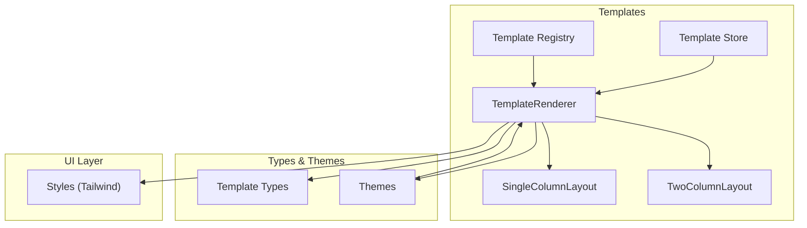
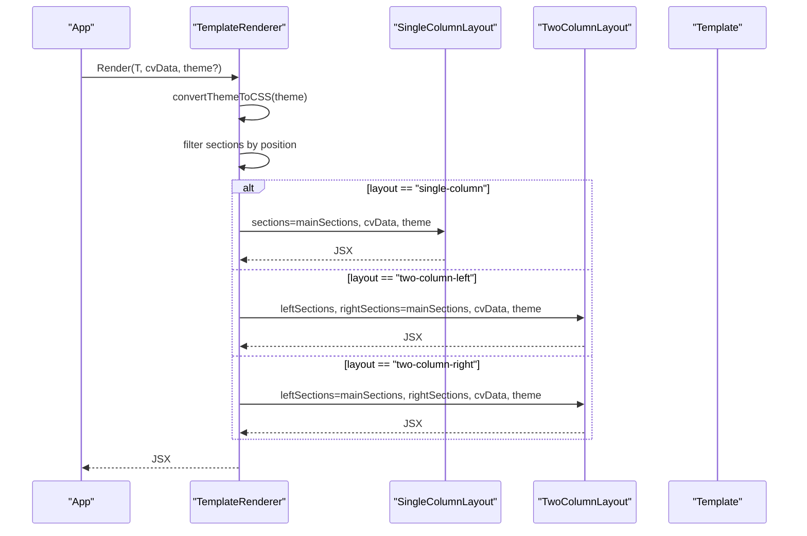
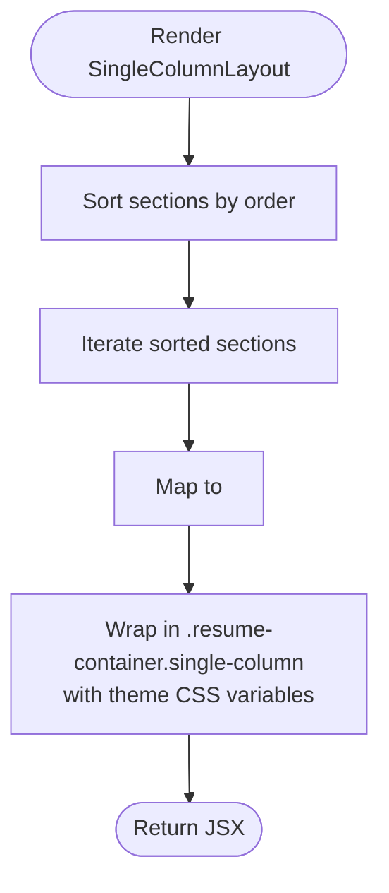
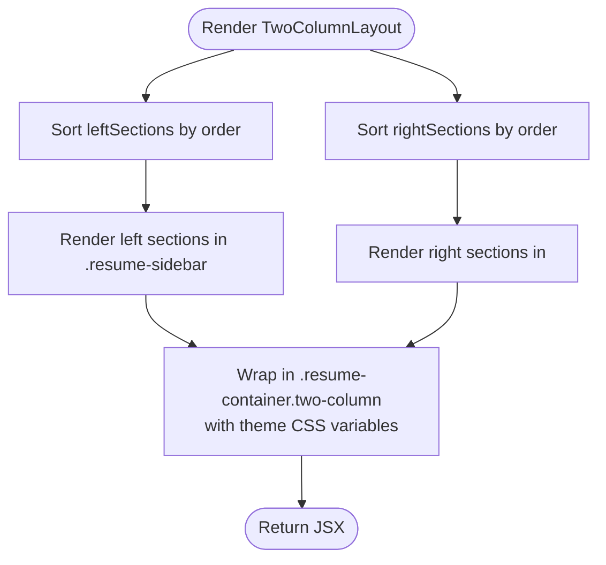
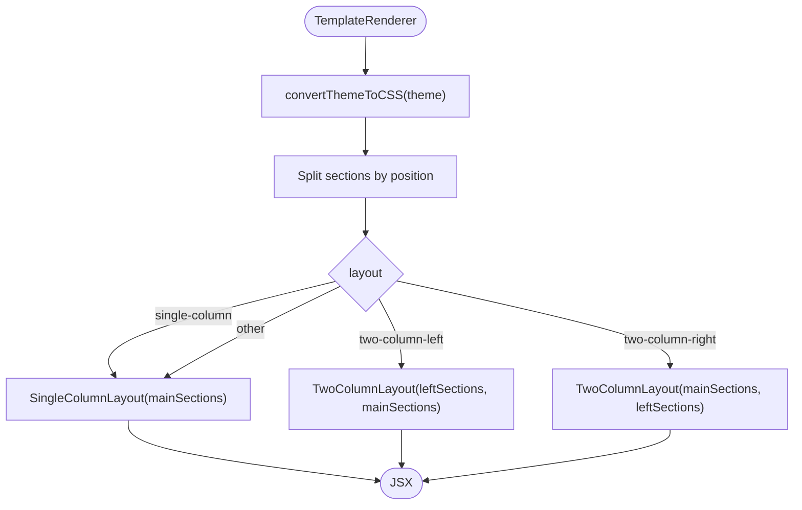
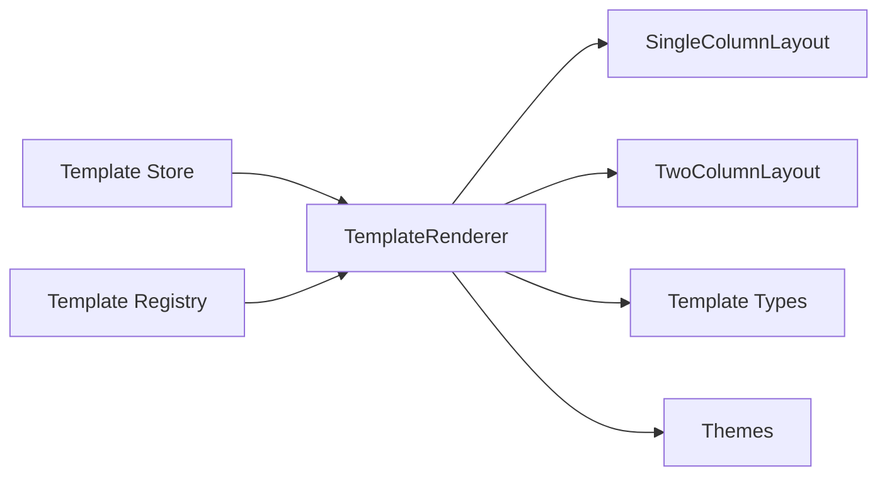

# Layout Management

<cite>
**Referenced Files in This Document**
- [SingleColumnLayout.tsx](file://src/templates/layouts/SingleColumnLayout.tsx)
- [TwoColumnLayout.tsx](file://src/templates/layouts/TwoColumnLayout.tsx)
- [TemplateRenderer.tsx](file://src/templates/core/TemplateRenderer.tsx)
- [template.types.ts](file://src/templates/types/template.types.ts)
- [template.store.ts](file://src/templates/store/template.store.ts)
- [useTemplateEngine.ts](file://src/templates/hooks/useTemplateEngine.ts)
- [template-registry.ts](file://src/templates/core/template-registry.ts)
- [harvard.template.ts](file://src/templates/examples/harvard.template.ts)
- [sidebar.template.ts](file://src/templates/examples/sidebar.template.ts)
- [default.ts](file://src/templates/themes/default.ts)
- [styles.css](file://src/styles.css)
</cite>

## Table of Contents
1. [Introduction](#introduction)
2. [Project Structure](#project-structure)
3. [Core Components](#core-components)
4. [Architecture Overview](#architecture-overview)
5. [Detailed Component Analysis](#detailed-component-analysis)
6. [Dependency Analysis](#dependency-analysis)
7. [Performance Considerations](#performance-considerations)
8. [Troubleshooting Guide](#troubleshooting-guide)
9. [Conclusion](#conclusion)
10. [Appendices](#appendices)

## Introduction
This document explains the Layout Management system that controls CV structure and presentation. It focuses on:
- SingleColumnLayout implementation, including main section rendering and responsive design principles
- TwoColumnLayout system supporting left/right column configurations and content positioning
- Layout switching mechanism and section distribution logic
- Responsive breakpoints, column width calculations, and mobile-first design considerations
- Examples of custom layout creation, column configuration, and layout-specific styling
- Accessibility requirements and cross-browser compatibility in layout rendering

## Project Structure
The layout system is organized around:
- Layout components: SingleColumnLayout and TwoColumnLayout
- Renderer: TemplateRenderer orchestrating layout selection and section distribution
- Types and stores: Template types, registry, and store for active template management
- Themes: CSS variable-based theme system for typography, colors, and spacing
- Styles: Tailwind-based global styles and responsive design foundation

**Diagram sources**
- [TemplateRenderer.tsx:1-74](file://src/templates/core/TemplateRenderer.tsx#L1-L74)
- [SingleColumnLayout.tsx:1-36](file://src/templates/layouts/SingleColumnLayout.tsx#L1-L36)
- [TwoColumnLayout.tsx:1-55](file://src/templates/layouts/TwoColumnLayout.tsx#L1-L55)
- [template.types.ts:1-77](file://src/templates/types/template.types.ts#L1-L77)
- [default.ts:1-103](file://src/templates/themes/default.ts#L1-L103)
- [styles.css:1-138](file://src/styles.css#L1-L138)

**Section sources**
- [TemplateRenderer.tsx:1-74](file://src/templates/core/TemplateRenderer.tsx#L1-L74)
- [SingleColumnLayout.tsx:1-36](file://src/templates/layouts/SingleColumnLayout.tsx#L1-L36)
- [TwoColumnLayout.tsx:1-55](file://src/templates/layouts/TwoColumnLayout.tsx#L1-L55)
- [template.types.ts:1-77](file://src/templates/types/template.types.ts#L1-L77)
- [default.ts:1-103](file://src/templates/themes/default.ts#L1-L103)
- [styles.css:1-138](file://src/styles.css#L1-L138)

## Core Components
- SingleColumnLayout: Renders all sections in a single vertical column, sorting by order and passing theme CSS variables via inline styles.
- TwoColumnLayout: Renders left and right columns with configurable sidebar width, sorting sections independently per column and applying theme CSS variables.
- TemplateRenderer: Selects layout based on template.layout, distributes sections by position, and converts theme to CSS variables for consistent styling.
- Template Types: Defines layout types, section positions, and template structure.
- Template Store and Registry: Manage active templates, custom templates, and template discovery.
- Themes: Provide font families, sizes, color palettes, and spacing values mapped to CSS variables.

**Section sources**
- [SingleColumnLayout.tsx:11-36](file://src/templates/layouts/SingleColumnLayout.tsx#L11-L36)
- [TwoColumnLayout.tsx:13-55](file://src/templates/layouts/TwoColumnLayout.tsx#L13-L55)
- [TemplateRenderer.tsx:13-73](file://src/templates/core/TemplateRenderer.tsx#L13-L73)
- [template.types.ts:3-53](file://src/templates/types/template.types.ts#L3-L53)
- [template.store.ts:1-103](file://src/templates/store/template.store.ts#L1-L103)
- [template-registry.ts:1-92](file://src/templates/core/template-registry.ts#L1-L92)
- [default.ts:1-103](file://src/templates/themes/default.ts#L1-L103)

## Architecture Overview
The layout system follows a template-driven rendering pipeline:
- Templates define layout type and section positions.
- TemplateRenderer selects the appropriate layout component.
- Layout components render sections in order and apply theme CSS variables.
- Themes are converted to CSS variables and applied via inline styles.

**Diagram sources**
- [TemplateRenderer.tsx:13-53](file://src/templates/core/TemplateRenderer.tsx#L13-L53)
- [SingleColumnLayout.tsx:11-36](file://src/templates/layouts/SingleColumnLayout.tsx#L11-L36)
- [TwoColumnLayout.tsx:13-55](file://src/templates/layouts/TwoColumnLayout.tsx#L13-L55)

## Detailed Component Analysis

### SingleColumnLayout
- Purpose: Render all sections in a single vertical column.
- Sorting: Sections are sorted by order before rendering.
- Rendering: Each section receives its data via a data key and any additional props.
- Theming: Applies theme CSS variables via inline styles on the container.

**Diagram sources**
- [SingleColumnLayout.tsx:11-36](file://src/templates/layouts/SingleColumnLayout.tsx#L11-L36)

**Section sources**
- [SingleColumnLayout.tsx:11-36](file://src/templates/layouts/SingleColumnLayout.tsx#L11-L36)

### TwoColumnLayout
- Purpose: Render left and right columns with optional sidebar width.
- Sorting: Left and right sections are sorted independently by order.
- Rendering: Left column rendered as sidebar; right column as main content.
- Theming: Applies theme CSS variables via inline styles on the container.

**Diagram sources**
- [TwoColumnLayout.tsx:13-55](file://src/templates/layouts/TwoColumnLayout.tsx#L13-L55)

**Section sources**
- [TwoColumnLayout.tsx:13-55](file://src/templates/layouts/TwoColumnLayout.tsx#L13-L55)

### TemplateRenderer and Layout Switching
- Distribution: Filters sections into left, right, and main groups based on position.
- Selection: Switches on template.layout to choose SingleColumnLayout or TwoColumnLayout variants.
- Fallback: Defaults to SingleColumnLayout if layout type is unrecognized.
- Theming: Converts Theme to CSS variables and passes to layout components.

**Diagram sources**
- [TemplateRenderer.tsx:13-53](file://src/templates/core/TemplateRenderer.tsx#L13-L53)

**Section sources**
- [TemplateRenderer.tsx:13-73](file://src/templates/core/TemplateRenderer.tsx#L13-L73)

### Section Distribution Logic
- Position mapping:
  - left: Used as sidebar content
  - right: Used as main content
  - main: Used as main content for single-column or as the opposite column for two-column variants
- Sorting ensures consistent ordering regardless of template definition order.

**Section sources**
- [TemplateRenderer.tsx:18-21](file://src/templates/core/TemplateRenderer.tsx#L18-L21)

### Responsive Design Principles and Mobile-First Approach
- Breakpoints: Tailwind’s default breakpoints are used for responsive behavior.
- Column width calculation:
  - TwoColumnLayout supports a configurable sidebar width via a prop with a default value.
  - Theme spacing values are exposed via CSS variables for consistent gutters and margins.
- Mobile-first considerations:
  - Use of CSS variables enables easy adaptation for narrow screens.
  - Section containers and spacing are designed to stack vertically on smaller screens when needed.

**Section sources**
- [TwoColumnLayout.tsx:14](file://src/templates/layouts/TwoColumnLayout.tsx#L14)
- [default.ts:21-24](file://src/templates/themes/default.ts#L21-L24)
- [styles.css:329-333](file://node_modules/tailwindcss/index.css#L329-L333)

### Creating Custom Layouts
- Define a new layout component similar to SingleColumnLayout or TwoColumnLayout.
- Integrate with TemplateRenderer by adding a new case in the switch statement.
- Ensure sections are filtered and passed according to the new layout’s needs.
- Example pattern: Add a new layout type in template.types.ts and handle it in TemplateRenderer.

**Section sources**
- [template.types.ts:4](file://src/templates/types/template.types.ts#L4)
- [TemplateRenderer.tsx:24-51](file://src/templates/core/TemplateRenderer.tsx#L24-L51)

### Column Configuration and Styling
- Sidebar width: Controlled via a prop with a default value in TwoColumnLayout.
- Theme application: CSS variables are applied via inline styles to the container element.
- Section classes: Each section is wrapped with a consistent class for styling and accessibility.

**Section sources**
- [TwoColumnLayout.tsx:14](file://src/templates/layouts/TwoColumnLayout.tsx#L14)
- [TemplateRenderer.tsx:58-73](file://src/templates/core/TemplateRenderer.tsx#L58-L73)

### Accessibility Requirements
- Semantic structure: Use of section and header elements within sections improves screen reader navigation.
- Links: External links include appropriate attributes for security and usability.
- Focus and contrast: Theme colors and spacing help maintain readability and focus visibility.

**Section sources**
- [ProfileSection.tsx:12-84](file://src/templates/sections/ProfileSection.tsx#L12-L84)

### Cross-Browser Compatibility
- CSS variables: Applied via inline styles for broad browser support.
- Tailwind utilities: Base styles and utilities ensure consistent rendering across browsers.
- Flexibility: Theme conversion to CSS variables allows easy adjustments for different environments.

**Section sources**
- [TemplateRenderer.tsx:58-73](file://src/templates/core/TemplateRenderer.tsx#L58-L73)
- [styles.css:1-138](file://src/styles.css#L1-L138)

## Dependency Analysis
The layout system exhibits low coupling and clear separation of concerns:
- TemplateRenderer depends on layout components and theme conversion.
- Layout components depend on section components and types.
- Template store and registry provide template data to the renderer.

**Diagram sources**
- [TemplateRenderer.tsx:1-74](file://src/templates/core/TemplateRenderer.tsx#L1-L74)
- [SingleColumnLayout.tsx:1-36](file://src/templates/layouts/SingleColumnLayout.tsx#L1-L36)
- [TwoColumnLayout.tsx:1-55](file://src/templates/layouts/TwoColumnLayout.tsx#L1-L55)
- [template.types.ts:1-77](file://src/templates/types/template.types.ts#L1-L77)
- [default.ts:1-103](file://src/templates/themes/default.ts#L1-L103)
- [template.store.ts:1-103](file://src/templates/store/template.store.ts#L1-L103)
- [template-registry.ts:1-92](file://src/templates/core/template-registry.ts#L1-L92)

**Section sources**
- [TemplateRenderer.tsx:1-74](file://src/templates/core/TemplateRenderer.tsx#L1-L74)
- [template.store.ts:1-103](file://src/templates/store/template.store.ts#L1-L103)
- [template-registry.ts:1-92](file://src/templates/core/template-registry.ts#L1-L92)

## Performance Considerations
- Memoization: Layout components and the renderer are memoized to prevent unnecessary re-renders.
- Sorting cost: Sorting sections by order occurs once per render; keep order arrays reasonably sized.
- CSS variables: Applying theme via inline styles avoids expensive DOM mutations and leverages efficient CSS variable updates.

**Section sources**
- [SingleColumnLayout.tsx:11](file://src/templates/layouts/SingleColumnLayout.tsx#L11)
- [TwoColumnLayout.tsx:13](file://src/templates/layouts/TwoColumnLayout.tsx#L13)
- [TemplateRenderer.tsx:13](file://src/templates/core/TemplateRenderer.tsx#L13)

## Troubleshooting Guide
- Layout not switching: Verify template.layout matches supported values and TemplateRenderer switch handles the type.
- Sections missing: Confirm sections have a valid position and order; ensure filtering logic aligns with intended layout.
- Styling not applied: Check that convertThemeToCSS produces expected CSS variables and that containers receive theme styles.
- Two-column layout issues: Validate sidebar width prop and section distribution for left/right/main positions.

**Section sources**
- [TemplateRenderer.tsx:24-51](file://src/templates/core/TemplateRenderer.tsx#L24-L51)
- [TemplateRenderer.tsx:58-73](file://src/templates/core/TemplateRenderer.tsx#L58-L73)
- [TwoColumnLayout.tsx:14](file://src/templates/layouts/TwoColumnLayout.tsx#L14)

## Conclusion
The Layout Management system provides a flexible, theme-aware rendering pipeline for CVs. SingleColumnLayout and TwoColumnLayout encapsulate rendering logic, while TemplateRenderer coordinates layout selection and section distribution. The theme system and CSS variables enable consistent styling across layouts, and the design supports responsive behavior and accessibility.

## Appendices

### Example Templates
- Single-column template: Demonstrates a classic academic layout with all sections in the main area.
- Two-column template: Shows a modern sidebar layout with compact profile and skills in the left column.

**Section sources**
- [harvard.template.ts:12-51](file://src/templates/examples/harvard.template.ts#L12-L51)
- [sidebar.template.ts:12-54](file://src/templates/examples/sidebar.template.ts#L12-L54)

### Theme Reference
- Font families, sizes, colors, and spacing are defined as themes and converted to CSS variables for consistent rendering.

**Section sources**
- [default.ts:3-25](file://src/templates/themes/default.ts#L3-L25)
- [default.ts:27-48](file://src/templates/themes/default.ts#L27-L48)
- [default.ts:50-94](file://src/templates/themes/default.ts#L50-L94)
- [TemplateRenderer.tsx:58-73](file://src/templates/core/TemplateRenderer.tsx#L58-L73)