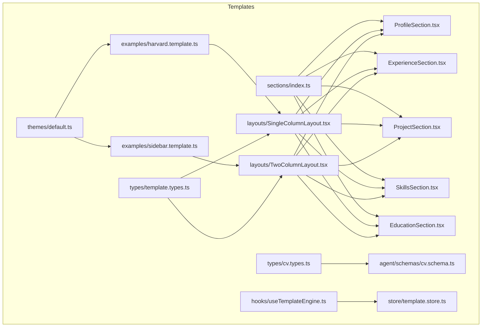
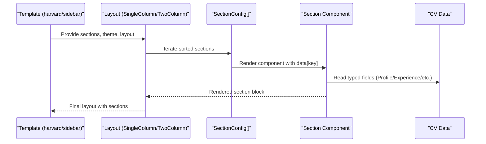
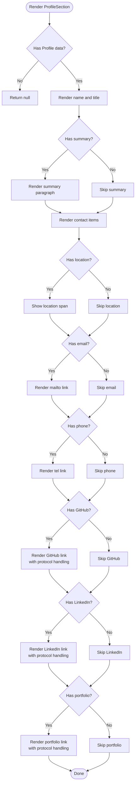
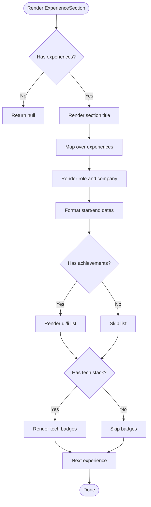
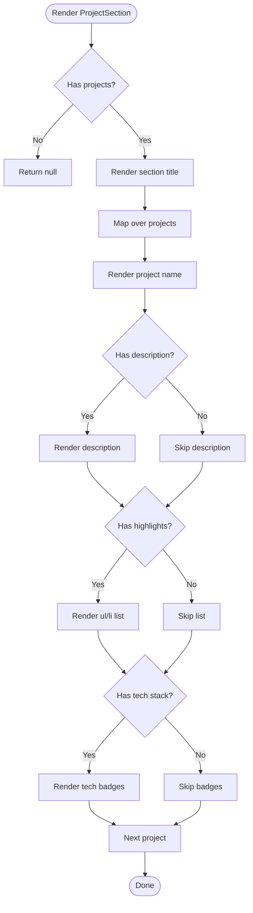
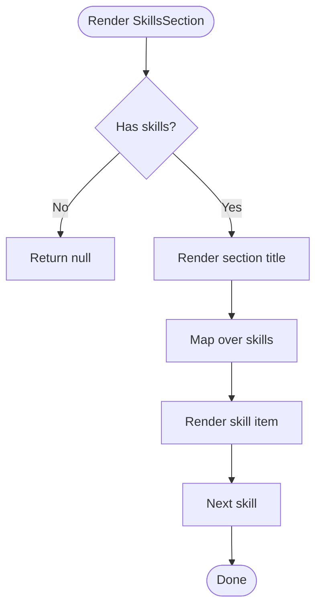
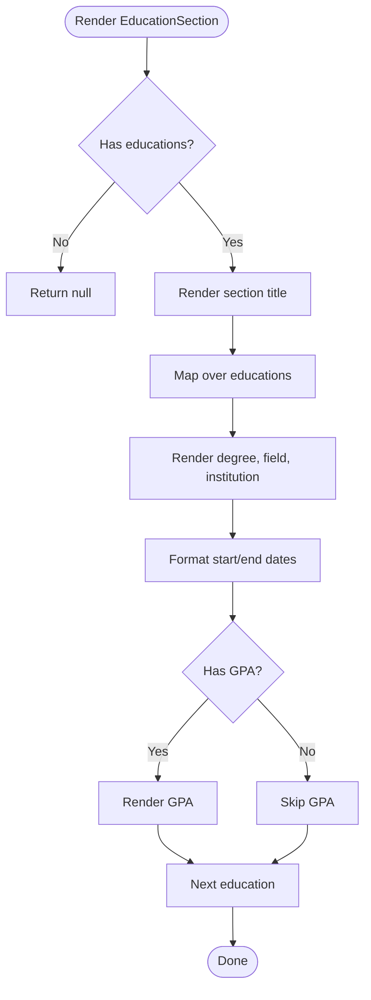
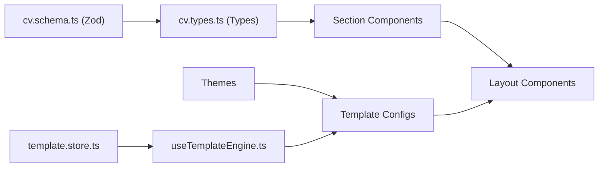

# Section Components

<cite>
**Referenced Files in This Document**
- [src/templates/sections/index.ts](file://src/templates/sections/index.ts)
- [src/templates/sections/ProfileSection.tsx](file://src/templates/sections/ProfileSection.tsx)
- [src/templates/sections/ExperienceSection.tsx](file://src/templates/sections/ExperienceSection.tsx)
- [src/templates/sections/ProjectSection.tsx](file://src/templates/sections/ProjectSection.tsx)
- [src/templates/sections/SkillsSection.tsx](file://src/templates/sections/SkillsSection.tsx)
- [src/templates/sections/EducationSection.tsx](file://src/templates/sections/EducationSection.tsx)
- [src/templates/types/cv.types.ts](file://src/templates/types/cv.types.ts)
- [src/agent/schemas/cv.schema.ts](file://src/agent/schemas/cv.schema.ts)
- [src/templates/layouts/SingleColumnLayout.tsx](file://src/templates/layouts/SingleColumnLayout.tsx)
- [src/templates/layouts/TwoColumnLayout.tsx](file://src/templates/layouts/TwoColumnLayout.tsx)
- [src/templates/types/template.types.ts](file://src/templates/types/template.types.ts)
- [src/templates/themes/default.ts](file://src/templates/themes/default.ts)
- [src/templates/examples/harvard.template.ts](file://src/templates/examples/harvard.template.ts)
- [src/templates/examples/sidebar.template.ts](file://src/templates/examples/sidebar.template.ts)
- [src/templates/hooks/useTemplateEngine.ts](file://src/templates/hooks/useTemplateEngine.ts)
- [src/templates/store/template.store.ts](file://src/templates/store/template.store.ts)
- [src/styles.css](file://src/styles.css)
</cite>

## Table of Contents
1. [Introduction](#introduction)
2. [Project Structure](#project-structure)
3. [Core Components](#core-components)
4. [Architecture Overview](#architecture-overview)
5. [Detailed Component Analysis](#detailed-component-analysis)
6. [Dependency Analysis](#dependency-analysis)
7. [Performance Considerations](#performance-considerations)
8. [Troubleshooting Guide](#troubleshooting-guide)
9. [Conclusion](#conclusion)
10. [Appendices](#appendices)

## Introduction
This document explains the Section Components system that renders CV content blocks. It covers the standardized props, rendering patterns, and data binding to the CV data model. It documents each section type—Profile, Experience, Projects, Skills, and Education—along with composition, conditional rendering, responsive behavior, customization, data validation, and accessibility. It also describes how to extend sections, create custom sections, and implement section-specific styling.

## Project Structure
The Section Components live under the templates/sections directory and are exported via a central index. They are consumed by layout components (single-column and two-column) that bind them to the CV data model using a SectionConfig array. Themes and templates define how sections are arranged, ordered, and styled.

**Diagram sources**
- [src/templates/sections/index.ts:1-6](file://src/templates/sections/index.ts#L1-L6)
- [src/templates/sections/ProfileSection.tsx:1-89](file://src/templates/sections/ProfileSection.tsx#L1-L89)
- [src/templates/sections/ExperienceSection.tsx:1-61](file://src/templates/sections/ExperienceSection.tsx#L1-L61)
- [src/templates/sections/ProjectSection.tsx:1-49](file://src/templates/sections/ProjectSection.tsx#L1-L49)
- [src/templates/sections/SkillsSection.tsx:1-26](file://src/templates/sections/SkillsSection.tsx#L1-L26)
- [src/templates/sections/EducationSection.tsx:1-44](file://src/templates/sections/EducationSection.tsx#L1-L44)
- [src/templates/layouts/SingleColumnLayout.tsx:1-36](file://src/templates/layouts/SingleColumnLayout.tsx#L1-L36)
- [src/templates/layouts/TwoColumnLayout.tsx:1-55](file://src/templates/layouts/TwoColumnLayout.tsx#L1-L55)
- [src/templates/types/template.types.ts:1-77](file://src/templates/types/template.types.ts#L1-L77)
- [src/templates/types/cv.types.ts:1-16](file://src/templates/types/cv.types.ts#L1-L16)
- [src/agent/schemas/cv.schema.ts:1-79](file://src/agent/schemas/cv.schema.ts#L1-L79)
- [src/templates/themes/default.ts:1-103](file://src/templates/themes/default.ts#L1-L103)
- [src/templates/examples/harvard.template.ts:1-52](file://src/templates/examples/harvard.template.ts#L1-L52)
- [src/templates/examples/sidebar.template.ts:1-55](file://src/templates/examples/sidebar.template.ts#L1-L55)
- [src/templates/hooks/useTemplateEngine.ts:1-57](file://src/templates/hooks/useTemplateEngine.ts#L1-L57)
- [src/templates/store/template.store.ts:1-103](file://src/templates/store/template.store.ts#L1-L103)

**Section sources**
- [src/templates/sections/index.ts:1-6](file://src/templates/sections/index.ts#L1-L6)
- [src/templates/layouts/SingleColumnLayout.tsx:1-36](file://src/templates/layouts/SingleColumnLayout.tsx#L1-L36)
- [src/templates/layouts/TwoColumnLayout.tsx:1-55](file://src/templates/layouts/TwoColumnLayout.tsx#L1-L55)
- [src/templates/types/template.types.ts:1-77](file://src/templates/types/template.types.ts#L1-L77)

## Core Components
Each section component follows a consistent pattern:
- Props: data of a specific type (Profile, Experience[], Project[], string[], Education[])
- Rendering: Conditional rendering for optional fields; lists for arrays; memoization for performance
- Accessibility: Semantic HTML (section, h2, h3, ul/li) and links with proper attributes
- Styling: Uses className tokens aligned with theme-driven spacing and typography

Key characteristics:
- Standardized prop shape: data
- Conditional rendering: returns null when data is missing or empty
- List rendering: maps over arrays with stable keys
- Memoization: React.memo applied to avoid unnecessary re-renders
- Semantic structure: section containers, headings, and lists for content hierarchy

**Section sources**
- [src/templates/sections/ProfileSection.tsx:4-89](file://src/templates/sections/ProfileSection.tsx#L4-L89)
- [src/templates/sections/ExperienceSection.tsx:4-61](file://src/templates/sections/ExperienceSection.tsx#L4-L61)
- [src/templates/sections/ProjectSection.tsx:4-49](file://src/templates/sections/ProjectSection.tsx#L4-L49)
- [src/templates/sections/SkillsSection.tsx:3-26](file://src/templates/sections/SkillsSection.tsx#L3-L26)
- [src/templates/sections/EducationSection.tsx:4-44](file://src/templates/sections/EducationSection.tsx#L4-L44)

## Architecture Overview
The Section Components are orchestrated by layout components that receive a SectionConfig array. Each config binds a component to a key in the CV data model, enabling dynamic composition and ordering. Templates define section arrangements and themes; themes supply color, font, and spacing tokens.

**Diagram sources**
- [src/templates/examples/harvard.template.ts:12-51](file://src/templates/examples/harvard.template.ts#L12-L51)
- [src/templates/examples/sidebar.template.ts:12-54](file://src/templates/examples/sidebar.template.ts#L12-L54)
- [src/templates/layouts/SingleColumnLayout.tsx:11-33](file://src/templates/layouts/SingleColumnLayout.tsx#L11-L33)
- [src/templates/layouts/TwoColumnLayout.tsx:13-52](file://src/templates/layouts/TwoColumnLayout.tsx#L13-L52)
- [src/templates/types/template.types.ts:34-40](file://src/templates/types/template.types.ts#L34-L40)

## Detailed Component Analysis

### ProfileSection
- Purpose: Renders personal information and contact links
- Props: data of type Profile
- Conditional rendering:
  - Summary shown only if present
  - Contact items rendered only if provided (location, email, phone, GitHub, LinkedIn, portfolio)
  - Auto-link generation for external URLs; otherwise adds protocol prefixes
- Accessibility:
  - Section container with semantic heading hierarchy
  - Proper anchor rel and target attributes for external links
- Styling:
  - Uses className tokens for header, summary, and contact grid
- Extensibility:
  - Accept additional props via SectionConfig.props (e.g., compact mode)
  - Add new contact methods by extending the contact schema and rendering logic

**Diagram sources**
- [src/templates/sections/ProfileSection.tsx:8-86](file://src/templates/sections/ProfileSection.tsx#L8-L86)

**Section sources**
- [src/templates/sections/ProfileSection.tsx:4-89](file://src/templates/sections/ProfileSection.tsx#L4-L89)

### ExperienceSection
- Purpose: Renders work history entries with dates, achievements, and tech stack
- Props: data of type Experience[]
- Conditional rendering:
  - Returns null if empty
  - Achievements list shown only if present and non-empty
  - Tech stack badges shown only if present and non-empty
- Formatting:
  - Dates formatted to short month and year; “Present” when end date is missing
- Accessibility:
  - Section with heading, nested headings for role/company, and list for achievements
- Styling:
  - Uses className tokens for list, items, and badges

**Diagram sources**
- [src/templates/sections/ExperienceSection.tsx:8-58](file://src/templates/sections/ExperienceSection.tsx#L8-L58)

**Section sources**
- [src/templates/sections/ExperienceSection.tsx:4-61](file://src/templates/sections/ExperienceSection.tsx#L4-L61)

### ProjectSection
- Purpose: Renders portfolio items with highlights and tech stack
- Props: data of type Project[]
- Conditional rendering:
  - Returns null if empty
  - Highlights list shown only if present and non-empty
  - Tech stack badges shown only if present and non-empty
- Accessibility:
  - Section with heading, headings for project names, and list for highlights
- Styling:
  - Uses className tokens for list and badges

**Diagram sources**
- [src/templates/sections/ProjectSection.tsx:8-46](file://src/templates/sections/ProjectSection.tsx#L8-L46)

**Section sources**
- [src/templates/sections/ProjectSection.tsx:4-49](file://src/templates/sections/ProjectSection.tsx#L4-L49)

### SkillsSection
- Purpose: Renders a flat list of skills
- Props: data of type string[]
- Conditional rendering:
  - Returns null if empty
- Accessibility:
  - Section with heading and inline items
- Styling:
  - Uses className tokens for list and items

**Diagram sources**
- [src/templates/sections/SkillsSection.tsx:7-23](file://src/templates/sections/SkillsSection.tsx#L7-L23)

**Section sources**
- [src/templates/sections/SkillsSection.tsx:3-26](file://src/templates/sections/SkillsSection.tsx#L3-L26)

### EducationSection
- Purpose: Renders academic background with dates and GPA
- Props: data of type Education[]
- Conditional rendering:
  - Returns null if empty
  - Optional field “field” shown only if present
  - Optional “gpa” shown only if present
- Formatting:
  - Dates formatted to short month and year; “Present” when end date is missing
- Accessibility:
  - Section with heading, headings for degree/institution, and optional GPA
- Styling:
  - Uses className tokens for list and items

**Diagram sources**
- [src/templates/sections/EducationSection.tsx:8-41](file://src/templates/sections/EducationSection.tsx#L8-L41)

**Section sources**
- [src/templates/sections/EducationSection.tsx:4-44](file://src/templates/sections/EducationSection.tsx#L4-L44)

## Dependency Analysis
- Section components depend on:
  - CV data types (Profile, Experience, Project, Education, Contact)
  - Zod schemas for validation
  - Layout components for arrangement and ordering
  - Templates for configuration and theme binding
- Coupling:
  - Sections are decoupled from data sources; they only consume typed data
  - Layouts and templates orchestrate which sections render and in what order
- Cohesion:
  - Each section encapsulates its own rendering logic and conditionals
- External dependencies:
  - TanStack Store and React Store for template state management
  - Tailwind-based theme system for styling

**Diagram sources**
- [src/agent/schemas/cv.schema.ts:1-79](file://src/agent/schemas/cv.schema.ts#L1-L79)
- [src/templates/types/cv.types.ts:1-16](file://src/templates/types/cv.types.ts#L1-L16)
- [src/templates/sections/ProfileSection.tsx:1-89](file://src/templates/sections/ProfileSection.tsx#L1-L89)
- [src/templates/layouts/SingleColumnLayout.tsx:1-36](file://src/templates/layouts/SingleColumnLayout.tsx#L1-L36)
- [src/templates/layouts/TwoColumnLayout.tsx:1-55](file://src/templates/layouts/TwoColumnLayout.tsx#L1-L55)
- [src/templates/examples/harvard.template.ts:1-52](file://src/templates/examples/harvard.template.ts#L1-L52)
- [src/templates/examples/sidebar.template.ts:1-55](file://src/templates/examples/sidebar.template.ts#L1-L55)
- [src/templates/themes/default.ts:1-103](file://src/templates/themes/default.ts#L1-L103)
- [src/templates/store/template.store.ts:1-103](file://src/templates/store/template.store.ts#L1-L103)
- [src/templates/hooks/useTemplateEngine.ts:1-57](file://src/templates/hooks/useTemplateEngine.ts#L1-L57)

**Section sources**
- [src/agent/schemas/cv.schema.ts:1-79](file://src/agent/schemas/cv.schema.ts#L1-L79)
- [src/templates/types/cv.types.ts:1-16](file://src/templates/types/cv.types.ts#L1-L16)
- [src/templates/layouts/SingleColumnLayout.tsx:1-36](file://src/templates/layouts/SingleColumnLayout.tsx#L1-L36)
- [src/templates/layouts/TwoColumnLayout.tsx:1-55](file://src/templates/layouts/TwoColumnLayout.tsx#L1-L55)
- [src/templates/themes/default.ts:1-103](file://src/templates/themes/default.ts#L1-L103)
- [src/templates/store/template.store.ts:1-103](file://src/templates/store/template.store.ts#L1-L103)
- [src/templates/hooks/useTemplateEngine.ts:1-57](file://src/templates/hooks/useTemplateEngine.ts#L1-L57)

## Performance Considerations
- Memoization: All section components use React.memo to prevent unnecessary re-renders when props are shallow-equal
- Conditional returns: Components return null early when data is missing, avoiding DOM construction
- Stable keys: Lists use array indices as keys; consider switching to stable identifiers if IDs become available
- Theme application: Themes are passed as style objects; keep theme updates minimal to reduce reflows

[No sources needed since this section provides general guidance]

## Troubleshooting Guide
- Empty or missing data:
  - Sections return null when data is absent; verify that the CV data contains the expected keys
- Validation errors:
  - Zod schemas enforce required fields and types; ensure data conforms to cv.schema before rendering
- Links not opening:
  - Profile contact links rely on proper protocols; confirm URLs start with http/https or are auto-prefixed
- Styling inconsistencies:
  - Ensure className tokens match theme-defined spacing and typography; verify Tailwind-based theme application
- Layout ordering:
  - Section order is controlled by SectionConfig.order; confirm sorting occurs before rendering

**Section sources**
- [src/agent/schemas/cv.schema.ts:1-79](file://src/agent/schemas/cv.schema.ts#L1-L79)
- [src/templates/sections/ProfileSection.tsx:39-82](file://src/templates/sections/ProfileSection.tsx#L39-L82)
- [src/templates/layouts/SingleColumnLayout.tsx:14-28](file://src/templates/layouts/SingleColumnLayout.tsx#L14-L28)
- [src/templates/layouts/TwoColumnLayout.tsx:16-48](file://src/templates/layouts/TwoColumnLayout.tsx#L16-L48)

## Conclusion
The Section Components system provides a standardized, reusable, and accessible way to render CV content. By adhering to typed props, conditional rendering, and semantic HTML, sections integrate cleanly with layouts and templates. Validation via Zod ensures robustness, while themes and configuration enable flexible customization and responsive behavior.

[No sources needed since this section summarizes without analyzing specific files]

## Appendices

### A. Section Composition and Data Binding
- Composition:
  - SectionConfig binds a component to a CV key and controls position/order
  - Layouts iterate over sorted configs and pass cvData[key] as data
- Data binding:
  - CV types are re-exported from agent schemas; sections consume strongly typed data
- Example bindings:
  - ProfileSection consumes profile
  - ExperienceSection consumes experience[]
  - ProjectSection consumes projects[]
  - SkillsSection consumes skills[]
  - EducationSection consumes education[]

**Section sources**
- [src/templates/types/template.types.ts:34-40](file://src/templates/types/template.types.ts#L34-L40)
- [src/templates/layouts/SingleColumnLayout.tsx:19-25](file://src/templates/layouts/SingleColumnLayout.tsx#L19-L25)
- [src/templates/layouts/TwoColumnLayout.tsx:22-44](file://src/templates/layouts/TwoColumnLayout.tsx#L22-L44)
- [src/templates/types/cv.types.ts:1-16](file://src/templates/types/cv.types.ts#L1-L16)

### B. Extending Sections and Creating Custom Sections
- Extend an existing section:
  - Add new props via SectionConfig.props (e.g., compact mode)
  - Update the component to conditionally render based on props
- Create a custom section:
  - Define a new component with a data prop of the appropriate type
  - Export it from sections/index.ts
  - Add a SectionConfig referencing the component and data key
  - Choose layout and theme as needed

**Section sources**
- [src/templates/sections/index.ts:1-6](file://src/templates/sections/index.ts#L1-L6)
- [src/templates/examples/sidebar.template.ts:20-26](file://src/templates/examples/sidebar.template.ts#L20-L26)

### C. Section-Specific Styling
- Theming:
  - Themes define fonts, sizes, colors, and spacing; apply via template.theme
  - Layouts accept a theme prop and apply it to the container
- Styling tokens:
  - Sections use className tokens for consistent spacing and typography
  - Tailwind-based theme system supports dark mode and variants

**Section sources**
- [src/templates/themes/default.ts:1-103](file://src/templates/themes/default.ts#L1-L103)
- [src/templates/examples/harvard.template.ts:50-51](file://src/templates/examples/harvard.template.ts#L50-L51)
- [src/templates/examples/sidebar.template.ts:53-54](file://src/templates/examples/sidebar.template.ts#L53-L54)
- [src/styles.css:1-138](file://src/styles.css#L1-L138)

### D. Accessibility and Semantic HTML
- Semantics:
  - Each section is wrapped in a section element
  - Headings are used appropriately (h2 for section titles, h3 for roles/institutions)
  - Lists are used for achievements/highlights
- Links:
  - External links include rel="noopener noreferrer" and target="_blank"
  - Mailto and tel links are used for contact actions
- ARIA:
  - No explicit aria-* attributes are used; ensure screen readers interpret headings and lists correctly

**Section sources**
- [src/templates/sections/ProfileSection.tsx:24-83](file://src/templates/sections/ProfileSection.tsx#L24-L83)
- [src/templates/sections/ExperienceSection.tsx:18-56](file://src/templates/sections/ExperienceSection.tsx#L18-L56)
- [src/templates/sections/ProjectSection.tsx:12-44](file://src/templates/sections/ProjectSection.tsx#L12-L44)
- [src/templates/sections/SkillsSection.tsx:11-22](file://src/templates/sections/SkillsSection.tsx#L11-L22)
- [src/templates/sections/EducationSection.tsx:18-40](file://src/templates/sections/EducationSection.tsx#L18-L40)