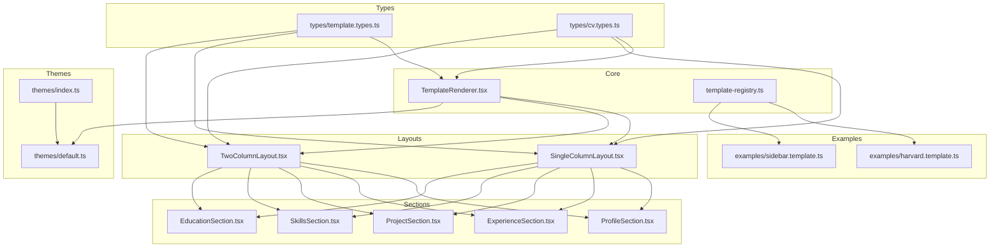
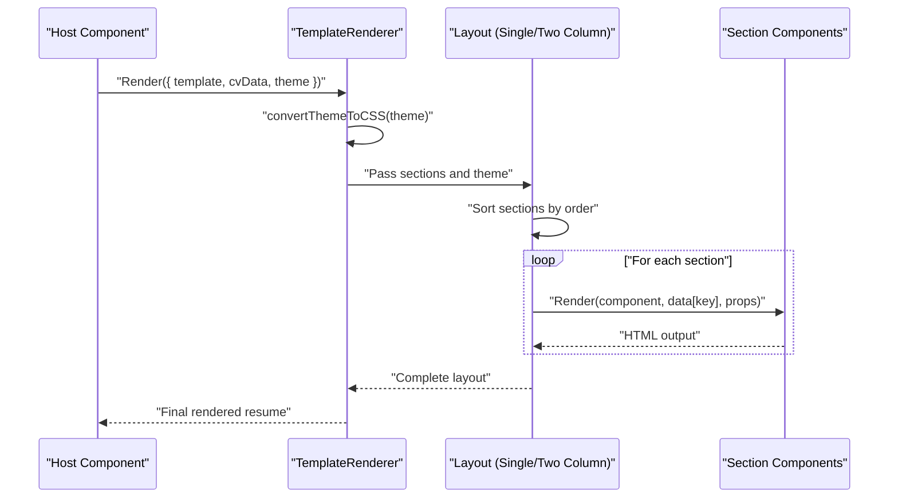
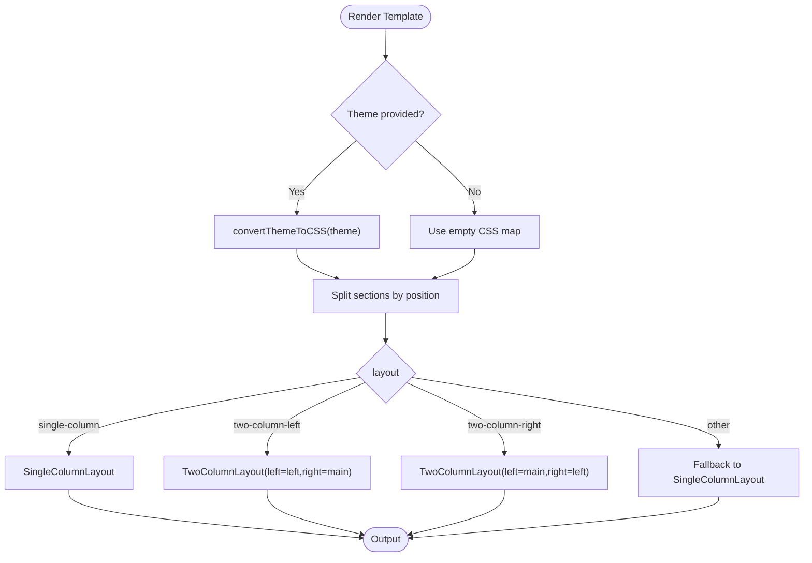
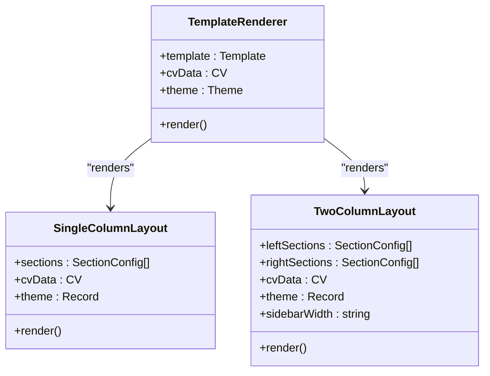
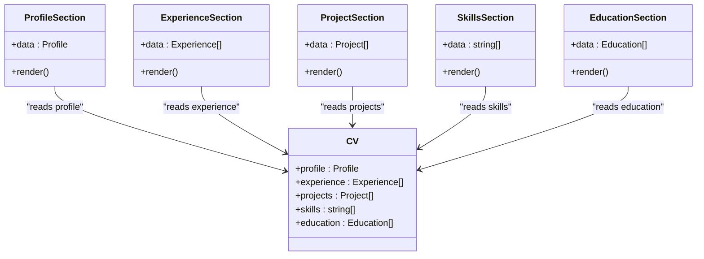
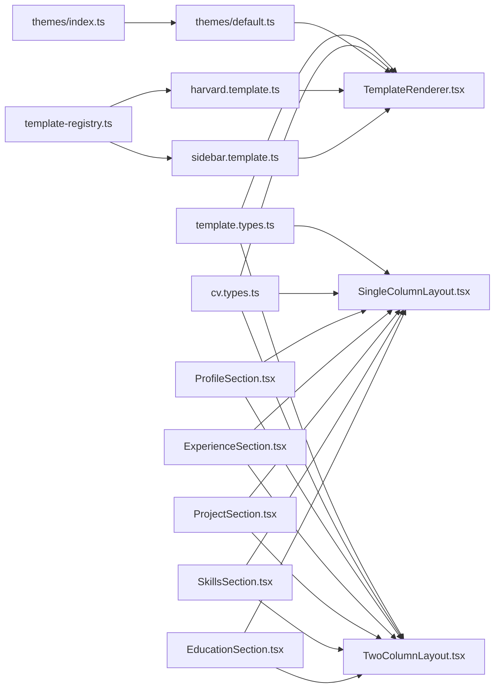

# Template Engine

<cite>
**Referenced Files in This Document**
- [TemplateRenderer.tsx](file://src/templates/core/TemplateRenderer.tsx)
- [template-registry.ts](file://src/templates/core/template-registry.ts)
- [SingleColumnLayout.tsx](file://src/templates/layouts/SingleColumnLayout.tsx)
- [TwoColumnLayout.tsx](file://src/templates/layouts/TwoColumnLayout.tsx)
- [ProfileSection.tsx](file://src/templates/sections/ProfileSection.tsx)
- [ExperienceSection.tsx](file://src/templates/sections/ExperienceSection.tsx)
- [ProjectSection.tsx](file://src/templates/sections/ProjectSection.tsx)
- [SkillsSection.tsx](file://src/templates/sections/SkillsSection.tsx)
- [EducationSection.tsx](file://src/templates/sections/EducationSection.tsx)
- [default.ts](file://src/templates/themes/default.ts)
- [index.ts](file://src/templates/themes/index.ts)
- [harvard.template.ts](file://src/templates/examples/harvard.template.ts)
- [sidebar.template.ts](file://src/templates/examples/sidebar.template.ts)
- [template.types.ts](file://src/templates/types/template.types.ts)
- [cv.types.ts](file://src/templates/types/cv.types.ts)
</cite>

## Table of Contents
1. [Introduction](#introduction)
2. [Project Structure](#project-structure)
3. [Core Components](#core-components)
4. [Architecture Overview](#architecture-overview)
5. [Detailed Component Analysis](#detailed-component-analysis)
6. [Dependency Analysis](#dependency-analysis)
7. [Performance Considerations](#performance-considerations)
8. [Troubleshooting Guide](#troubleshooting-guide)
9. [Conclusion](#conclusion)
10. [Appendices](#appendices)

## Introduction
This document explains the Template Engine responsible for rendering CVs and portfolios. It covers the rendering pipeline via TemplateRenderer, the template registry for discovery and management, layout systems for single-column and two-column designs, the theme system using CSS variables and prebuilt themes, and the section components for Profile, Experience, Projects, Skills, and Education. It also documents the template creation process, section composition, dynamic content rendering, and practical guidance for custom template development, theme customization, and section extension. Finally, it addresses performance optimization and responsive design considerations.

## Project Structure
The template engine is organized into cohesive modules:
- Core renderer and registry: orchestrate rendering and template lifecycle
- Layouts: renderers for single-column and two-column designs
- Sections: reusable components for each CV domain
- Themes: prebuilt themes and exports
- Examples: ready-to-use templates
- Types: shared TypeScript interfaces for templates, themes, and CV data

**Diagram sources**
- [TemplateRenderer.tsx:1-74](file://src/templates/core/TemplateRenderer.tsx#L1-L74)
- [template-registry.ts:1-92](file://src/templates/core/template-registry.ts#L1-L92)
- [SingleColumnLayout.tsx:1-36](file://src/templates/layouts/SingleColumnLayout.tsx#L1-L36)
- [TwoColumnLayout.tsx:1-55](file://src/templates/layouts/TwoColumnLayout.tsx#L1-L55)
- [ProfileSection.tsx:1-89](file://src/templates/sections/ProfileSection.tsx#L1-L89)
- [ExperienceSection.tsx:1-61](file://src/templates/sections/ExperienceSection.tsx#L1-L61)
- [ProjectSection.tsx:1-49](file://src/templates/sections/ProjectSection.tsx#L1-L49)
- [SkillsSection.tsx:1-26](file://src/templates/sections/SkillsSection.tsx#L1-L26)
- [EducationSection.tsx:1-44](file://src/templates/sections/EducationSection.tsx#L1-L44)
- [themes/index.ts:1-2](file://src/templates/themes/index.ts#L1-L2)
- [themes/default.ts:1-103](file://src/templates/themes/default.ts#L1-L103)
- [examples/harvard.template.ts:1-52](file://src/templates/examples/harvard.template.ts#L1-L52)
- [examples/sidebar.template.ts:1-55](file://src/templates/examples/sidebar.template.ts#L1-L55)
- [template.types.ts:1-77](file://src/templates/types/template.types.ts#L1-L77)
- [cv.types.ts:1-16](file://src/templates/types/cv.types.ts#L1-L16)

**Section sources**
- [TemplateRenderer.tsx:1-74](file://src/templates/core/TemplateRenderer.tsx#L1-L74)
- [template-registry.ts:1-92](file://src/templates/core/template-registry.ts#L1-L92)
- [SingleColumnLayout.tsx:1-36](file://src/templates/layouts/SingleColumnLayout.tsx#L1-L36)
- [TwoColumnLayout.tsx:1-55](file://src/templates/layouts/TwoColumnLayout.tsx#L1-L55)
- [ProfileSection.tsx:1-89](file://src/templates/sections/ProfileSection.tsx#L1-L89)
- [ExperienceSection.tsx:1-61](file://src/templates/sections/ExperienceSection.tsx#L1-L61)
- [ProjectSection.tsx:1-49](file://src/templates/sections/ProjectSection.tsx#L1-L49)
- [SkillsSection.tsx:1-26](file://src/templates/sections/SkillsSection.tsx#L1-L26)
- [EducationSection.tsx:1-44](file://src/templates/sections/EducationSection.tsx#L1-L44)
- [themes/index.ts:1-2](file://src/templates/themes/index.ts#L1-L2)
- [themes/default.ts:1-103](file://src/templates/themes/default.ts#L1-L103)
- [examples/harvard.template.ts:1-52](file://src/templates/examples/harvard.template.ts#L1-L52)
- [examples/sidebar.template.ts:1-55](file://src/templates/examples/sidebar.template.ts#L1-L55)
- [template.types.ts:1-77](file://src/templates/types/template.types.ts#L1-L77)
- [cv.types.ts:1-16](file://src/templates/types/cv.types.ts#L1-L16)

## Core Components
- TemplateRenderer: central orchestrator that converts a Theme into CSS variables, splits sections by position, and delegates rendering to the appropriate layout component.
- Template Registry: global singleton managing registration, lookup, filtering, and removal of templates.
- Layouts: SingleColumnLayout and TwoColumnLayout render sections in order, applying theme CSS variables and optional sidebar width.
- Sections: ProfileSection, ExperienceSection, ProjectSection, SkillsSection, and EducationSection render typed CV data into semantic HTML.
- Themes: Prebuilt themes define font families, sizes, color palettes, and spacing; exported via themes/index.ts and default.ts.
- Templates: Example templates demonstrate single-column and two-column compositions with explicit section ordering and theme references.

**Section sources**
- [TemplateRenderer.tsx:13-74](file://src/templates/core/TemplateRenderer.tsx#L13-L74)
- [template-registry.ts:4-92](file://src/templates/core/template-registry.ts#L4-L92)
- [SingleColumnLayout.tsx:11-36](file://src/templates/layouts/SingleColumnLayout.tsx#L11-L36)
- [TwoColumnLayout.tsx:13-55](file://src/templates/layouts/TwoColumnLayout.tsx#L13-L55)
- [ProfileSection.tsx:8-89](file://src/templates/sections/ProfileSection.tsx#L8-L89)
- [ExperienceSection.tsx:8-61](file://src/templates/sections/ExperienceSection.tsx#L8-L61)
- [ProjectSection.tsx:8-49](file://src/templates/sections/ProjectSection.tsx#L8-L49)
- [SkillsSection.tsx:7-26](file://src/templates/sections/SkillsSection.tsx#L7-L26)
- [EducationSection.tsx:8-44](file://src/templates/sections/EducationSection.tsx#L8-L44)
- [themes/index.ts:1-2](file://src/templates/themes/index.ts#L1-L2)
- [themes/default.ts:3-103](file://src/templates/themes/default.ts#L3-L103)
- [harvard.template.ts:12-52](file://src/templates/examples/harvard.template.ts#L12-L52)
- [sidebar.template.ts:12-55](file://src/templates/examples/sidebar.template.ts#L12-L55)

## Architecture Overview
The rendering pipeline is driven by a Template object containing layout, sections, and theme. TemplateRenderer transforms the Theme into CSS variables and routes to the correct layout. Layouts sort sections by order and render the corresponding section components with data keyed from the CV object.

**Diagram sources**
- [TemplateRenderer.tsx:13-53](file://src/templates/core/TemplateRenderer.tsx#L13-L53)
- [SingleColumnLayout.tsx:11-33](file://src/templates/layouts/SingleColumnLayout.tsx#L11-L33)
- [TwoColumnLayout.tsx:13-52](file://src/templates/layouts/TwoColumnLayout.tsx#L13-L52)
- [ProfileSection.tsx:8-89](file://src/templates/sections/ProfileSection.tsx#L8-L89)
- [ExperienceSection.tsx:8-61](file://src/templates/sections/ExperienceSection.tsx#L8-L61)
- [ProjectSection.tsx:8-49](file://src/templates/sections/ProjectSection.tsx#L8-L49)
- [SkillsSection.tsx:7-26](file://src/templates/sections/SkillsSection.tsx#L7-L26)
- [EducationSection.tsx:8-44](file://src/templates/sections/EducationSection.tsx#L8-L44)

## Detailed Component Analysis

### TemplateRenderer
Responsibilities:
- Converts a Theme into CSS variables for runtime application
- Splits template sections into left/main/right groups
- Selects and renders the appropriate layout based on template.layout
- Falls back to single-column if layout is unrecognized

Rendering logic highlights:
- Memoization prevents unnecessary re-renders
- CSS variable keys map theme fields to consistent names for layout/theme consumption
- Switch on layout type ensures correct column arrangement

**Diagram sources**
- [TemplateRenderer.tsx:13-53](file://src/templates/core/TemplateRenderer.tsx#L13-L53)

**Section sources**
- [TemplateRenderer.tsx:13-74](file://src/templates/core/TemplateRenderer.tsx#L13-L74)

### Template Registry
Responsibilities:
- Singleton registry for templates
- Registration, retrieval by ID, listing, filtering by category/tags, existence checks, removal, and metadata extraction

Usage patterns:
- Centralized discovery and filtering for UIs and engines
- Supports categorization and tagging for discoverability

**Section sources**
- [template-registry.ts:4-92](file://src/templates/core/template-registry.ts#L4-L92)

### Layout System
SingleColumnLayout:
- Sorts sections by order and renders them sequentially inside a container
- Applies theme CSS variables via inline style

TwoColumnLayout:
- Accepts left and right section arrays
- Renders a sidebar with configurable width and a main area
- Both areas apply theme CSS variables

**Diagram sources**
- [SingleColumnLayout.tsx:5-36](file://src/templates/layouts/SingleColumnLayout.tsx#L5-L36)
- [TwoColumnLayout.tsx:5-55](file://src/templates/layouts/TwoColumnLayout.tsx#L5-L55)
- [TemplateRenderer.tsx:13-53](file://src/templates/core/TemplateRenderer.tsx#L13-L53)

**Section sources**
- [SingleColumnLayout.tsx:11-36](file://src/templates/layouts/SingleColumnLayout.tsx#L11-L36)
- [TwoColumnLayout.tsx:13-55](file://src/templates/layouts/TwoColumnLayout.tsx#L13-L55)

### Theme System
Theme definition:
- Font family, font sizes, color palette, and spacing
- Exported via themes/default.ts and re-exported via themes/index.ts

Theme application:
- TemplateRenderer converts Theme to CSS variables
- Layouts apply theme via inline style to the container

Prebuilt themes:
- Modern, Professional, Creative, Minimal with distinct fonts, colors, and spacing

**Section sources**
- [themes/default.ts:3-103](file://src/templates/themes/default.ts#L3-L103)
- [themes/index.ts:1-2](file://src/templates/themes/index.ts#L1-L2)
- [TemplateRenderer.tsx:58-73](file://src/templates/core/TemplateRenderer.tsx#L58-L73)

### Section Components
Each section receives typed data from CV and renders structured content:
- ProfileSection: name, title, summary, and contact links with protocol normalization
- ExperienceSection: role, company, dates, achievements, and tech badges
- ProjectSection: name, description, highlights, and tech badges
- SkillsSection: comma-separated skills as inline items
- EducationSection: degree, field, institution, dates, and GPA

**Diagram sources**
- [ProfileSection.tsx:4-89](file://src/templates/sections/ProfileSection.tsx#L4-L89)
- [ExperienceSection.tsx:4-61](file://src/templates/sections/ExperienceSection.tsx#L4-L61)
- [ProjectSection.tsx:4-49](file://src/templates/sections/ProjectSection.tsx#L4-L49)
- [SkillsSection.tsx:3-26](file://src/templates/sections/SkillsSection.tsx#L3-L26)
- [EducationSection.tsx:4-44](file://src/templates/sections/EducationSection.tsx#L4-L44)
- [cv.types.ts:1-16](file://src/templates/types/cv.types.ts#L1-L16)

**Section sources**
- [ProfileSection.tsx:8-89](file://src/templates/sections/ProfileSection.tsx#L8-L89)
- [ExperienceSection.tsx:8-61](file://src/templates/sections/ExperienceSection.tsx#L8-L61)
- [ProjectSection.tsx:8-49](file://src/templates/sections/ProjectSection.tsx#L8-L49)
- [SkillsSection.tsx:7-26](file://src/templates/sections/SkillsSection.tsx#L7-L26)
- [EducationSection.tsx:8-44](file://src/templates/sections/EducationSection.tsx#L8-L44)

### Template Creation and Composition
Templates define:
- id, name, description, layout, page size
- sections array with key (matching CV property), component, position (main/left/right), order, and optional props
- theme reference (by ID or full object)

Example templates:
- Harvard: classic single-column academic layout
- Sidebar: modern two-column with a compact profile in the left sidebar

Composition patterns:
- Position determines placement in two-column layouts
- Order controls vertical stacking within a column
- Props enable per-section customization (e.g., compact profile)

**Section sources**
- [harvard.template.ts:12-52](file://src/templates/examples/harvard.template.ts#L12-L52)
- [sidebar.template.ts:12-55](file://src/templates/examples/sidebar.template.ts#L12-L55)
- [template.types.ts:34-53](file://src/templates/types/template.types.ts#L34-L53)

## Dependency Analysis
High-level dependencies:
- TemplateRenderer depends on layouts and theme conversion
- Layouts depend on section components and CV data typing
- Templates depend on sections and themes
- Registry depends on template types and provides discovery

**Diagram sources**
- [template.types.ts:1-77](file://src/templates/types/template.types.ts#L1-L77)
- [cv.types.ts:1-16](file://src/templates/types/cv.types.ts#L1-L16)
- [TemplateRenderer.tsx:1-74](file://src/templates/core/TemplateRenderer.tsx#L1-L74)
- [SingleColumnLayout.tsx:1-36](file://src/templates/layouts/SingleColumnLayout.tsx#L1-L36)
- [TwoColumnLayout.tsx:1-55](file://src/templates/layouts/TwoColumnLayout.tsx#L1-L55)
- [ProfileSection.tsx:1-89](file://src/templates/sections/ProfileSection.tsx#L1-L89)
- [ExperienceSection.tsx:1-61](file://src/templates/sections/ExperienceSection.tsx#L1-L61)
- [ProjectSection.tsx:1-49](file://src/templates/sections/ProjectSection.tsx#L1-L49)
- [SkillsSection.tsx:1-26](file://src/templates/sections/SkillsSection.tsx#L1-L26)
- [EducationSection.tsx:1-44](file://src/templates/sections/EducationSection.tsx#L1-L44)
- [themes/default.ts:1-103](file://src/templates/themes/default.ts#L1-L103)
- [themes/index.ts:1-2](file://src/templates/themes/index.ts#L1-L2)
- [harvard.template.ts:1-52](file://src/templates/examples/harvard.template.ts#L1-L52)
- [sidebar.template.ts:1-55](file://src/templates/examples/sidebar.template.ts#L1-L55)
- [template-registry.ts:1-92](file://src/templates/core/template-registry.ts#L1-L92)

**Section sources**
- [template.types.ts:1-77](file://src/templates/types/template.types.ts#L1-L77)
- [cv.types.ts:1-16](file://src/templates/types/cv.types.ts#L1-L16)
- [TemplateRenderer.tsx:1-74](file://src/templates/core/TemplateRenderer.tsx#L1-L74)
- [SingleColumnLayout.tsx:1-36](file://src/templates/layouts/SingleColumnLayout.tsx#L1-L36)
- [TwoColumnLayout.tsx:1-55](file://src/templates/layouts/TwoColumnLayout.tsx#L1-L55)
- [ProfileSection.tsx:1-89](file://src/templates/sections/ProfileSection.tsx#L1-L89)
- [ExperienceSection.tsx:1-61](file://src/templates/sections/ExperienceSection.tsx#L1-L61)
- [ProjectSection.tsx:1-49](file://src/templates/sections/ProjectSection.tsx#L1-L49)
- [SkillsSection.tsx:1-26](file://src/templates/sections/SkillsSection.tsx#L1-L26)
- [EducationSection.tsx:1-44](file://src/templates/sections/EducationSection.tsx#L1-L44)
- [themes/default.ts:1-103](file://src/templates/themes/default.ts#L1-L103)
- [themes/index.ts:1-2](file://src/templates/themes/index.ts#L1-L2)
- [harvard.template.ts:1-52](file://src/templates/examples/harvard.template.ts#L1-L52)
- [sidebar.template.ts:1-55](file://src/templates/examples/sidebar.template.ts#L1-L55)
- [template-registry.ts:1-92](file://src/templates/core/template-registry.ts#L1-L92)

## Performance Considerations
- Rendering memoization: TemplateRenderer, layouts, and sections are wrapped in React.memo to avoid unnecessary re-renders when props are unchanged.
- Sorting cost: Sorting sections by order occurs once per render; keep order lists short and stable to minimize overhead.
- CSS variable application: Applying theme via inline style is lightweight but consider batching updates if themes change frequently.
- Two-column sidebar width: Sidebar width is configurable; keep it reasonable to avoid excessive layout thrashing on narrow screens.
- Data access: Sections receive only the slice of CV data they need; avoid passing large derived datasets unnecessarily.

[No sources needed since this section provides general guidance]

## Troubleshooting Guide
Common issues and resolutions:
- Missing or mismatched section keys: Ensure each section key corresponds to a property in CV; otherwise, the section will receive undefined data.
- Unrecognized layout: If layout is not one of the supported types, TemplateRenderer falls back to single-column; verify template.layout value.
- Empty sections: Sections return null when data is missing; confirm CV contains the expected arrays or objects.
- Theme not applied: Verify theme object is provided and convertThemeToCSS is invoked; check that layout containers receive the CSS variables via inline style.
- Two-column overflow: Adjust sidebarWidth or reduce section content density; ensure responsive breakpoints are considered.

**Section sources**
- [TemplateRenderer.tsx:13-53](file://src/templates/core/TemplateRenderer.tsx#L13-L53)
- [SingleColumnLayout.tsx:11-36](file://src/templates/layouts/SingleColumnLayout.tsx#L11-L36)
- [TwoColumnLayout.tsx:13-55](file://src/templates/layouts/TwoColumnLayout.tsx#L13-L55)
- [ProfileSection.tsx:8-89](file://src/templates/sections/ProfileSection.tsx#L8-L89)
- [ExperienceSection.tsx:8-61](file://src/templates/sections/ExperienceSection.tsx#L8-L61)
- [ProjectSection.tsx:8-49](file://src/templates/sections/ProjectSection.tsx#L8-L49)
- [SkillsSection.tsx:7-26](file://src/templates/sections/SkillsSection.tsx#L7-L26)
- [EducationSection.tsx:8-44](file://src/templates/sections/EducationSection.tsx#L8-L44)

## Conclusion
The Template Engine provides a modular, extensible system for rendering CVs and portfolios. TemplateRenderer coordinates theme application and layout selection, while the registry enables discoverability and management. The layout system supports single-column and two-column designs, and the section components encapsulate domain-specific rendering. With CSS variable-based theming and prebuilt themes, customization is straightforward. The examples demonstrate practical composition patterns for academic and modern professional styles.

[No sources needed since this section summarizes without analyzing specific files]

## Appendices

### How to Create a Custom Template
Steps:
- Define a new Template with layout, sections, and theme
- Assign each section a key matching a CV property, choose position (main/left/right), and set order
- Optionally pass props to tailor section rendering
- Register the template using the registry for discovery

Reference paths:
- [template.types.ts:43-53](file://src/templates/types/template.types.ts#L43-L53)
- [template-registry.ts:20-22](file://src/templates/core/template-registry.ts#L20-L22)
- [harvard.template.ts:12-52](file://src/templates/examples/harvard.template.ts#L12-L52)
- [sidebar.template.ts:12-55](file://src/templates/examples/sidebar.template.ts#L12-L55)

**Section sources**
- [template.types.ts:43-53](file://src/templates/types/template.types.ts#L43-L53)
- [template-registry.ts:20-22](file://src/templates/core/template-registry.ts#L20-L22)
- [harvard.template.ts:12-52](file://src/templates/examples/harvard.template.ts#L12-L52)
- [sidebar.template.ts:12-55](file://src/templates/examples/sidebar.template.ts#L12-L55)

### How to Customize a Theme
Steps:
- Extend or modify a theme object with desired font family, sizes, colors, and spacing
- Reference the theme in a template or pass it to TemplateRenderer
- Confirm CSS variables are applied via inline style on the layout container

Reference paths:
- [themes/default.ts:3-103](file://src/templates/themes/default.ts#L3-L103)
- [TemplateRenderer.tsx:58-73](file://src/templates/core/TemplateRenderer.tsx#L58-L73)

**Section sources**
- [themes/default.ts:3-103](file://src/templates/themes/default.ts#L3-L103)
- [TemplateRenderer.tsx:58-73](file://src/templates/core/TemplateRenderer.tsx#L58-L73)

### How to Add a New Section Component
Steps:
- Create a new section component that accepts typed data and renders structured HTML
- Export the component and include it in a template’s sections array
- Ensure the section key matches a CV property and set position/order appropriately

Reference paths:
- [ProfileSection.tsx:8-89](file://src/templates/sections/ProfileSection.tsx#L8-L89)
- [ExperienceSection.tsx:8-61](file://src/templates/sections/ExperienceSection.tsx#L8-L61)
- [ProjectSection.tsx:8-49](file://src/templates/sections/ProjectSection.tsx#L8-L49)
- [SkillsSection.tsx:7-26](file://src/templates/sections/SkillsSection.tsx#L7-L26)
- [EducationSection.tsx:8-44](file://src/templates/sections/EducationSection.tsx#L8-L44)
- [template.types.ts:34-40](file://src/templates/types/template.types.ts#L34-L40)

**Section sources**
- [ProfileSection.tsx:8-89](file://src/templates/sections/ProfileSection.tsx#L8-L89)
- [ExperienceSection.tsx:8-61](file://src/templates/sections/ExperienceSection.tsx#L8-L61)
- [ProjectSection.tsx:8-49](file://src/templates/sections/ProjectSection.tsx#L8-L49)
- [SkillsSection.tsx:7-26](file://src/templates/sections/SkillsSection.tsx#L7-L26)
- [EducationSection.tsx:8-44](file://src/templates/sections/EducationSection.tsx#L8-L44)
- [template.types.ts:34-40](file://src/templates/types/template.types.ts#L34-L40)

### Responsive Design Considerations
Recommendations:
- Use flexible units (rem, em) for spacing and typography to scale with theme font sizes
- Leverage CSS media queries to adjust sidebar width and section padding for smaller screens
- Keep section content concise; consider truncation or pagination for long lists
- Test print layouts with page sizes A4/Letter/Legal as defined in templates

[No sources needed since this section provides general guidance]