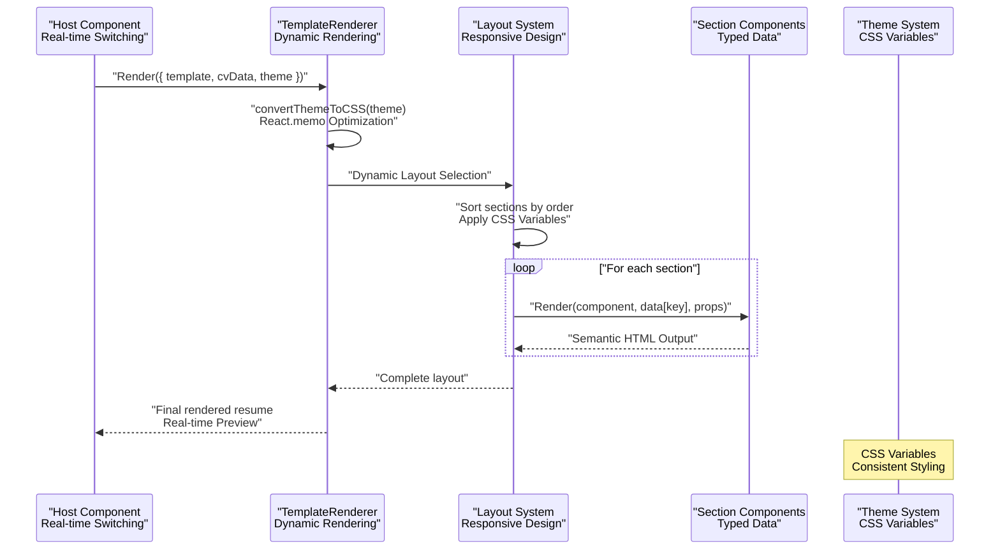
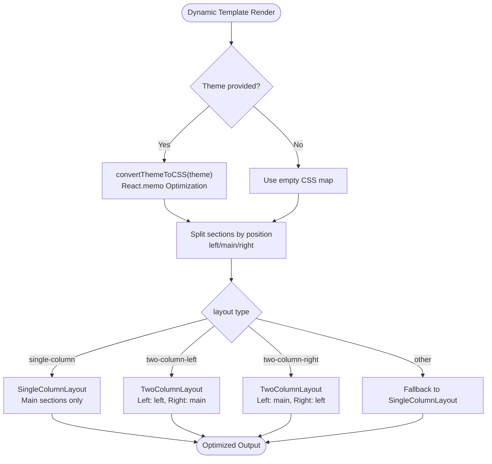
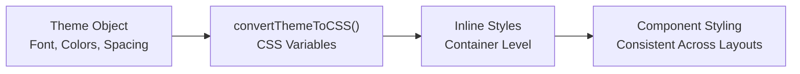
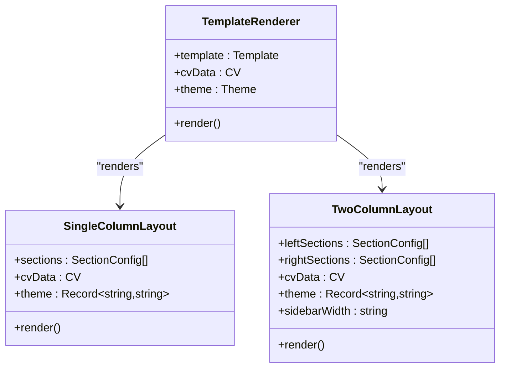
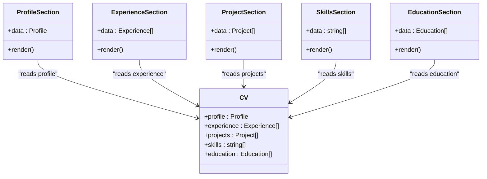

# Template Engine

<cite>
**Referenced Files in This Document**
- [TemplateRenderer.tsx](file://src/templates/core/TemplateRenderer.tsx)
- [template-registry.ts](file://src/templates/core/template-registry.ts)
- [SingleColumnLayout.tsx](file://src/templates/layouts/SingleColumnLayout.tsx)
- [TwoColumnLayout.tsx](file://src/templates/layouts/TwoColumnLayout.tsx)
- [ProfileSection.tsx](file://src/templates/sections/ProfileSection.tsx)
- [ExperienceSection.tsx](file://src/templates/sections/ExperienceSection.tsx)
- [ProjectSection.tsx](file://src/templates/sections/ProjectSection.tsx)
- [SkillsSection.tsx](file://src/templates/sections/SkillsSection.tsx)
- [EducationSection.tsx](file://src/templates/sections/EducationSection.tsx)
- [default.ts](file://src/templates/themes/default.ts)
- [index.ts](file://src/templates/themes/index.ts)
- [harvard.template.ts](file://src/templates/examples/harvard.template.ts)
- [sidebar.template.ts](file://src/templates/examples/sidebar.template.ts)
- [template.types.ts](file://src/templates/types/template.types.ts)
- [cv.types.ts](file://src/templates/types/cv.types.ts)
</cite>

## Update Summary
**Changes Made**
- Updated architecture overview to reflect dynamic rendering capabilities with real-time template switching
- Enhanced theme system documentation with four pre-built themes (Modern, Professional, Creative, Minimal)
- Added comprehensive CSS variable-based theming support for consistent styling
- Updated layout system documentation to cover single-column and two-column dynamic rendering
- Expanded template registry documentation with advanced discovery and filtering capabilities
- Added real-time preview functionality integration details

## Table of Contents
1. [Introduction](#introduction)
2. [Project Structure](#project-structure)
3. [Core Components](#core-components)
4. [Architecture Overview](#architecture-overview)
5. [Detailed Component Analysis](#detailed-component-analysis)
6. [Dynamic Rendering System](#dynamic-rendering-system)
7. [Theme Management System](#theme-management-system)
8. [Template Registry and Discovery](#template-registry-and-discovery)
9. [Layout System](#layout-system)
10. [Section Components](#section-components)
11. [Template Creation Process](#template-creation-process)
12. [Real-time Integration](#real-time-integration)
13. [Performance Considerations](#performance-considerations)
14. [Troubleshooting Guide](#troubleshooting-guide)
15. [Conclusion](#conclusion)
16. [Appendices](#appendices)

## Introduction
This document explains the Template Engine responsible for rendering CVs and portfolios with dynamic capabilities. The system now features real-time template switching, comprehensive theme management with CSS variable support, and integrated preview functionality. It covers the rendering pipeline via TemplateRenderer, the template registry for discovery and management, layout systems for single-column and two-column designs, the theme system using CSS variables and prebuilt themes, and the section components for Profile, Experience, Projects, Skills, and Education. The engine supports dynamic content rendering with responsive design considerations and performance optimizations.

## Project Structure
The template engine is organized into cohesive modules with enhanced dynamic capabilities:
- Core renderer and registry: orchestrate rendering and template lifecycle with real-time updates
- Layouts: renderers for single-column and two-column designs with dynamic switching
- Sections: reusable components for each CV domain with typed data handling
- Themes: prebuilt themes with CSS variable support for consistent styling
- Examples: ready-to-use templates with dynamic positioning
- Types: shared TypeScript interfaces for templates, themes, and CV data with enhanced metadata

```mermaid
graph TB
subgraph "Core Engine"
TR["TemplateRenderer.tsx<br/>Dynamic Rendering"]
REG["template-registry.ts<br/>Advanced Discovery"]
END
subgraph "Layout System"
SCL["SingleColumnLayout.tsx<br/>Dynamic Switching"]
TCL["TwoColumnLayout.tsx<br/>Responsive Design"]
END
subgraph "Section Components"
PS["ProfileSection.tsx<br/>Typed Data Handling"]
ES["ExperienceSection.tsx<br/>Achievement Lists"]
ProS["ProjectSection.tsx<br/>Tech Stack Display"]
SS["SkillsSection.tsx<br/>Inline Items"]
EdS["EducationSection.tsx<br/>GPA Support"]
END
subgraph "Theme Management"
TIDX["themes/index.ts<br/>Export System"]
TDEF["themes/default.ts<br/>Four Pre-built Themes"]
CSS["CSS Variables<br/>Consistent Styling"]
END
subgraph "Template Examples"
HARV["harvard.template.ts<br/>Academic Style"]
SB["sidebar.template.ts<br/>Modern Tech Layout"]
END
subgraph "Type System"
TT["types/template.types.ts<br/>Enhanced Interfaces"]
CT["types/cv.types.ts<br/>Extended Metadata"]
END
TR --> SCL
TR --> TCL
TR --> TDEF
SCL --> PS
SCL --> ES
SCL --> ProS
SCL --> SS
SCL --> EdS
TCL --> PS
TCL --> ES
TCL --> ProS
TCL --> SS
TCL --> EdS
REG --> HARV
REG --> SB
TIDX --> TDEF
TT --> TR
TT --> SCL
TT --> TCL
CT --> TR
CT --> SCL
CT --> TCL
CSS --> TR
CSS --> SCL
CSS --> TCL
```

**Diagram sources**
- [TemplateRenderer.tsx:1-74](file://src/templates/core/TemplateRenderer.tsx#L1-L74)
- [template-registry.ts:1-92](file://src/templates/core/template-registry.ts#L1-L92)
- [SingleColumnLayout.tsx:1-36](file://src/templates/layouts/SingleColumnLayout.tsx#L1-L36)
- [TwoColumnLayout.tsx:1-55](file://src/templates/layouts/TwoColumnLayout.tsx#L1-L55)
- [ProfileSection.tsx:1-89](file://src/templates/sections/ProfileSection.tsx#L1-L89)
- [ExperienceSection.tsx:1-61](file://src/templates/sections/ExperienceSection.tsx#L1-L61)
- [ProjectSection.tsx:1-49](file://src/templates/sections/ProjectSection.tsx#L1-L49)
- [SkillsSection.tsx:1-26](file://src/templates/sections/SkillsSection.tsx#L1-L26)
- [EducationSection.tsx:1-44](file://src/templates/sections/EducationSection.tsx#L1-L44)
- [themes/index.ts:1-2](file://src/templates/themes/index.ts#L1-L2)
- [themes/default.ts:1-103](file://src/templates/themes/default.ts#L1-L103)
- [examples/harvard.template.ts:1-52](file://src/templates/examples/harvard.template.ts#L1-L52)
- [examples/sidebar.template.ts:1-55](file://src/templates/examples/sidebar.template.ts#L1-L55)
- [template.types.ts:1-77](file://src/templates/types/template.types.ts#L1-L77)
- [cv.types.ts:1-16](file://src/templates/types/cv.types.ts#L1-L16)

## Core Components
- **TemplateRenderer**: Central orchestrator with React.memo optimization that converts Theme into CSS variables, dynamically splits sections by position, and delegates rendering to appropriate layout components with real-time switching capabilities.
- **Template Registry**: Advanced singleton registry managing registration, lookup, filtering, and removal of templates with category tagging, metadata extraction, and discovery capabilities.
- **Layout System**: Dynamic SingleColumnLayout and TwoColumnLayout components that render sections in order, apply theme CSS variables, and support responsive design with configurable sidebar widths.
- **Section Components**: ProfileSection, ExperienceSection, ProjectSection, SkillsSection, and EducationSection with typed CV data handling and semantic HTML rendering.
- **Theme System**: Four pre-built themes (Modern, Professional, Creative, Minimal) with comprehensive CSS variable support for consistent styling across all CV formats.
- **Template Examples**: Ready-to-use templates demonstrating single-column and two-column compositions with dynamic section positioning and theme references.

**Section sources**
- [TemplateRenderer.tsx:13-74](file://src/templates/core/TemplateRenderer.tsx#L13-L74)
- [template-registry.ts:4-92](file://src/templates/core/template-registry.ts#L4-L92)
- [SingleColumnLayout.tsx:11-36](file://src/templates/layouts/SingleColumnLayout.tsx#L11-L36)
- [TwoColumnLayout.tsx:13-55](file://src/templates/layouts/TwoColumnLayout.tsx#L13-L55)
- [ProfileSection.tsx:8-89](file://src/templates/sections/ProfileSection.tsx#L8-L89)
- [ExperienceSection.tsx:8-61](file://src/templates/sections/ExperienceSection.tsx#L8-L61)
- [ProjectSection.tsx:8-49](file://src/templates/sections/ProjectSection.tsx#L8-L49)
- [SkillsSection.tsx:7-26](file://src/templates/sections/SkillsSection.tsx#L7-L26)
- [EducationSection.tsx:8-44](file://src/templates/sections/EducationSection.tsx#L8-L44)
- [themes/index.ts:1-2](file://src/templates/themes/index.ts#L1-L2)
- [themes/default.ts:3-103](file://src/templates/themes/default.ts#L3-L103)
- [harvard.template.ts:12-52](file://src/templates/examples/harvard.template.ts#L12-L52)
- [sidebar.template.ts:12-55](file://src/templates/examples/sidebar.template.ts#L12-L55)

## Architecture Overview
The enhanced rendering pipeline supports real-time template switching and dynamic theme application. TemplateRenderer transforms themes into CSS variables and routes to correct layout components with React.memo optimization for performance. Layouts sort sections by order and render corresponding section components with data keyed from CV objects, supporting both single-column and two-column arrangements with responsive design.



**Diagram sources**
- [TemplateRenderer.tsx:13-53](file://src/templates/core/TemplateRenderer.tsx#L13-L53)
- [SingleColumnLayout.tsx:11-33](file://src/templates/layouts/SingleColumnLayout.tsx#L11-L33)
- [TwoColumnLayout.tsx:13-52](file://src/templates/layouts/TwoColumnLayout.tsx#L13-L52)
- [ProfileSection.tsx:8-89](file://src/templates/sections/ProfileSection.tsx#L8-L89)
- [ExperienceSection.tsx:8-61](file://src/templates/sections/ExperienceSection.tsx#L8-L61)
- [ProjectSection.tsx:8-49](file://src/templates/sections/ProjectSection.tsx#L8-L49)
- [SkillsSection.tsx:7-26](file://src/templates/sections/SkillsSection.tsx#L7-L26)
- [EducationSection.tsx:8-44](file://src/templates/sections/EducationSection.tsx#L8-L44)

## Detailed Component Analysis

### TemplateRenderer
**Enhanced Capabilities**:
- **Dynamic Rendering**: Converts Theme into CSS variables for runtime application with React.memo optimization preventing unnecessary re-renders
- **Intelligent Layout Selection**: Splits template sections into left/main/right groups and selects appropriate layout based on template.layout
- **Fallback Mechanism**: Falls back to single-column layout if layout type is unrecognized
- **Performance Optimization**: Memoized component with displayName for debugging

**Rendering Logic Highlights**:
- CSS variable keys map theme fields to consistent names (`--resume-font-family`, `--resume-color-primary`, etc.) for layout/theme consumption
- Switch statement ensures correct column arrangement for single-column, two-column-left, and two-column-right layouts
- Theme conversion function handles empty theme gracefully



**Diagram sources**
- [TemplateRenderer.tsx:13-74](file://src/templates/core/TemplateRenderer.tsx#L13-L74)

**Section sources**
- [TemplateRenderer.tsx:13-74](file://src/templates/core/TemplateRenderer.tsx#L13-L74)

### Template Registry
**Advanced Features**:
- **Singleton Pattern**: Thread-safe template registry with lazy initialization
- **Comprehensive Discovery**: Registration, retrieval by ID, listing, filtering by category/tags, existence checks, removal, and metadata extraction
- **Enhanced Metadata**: TemplateRegistryEntry includes thumbnail, tags, and category for better organization
- **Search Capabilities**: Category filtering and tag-based searching for template discovery

**Usage Patterns**:
- Centralized template management for UIs and engines with real-time updates
- Supports categorization (professional, creative, minimal, academic) and tagging for discoverability
- Provides template metadata extraction for preview and management interfaces

**Section sources**
- [template-registry.ts:4-92](file://src/templates/core/template-registry.ts#L4-L92)

## Dynamic Rendering System
**Real-time Template Switching**:
- **Instant Updates**: TemplateRenderer uses React.memo for optimal performance during template switching
- **Dynamic Layout Selection**: Runtime layout determination based on template.layout property
- **Responsive Design**: TwoColumnLayout supports configurable sidebar width with responsive breakpoints
- **Performance Optimization**: Memoization prevents unnecessary re-renders when props remain unchanged

**Integration Benefits**:
- Seamless template switching in CV Builder with real-time preview
- Efficient rendering pipeline with minimal DOM manipulation
- Scalable architecture supporting multiple template types and configurations

## Theme Management System
**Four Pre-built Themes**:
- **Modern Theme**: Contemporary sans-serif typography with blue accents and clean spacing
- **Professional Theme**: Classic serif typography with traditional blue color scheme and formal spacing
- **Creative Theme**: Modern font stack with vibrant purple, pink, and yellow accents for artistic profiles
- **Minimal Theme**: Monochrome black and gray palette with minimalist design philosophy

**CSS Variable Implementation**:
- Comprehensive CSS variable support for consistent styling across all components
- Variables include font families, sizes, colors, and spacing for complete theming control
- Dynamic theme application through inline styles for immediate visual feedback

**Theme Application Flow**:


**Diagram sources**
- [TemplateRenderer.tsx:58-73](file://src/templates/core/TemplateRenderer.tsx#L58-L73)
- [themes/default.ts:3-103](file://src/templates/themes/default.ts#L3-L103)

**Section sources**
- [themes/default.ts:3-103](file://src/templates/themes/default.ts#L3-L103)
- [themes/index.ts:1-2](file://src/templates/themes/index.ts#L1-L2)
- [TemplateRenderer.tsx:58-73](file://src/templates/core/TemplateRenderer.tsx#L58-L73)

## Template Registry and Discovery
**Enhanced Template Management**:
- **Advanced Filtering**: Category-based filtering (professional, creative, minimal, academic) for template organization
- **Tag-based Search**: Multi-tag search capability for discovering templates by specific characteristics
- **Metadata-rich Entries**: TemplateRegistryEntry includes thumbnail previews, tags, and category information
- **Template Lifecycle**: Complete template management from registration to removal with validation

**Discovery Features**:
- Template listing with metadata for user-friendly browsing
- Template existence checking for validation and error prevention
- Template ID management for consistent referencing across the system

**Section sources**
- [template-registry.ts:17-87](file://src/templates/core/template-registry.ts#L17-L87)

## Layout System
**Dynamic Layout Architecture**:
- **SingleColumnLayout**: Sorts sections by order and renders them sequentially with theme CSS variables applied via inline styles
- **TwoColumnLayout**: Accepts left and right section arrays with configurable sidebar width (default 280px) and responsive design considerations
- **Position-based Rendering**: Sections positioned based on 'main', 'left', or 'right' properties for flexible layout arrangements
- **Order-based Stacking**: Sections within each column are sorted by order property for consistent visual hierarchy

**Responsive Design**:
- Configurable sidebar width for different screen sizes and content densities
- Flexible container sizing with CSS classes for layout identification
- Consistent theme application across both single and two-column layouts



**Diagram sources**
- [SingleColumnLayout.tsx:5-36](file://src/templates/layouts/SingleColumnLayout.tsx#L5-L36)
- [TwoColumnLayout.tsx:5-55](file://src/templates/layouts/TwoColumnLayout.tsx#L5-L55)
- [TemplateRenderer.tsx:13-53](file://src/templates/core/TemplateRenderer.tsx#L13-L53)

**Section sources**
- [SingleColumnLayout.tsx:11-36](file://src/templates/layouts/SingleColumnLayout.tsx#L11-L36)
- [TwoColumnLayout.tsx:13-55](file://src/templates/layouts/TwoColumnLayout.tsx#L13-L55)

## Section Components
**Enhanced Section Architecture**:
- **ProfileSection**: Handles name, title, summary, and contact links with protocol normalization and social media integration
- **ExperienceSection**: Renders role, company, dates, achievements, and tech badges with proper date formatting
- **ProjectSection**: Displays project name, description, highlights, and tech badges with semantic HTML structure
- **SkillsSection**: Presents comma-separated skills as inline items with responsive design
- **EducationSection**: Shows degree, field, institution, dates, and GPA with academic formatting

**Typed Data Handling**:
- Each section receives typed data from CV interface for type safety
- Proper null checking and empty array validation for robust rendering
- Semantic HTML structure for accessibility and SEO optimization



**Diagram sources**
- [ProfileSection.tsx:4-89](file://src/templates/sections/ProfileSection.tsx#L4-L89)
- [ExperienceSection.tsx:4-61](file://src/templates/sections/ExperienceSection.tsx#L4-L61)
- [ProjectSection.tsx:4-49](file://src/templates/sections/ProjectSection.tsx#L4-L49)
- [SkillsSection.tsx:3-26](file://src/templates/sections/SkillsSection.tsx#L3-L26)
- [EducationSection.tsx:4-44](file://src/templates/sections/EducationSection.tsx#L4-L44)
- [cv.types.ts:1-16](file://src/templates/types/cv.types.ts#L1-L16)

**Section sources**
- [ProfileSection.tsx:8-89](file://src/templates/sections/ProfileSection.tsx#L8-L89)
- [ExperienceSection.tsx:8-61](file://src/templates/sections/ExperienceSection.tsx#L8-L61)
- [ProjectSection.tsx:8-49](file://src/templates/sections/ProjectSection.tsx#L8-L49)
- [SkillsSection.tsx:7-26](file://src/templates/sections/SkillsSection.tsx#L7-L26)
- [EducationSection.tsx:8-44](file://src/templates/sections/EducationSection.tsx#L8-L44)

## Template Creation Process
**Enhanced Template Architecture**:
- **Template Definition**: Includes id, name, description, layout, page size, sections array, theme reference, and timestamps
- **Section Configuration**: Each section defines key (matching CV property), component, position (main/left/right), order, and optional props
- **Theme Integration**: Templates reference themes by ID or include full theme objects for customization
- **Page Size Support**: Built-in support for A4, Letter, and Legal page sizes for print optimization

**Example Templates**:
- **Harvard Template**: Classic single-column academic layout focusing on education with professional theme
- **Sidebar Template**: Modern two-column layout with compact profile in left sidebar and experience/projects in main content

**Composition Patterns**:
- Position determines placement in two-column layouts (left vs right)
- Order controls vertical stacking within columns
- Props enable per-section customization (e.g., compact profile)
- Theme reference ensures consistent styling across sections

**Section sources**
- [harvard.template.ts:12-52](file://src/templates/examples/harvard.template.ts#L12-L52)
- [sidebar.template.ts:12-55](file://src/templates/examples/sidebar.template.ts#L12-L55)
- [template.types.ts:43-53](file://src/templates/types/template.types.ts#L43-L53)

## Real-time Integration
**CV Builder Integration**:
- **Live Template Switching**: Real-time template preview updates without page reload
- **Dynamic Theme Application**: Instant theme changes reflected across all sections
- **Responsive Preview**: Live preview adjusts to different screen sizes and orientations
- **Performance Monitoring**: Optimized rendering pipeline prevents lag during frequent switching

**Enhanced User Experience**:
- Immediate visual feedback for template and theme selections
- Smooth transitions between different layout configurations
- Consistent styling application across all component types
- Accessible preview modes for different viewing contexts

## Performance Considerations
**Optimization Strategies**:
- **React.memo Implementation**: TemplateRenderer, layouts, and sections wrapped in React.memo prevent unnecessary re-renders when props are unchanged
- **Efficient Sorting**: Sorting sections by order occurs once per render with optimized comparison functions
- **CSS Variable Application**: Inline style application of theme variables is lightweight and batched
- **Memory Management**: TemplateRegistry uses efficient Map structure for template storage and retrieval
- **Conditional Rendering**: Sections return null when data is missing, preventing empty DOM nodes

**Scalability Features**:
- Template caching for frequently used templates
- Lazy loading for large CV data sets
- Optimized theme variable conversion for repeated use
- Efficient layout switching with minimal DOM manipulation

## Troubleshooting Guide
**Common Issues and Resolutions**:
- **Missing or Mismatched Section Keys**: Ensure each section key corresponds to a property in CV interface; sections receive undefined data when mismatched
- **Unrecognized Layout Types**: TemplateRenderer falls back to single-column for unsupported layout values; verify template.layout matches supported types
- **Empty Sections**: Sections return null when data is missing or empty arrays; confirm CV contains expected arrays or objects
- **Theme Application Issues**: Verify theme object is provided and convertThemeToCSS function is invoked; check that layout containers receive CSS variables via inline styles
- **Two-column Overflow**: Adjust sidebarWidth or reduce section content density; ensure responsive breakpoints are properly configured
- **Template Registry Errors**: Use templateRegistry methods for template management; check template IDs and metadata for consistency
- **Performance Degradation**: Monitor React.memo effectiveness and optimize template complexity for better rendering performance

**Section sources**
- [TemplateRenderer.tsx:13-53](file://src/templates/core/TemplateRenderer.tsx#L13-L53)
- [SingleColumnLayout.tsx:11-36](file://src/templates/layouts/SingleColumnLayout.tsx#L11-L36)
- [TwoColumnLayout.tsx:13-55](file://src/templates/layouts/TwoColumnLayout.tsx#L13-L55)
- [ProfileSection.tsx:8-89](file://src/templates/sections/ProfileSection.tsx#L8-L89)
- [ExperienceSection.tsx:8-61](file://src/templates/sections/ExperienceSection.tsx#L8-L61)
- [ProjectSection.tsx:8-49](file://src/templates/sections/ProjectSection.tsx#L8-L49)
- [SkillsSection.tsx:7-26](file://src/templates/sections/SkillsSection.tsx#L7-L26)
- [EducationSection.tsx:8-44](file://src/templates/sections/EducationSection.tsx#L8-L44)

## Conclusion
The enhanced Template Engine provides a sophisticated, modular, and highly dynamic system for rendering CVs and portfolios. With real-time template switching, comprehensive theme management, and responsive design capabilities, the system delivers exceptional user experience and developer flexibility. TemplateRenderer coordinates theme application and layout selection with React.memo optimization, while the advanced registry enables powerful template discovery and management. The layout system supports both single-column and two-column designs with CSS variable-based theming across four pre-built themes. The section components encapsulate domain-specific rendering with typed data handling and semantic HTML structure. This architecture enables seamless integration with CV Builder for real-time preview functionality and supports scalable customization for diverse professional needs.

## Appendices

### How to Create a Custom Template
**Enhanced Development Process**:
- **Template Definition**: Define new Template with layout, sections, and theme integration
- **Section Configuration**: Assign each section a key matching CV property, choose position (main/left/right), and set order for proper visual hierarchy
- **Theme Integration**: Reference existing themes or create custom themes with CSS variable support
- **Advanced Props**: Pass props to tailor section rendering for specific requirements
- **Registry Registration**: Register templates using templateRegistry for discovery and management
- **Testing Strategy**: Test template across different screen sizes and with various CV data combinations

**Reference Paths**:
- [template.types.ts:43-53](file://src/templates/types/template.types.ts#L43-L53)
- [template-registry.ts:20-22](file://src/templates/core/template-registry.ts#L20-L22)
- [harvard.template.ts:12-52](file://src/templates/examples/harvard.template.ts#L12-L52)
- [sidebar.template.ts:12-55](file://src/templates/examples/sidebar.template.ts#L12-L55)

**Section sources**
- [template.types.ts:43-53](file://src/templates/types/template.types.ts#L43-L53)
- [template-registry.ts:20-22](file://src/templates/core/template-registry.ts#L20-L22)
- [harvard.template.ts:12-52](file://src/templates/examples/harvard.template.ts#L12-L52)
- [sidebar.template.ts:12-55](file://src/templates/examples/sidebar.template.ts#L12-L55)

### How to Customize a Theme
**Advanced Theme Development**:
- **Theme Extension**: Extend or modify theme objects with desired font families, sizes, colors, and spacing
- **CSS Variable Integration**: Ensure theme variables align with convertThemeToCSS function for consistent application
- **Cross-layout Compatibility**: Test themes across single-column and two-column layouts for consistent appearance
- **Accessibility Considerations**: Verify color contrast ratios and font readability across different themes
- **Performance Optimization**: Minimize theme complexity for optimal rendering performance

**Reference Paths**:
- [themes/default.ts:3-103](file://src/templates/themes/default.ts#L3-L103)
- [TemplateRenderer.tsx:58-73](file://src/templates/core/TemplateRenderer.tsx#L58-L73)

**Section sources**
- [themes/default.ts:3-103](file://src/templates/themes/default.ts#L3-L103)
- [TemplateRenderer.tsx:58-73](file://src/templates/core/TemplateRenderer.tsx#L58-L73)

### How to Add a New Section Component
**Enhanced Component Development**:
- **Typed Interface**: Create new section component with proper TypeScript interface extending data type
- **Data Validation**: Implement null checking and empty array validation for robust rendering
- **Semantic HTML**: Use proper semantic HTML structure for accessibility and SEO benefits
- **Component Registration**: Export component and include in template sections array with appropriate configuration
- **Integration Testing**: Test component with various data inputs and edge cases
- **Performance Optimization**: Wrap component in React.memo for optimal rendering performance

**Reference Paths**:
- [ProfileSection.tsx:8-89](file://src/templates/sections/ProfileSection.tsx#L8-L89)
- [ExperienceSection.tsx:8-61](file://src/templates/sections/ExperienceSection.tsx#L8-L61)
- [ProjectSection.tsx:8-49](file://src/templates/sections/ProjectSection.tsx#L8-L49)
- [SkillsSection.tsx:7-26](file://src/templates/sections/SkillsSection.tsx#L7-L26)
- [EducationSection.tsx:8-44](file://src/templates/sections/EducationSection.tsx#L8-L44)
- [template.types.ts:34-40](file://src/templates/types/template.types.ts#L34-L40)

**Section sources**
- [ProfileSection.tsx:8-89](file://src/templates/sections/ProfileSection.tsx#L8-L89)
- [ExperienceSection.tsx:8-61](file://src/templates/sections/ExperienceSection.tsx#L8-L61)
- [ProjectSection.tsx:8-49](file://src/templates/sections/ProjectSection.tsx#L8-L49)
- [SkillsSection.tsx:7-26](file://src/templates/sections/SkillsSection.tsx#L7-L26)
- [EducationSection.tsx:8-44](file://src/templates/sections/EducationSection.tsx#L8-L44)
- [template.types.ts:34-40](file://src/templates/types/template.types.ts#L34-L40)

### Responsive Design Considerations
**Enhanced Responsive Strategy**:
- **Flexible Units**: Use rem, em, and percentage units for typography and spacing to scale with theme font sizes
- **Media Queries**: Implement CSS media queries to adjust sidebar width and section padding for different screen sizes
- **Content Optimization**: Keep section content concise with truncation options for long lists
- **Print Optimization**: Test print layouts with A4, Letter, and Legal page sizes as defined in templates
- **Touch Interaction**: Ensure interactive elements are appropriately sized for mobile device interaction
- **Performance on Mobile**: Optimize rendering performance for lower-powered mobile devices

**Section sources**
- [TwoColumnLayout.tsx:14](file://src/templates/layouts/TwoColumnLayout.tsx#L14)
- [SingleColumnLayout.tsx:14](file://src/templates/layouts/SingleColumnLayout.tsx#L14)
- [template.types.ts:50](file://src/templates/types/template.types.ts#L50)