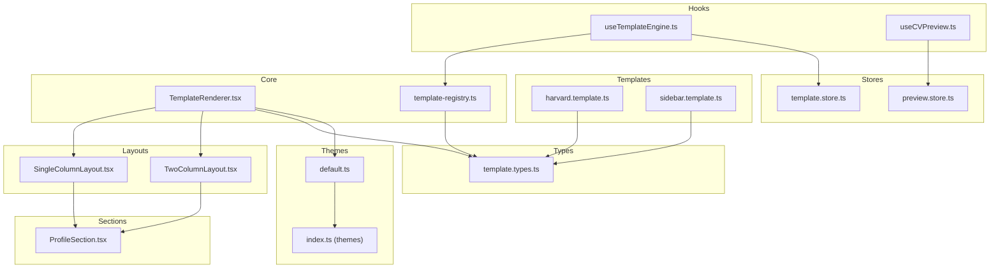
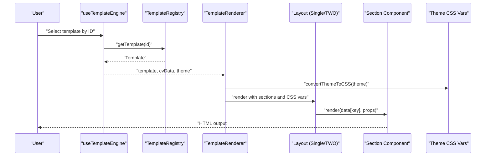
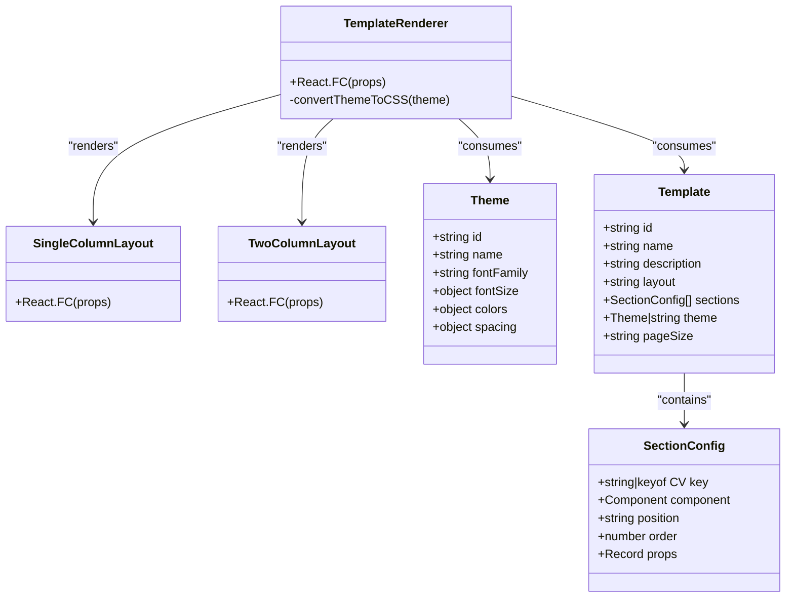
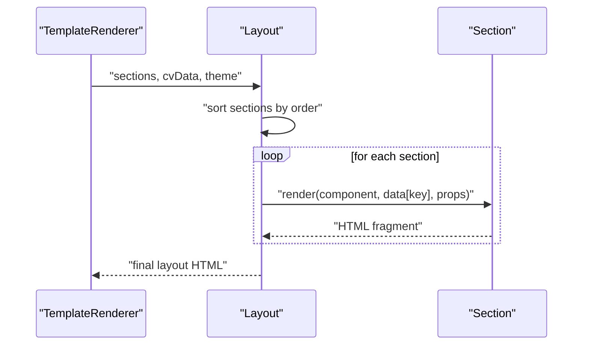
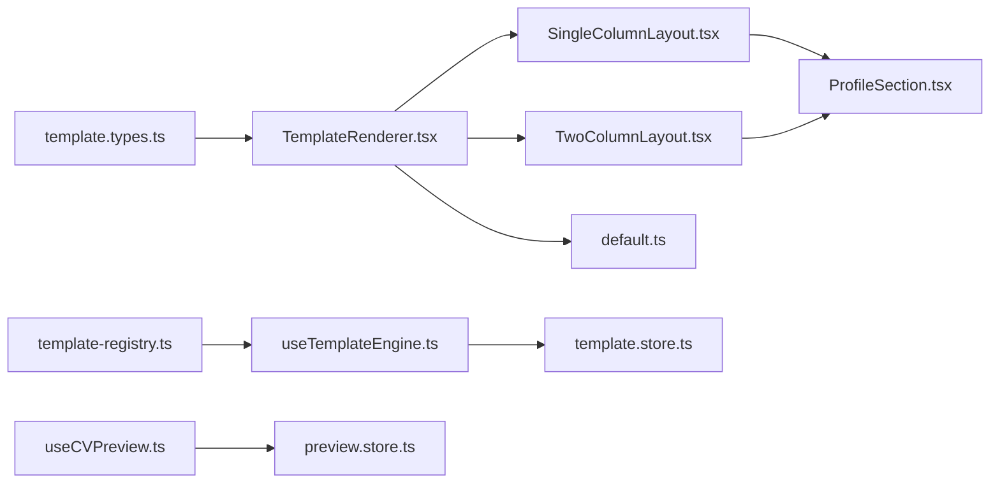
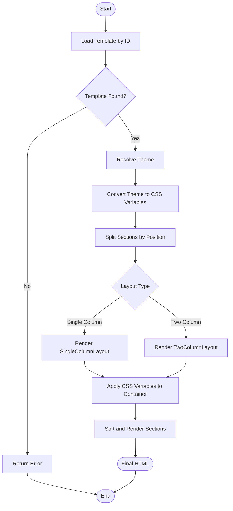

# Template Rendering System

<cite>
**Referenced Files in This Document**
- [TemplateRenderer.tsx](file://src/templates/core/TemplateRenderer.tsx)
- [template-registry.ts](file://src/templates/core/template-registry.ts)
- [template.types.ts](file://src/templates/types/template.types.ts)
- [useTemplateEngine.ts](file://src/templates/hooks/useTemplateEngine.ts)
- [useCVPreview.ts](file://src/templates/hooks/useCVPreview.ts)
- [harvard.template.ts](file://src/templates/examples/harvard.template.ts)
- [sidebar.template.ts](file://src/templates/examples/sidebar.template.ts)
- [SingleColumnLayout.tsx](file://src/templates/layouts/SingleColumnLayout.tsx)
- [TwoColumnLayout.tsx](file://src/templates/layouts/TwoColumnLayout.tsx)
- [ProfileSection.tsx](file://src/templates/sections/ProfileSection.tsx)
- [default.ts](file://src/templates/themes/default.ts)
- [index.ts (themes)](file://src/templates/themes/index.ts)
- [template.store.ts](file://src/templates/store/template.store.ts)
- [preview.store.ts](file://src/templates/store/preview.store.ts)
</cite>

## Table of Contents
1. [Introduction](#introduction)
2. [Project Structure](#project-structure)
3. [Core Components](#core-components)
4. [Architecture Overview](#architecture-overview)
5. [Detailed Component Analysis](#detailed-component-analysis)
6. [Dependency Analysis](#dependency-analysis)
7. [Performance Considerations](#performance-considerations)
8. [Troubleshooting Guide](#troubleshooting-guide)
9. [Conclusion](#conclusion)
10. [Appendices](#appendices)

## Introduction
This document explains the Template Rendering System that powers CV and portfolio generation. It covers the TemplateRenderer component architecture, memoization strategy, prop-based rendering logic, the template registry system, and the end-to-end rendering pipeline from template configuration to final HTML output. It also documents CSS variable conversion and theme application, provides examples of template configuration, outlines optimization techniques, and offers debugging approaches with performance and memory management considerations.

## Project Structure
The template system is organized around a core renderer, layout abstractions, reusable sections, a theme system, and stores for state management. Templates are defined declaratively and registered centrally for discovery and filtering.

**Diagram sources**
- [TemplateRenderer.tsx:1-74](file://src/templates/core/TemplateRenderer.tsx#L1-L74)
- [template-registry.ts:1-92](file://src/templates/core/template-registry.ts#L1-L92)
- [template.types.ts:1-77](file://src/templates/types/template.types.ts#L1-L77)
- [useTemplateEngine.ts:1-57](file://src/templates/hooks/useTemplateEngine.ts#L1-L57)
- [useCVPreview.ts:1-60](file://src/templates/hooks/useCVPreview.ts#L1-L60)
- [harvard.template.ts:1-52](file://src/templates/examples/harvard.template.ts#L1-L52)
- [sidebar.template.ts:1-55](file://src/templates/examples/sidebar.template.ts#L1-L55)
- [SingleColumnLayout.tsx:1-36](file://src/templates/layouts/SingleColumnLayout.tsx#L1-L36)
- [TwoColumnLayout.tsx:1-55](file://src/templates/layouts/TwoColumnLayout.tsx#L1-L55)
- [ProfileSection.tsx:1-89](file://src/templates/sections/ProfileSection.tsx#L1-L89)
- [default.ts:1-103](file://src/templates/themes/default.ts#L1-L103)
- [index.ts (themes):1-2](file://src/templates/themes/index.ts#L1-L2)
- [template.store.ts:1-103](file://src/templates/store/template.store.ts#L1-L103)
- [preview.store.ts:1-100](file://src/templates/store/preview.store.ts#L1-L100)

**Section sources**
- [TemplateRenderer.tsx:1-74](file://src/templates/core/TemplateRenderer.tsx#L1-L74)
- [template-registry.ts:1-92](file://src/templates/core/template-registry.ts#L1-L92)
- [template.types.ts:1-77](file://src/templates/types/template.types.ts#L1-L77)
- [useTemplateEngine.ts:1-57](file://src/templates/hooks/useTemplateEngine.ts#L1-L57)
- [useCVPreview.ts:1-60](file://src/templates/hooks/useCVPreview.ts#L1-L60)
- [harvard.template.ts:1-52](file://src/templates/examples/harvard.template.ts#L1-L52)
- [sidebar.template.ts:1-55](file://src/templates/examples/sidebar.template.ts#L1-L55)
- [SingleColumnLayout.tsx:1-36](file://src/templates/layouts/SingleColumnLayout.tsx#L1-L36)
- [TwoColumnLayout.tsx:1-55](file://src/templates/layouts/TwoColumnLayout.tsx#L1-L55)
- [ProfileSection.tsx:1-89](file://src/templates/sections/ProfileSection.tsx#L1-L89)
- [default.ts:1-103](file://src/templates/themes/default.ts#L1-L103)
- [index.ts (themes):1-2](file://src/templates/themes/index.ts#L1-L2)
- [template.store.ts:1-103](file://src/templates/store/template.store.ts#L1-L103)
- [preview.store.ts:1-100](file://src/templates/store/preview.store.ts#L1-L100)

## Core Components
- TemplateRenderer: Central renderer that converts a Theme to CSS variables, splits sections by position, selects a layout, and renders the final HTML.
- Layouts: SingleColumnLayout and TwoColumnLayout render sections in sorted order and apply theme CSS variables.
- Sections: Reusable components (e.g., ProfileSection) consume typed data from CV and render semantic HTML.
- Themes: Declarative theme definitions mapped to CSS variables for consistent styling.
- Registry: Centralized template registry supporting registration, lookup, filtering, and metadata retrieval.
- Hooks: useTemplateEngine and useCVPreview provide reactive access to templates and preview settings.
- Stores: TanStack Store-backed state for active template, custom templates, and preview settings.

**Section sources**
- [TemplateRenderer.tsx:1-74](file://src/templates/core/TemplateRenderer.tsx#L1-L74)
- [SingleColumnLayout.tsx:1-36](file://src/templates/layouts/SingleColumnLayout.tsx#L1-L36)
- [TwoColumnLayout.tsx:1-55](file://src/templates/layouts/TwoColumnLayout.tsx#L1-L55)
- [ProfileSection.tsx:1-89](file://src/templates/sections/ProfileSection.tsx#L1-L89)
- [default.ts:1-103](file://src/templates/themes/default.ts#L1-L103)
- [template-registry.ts:1-92](file://src/templates/core/template-registry.ts#L1-L92)
- [useTemplateEngine.ts:1-57](file://src/templates/hooks/useTemplateEngine.ts#L1-L57)
- [useCVPreview.ts:1-60](file://src/templates/hooks/useCVPreview.ts#L1-L60)
- [template.store.ts:1-103](file://src/templates/store/template.store.ts#L1-L103)
- [preview.store.ts:1-100](file://src/templates/store/preview.store.ts#L1-L100)

## Architecture Overview
The rendering pipeline begins with a Template and CV data. The renderer converts the Theme to CSS variables and delegates to a layout. The layout sorts sections by order and renders each section component with data extracted from CV. The registry manages template metadata and discovery, while hooks and stores provide reactive access and state updates.

**Diagram sources**
- [useTemplateEngine.ts:1-57](file://src/templates/hooks/useTemplateEngine.ts#L1-L57)
- [template-registry.ts:1-92](file://src/templates/core/template-registry.ts#L1-L92)
- [TemplateRenderer.tsx:1-74](file://src/templates/core/TemplateRenderer.tsx#L1-L74)
- [SingleColumnLayout.tsx:1-36](file://src/templates/layouts/SingleColumnLayout.tsx#L1-L36)
- [TwoColumnLayout.tsx:1-55](file://src/templates/layouts/TwoColumnLayout.tsx#L1-L55)
- [ProfileSection.tsx:1-89](file://src/templates/sections/ProfileSection.tsx#L1-L89)
- [default.ts:1-103](file://src/templates/themes/default.ts#L1-L103)

## Detailed Component Analysis

### TemplateRenderer
Responsibilities:
- Converts Theme to CSS variables for runtime application.
- Splits template sections by position (main/left/right).
- Switches layout based on template.layout.
- Applies theme via inline styles to the container.

Memoization strategy:
- Uses React.memo to prevent re-rendering when props are shallow-equal.

Prop-based rendering logic:
- Filters sections per position.
- Sorts sections by order before rendering.
- Passes props from SectionConfig to the section component.

CSS variable conversion:
- Maps theme fields to CSS custom properties consumed by layout containers.

Rendering pipeline:
- Single-column: renders main sections.
- Two-column-left/right: renders left and right sections accordingly.

**Section sources**
- [TemplateRenderer.tsx:1-74](file://src/templates/core/TemplateRenderer.tsx#L1-L74)

#### Class Diagram: Renderer and Types

**Diagram sources**
- [TemplateRenderer.tsx:1-74](file://src/templates/core/TemplateRenderer.tsx#L1-L74)
- [SingleColumnLayout.tsx:1-36](file://src/templates/layouts/SingleColumnLayout.tsx#L1-L36)
- [TwoColumnLayout.tsx:1-55](file://src/templates/layouts/TwoColumnLayout.tsx#L1-L55)
- [template.types.ts:1-77](file://src/templates/types/template.types.ts#L1-L77)

### Layouts
SingleColumnLayout:
- Sorts sections by order.
- Renders each section inside a container div.
- Applies theme CSS variables via inline styles.

TwoColumnLayout:
- Sorts left and right sections independently.
- Renders aside and main areas with optional sidebar width.
- Applies theme CSS variables via inline styles.

Both layouts leverage React.memo to avoid unnecessary re-renders when props are unchanged.

**Section sources**
- [SingleColumnLayout.tsx:1-36](file://src/templates/layouts/SingleColumnLayout.tsx#L1-L36)
- [TwoColumnLayout.tsx:1-55](file://src/templates/layouts/TwoColumnLayout.tsx#L1-L55)

#### Sequence Diagram: Layout Rendering Flow

**Diagram sources**
- [TemplateRenderer.tsx:1-74](file://src/templates/core/TemplateRenderer.tsx#L1-L74)
- [SingleColumnLayout.tsx:1-36](file://src/templates/layouts/SingleColumnLayout.tsx#L1-L36)
- [TwoColumnLayout.tsx:1-55](file://src/templates/layouts/TwoColumnLayout.tsx#L1-L55)

### Sections
ProfileSection demonstrates prop-based rendering:
- Accepts typed Profile data.
- Conditionally renders summary and contact links.
- Uses semantic markup and safe anchor handling.

Other sections follow the same pattern: accept typed data, render structured HTML, and rely on theme CSS variables for styling.

**Section sources**
- [ProfileSection.tsx:1-89](file://src/templates/sections/ProfileSection.tsx#L1-L89)

### Themes and CSS Variable Conversion
Theme definitions provide font families, sizes, colors, and spacing. The renderer converts a Theme into CSS custom properties and applies them via inline styles to the layout containers. This enables consistent theming across layouts and sections without global CSS overrides.

**Section sources**
- [default.ts:1-103](file://src/templates/themes/default.ts#L1-L103)
- [TemplateRenderer.tsx:58-73](file://src/templates/core/TemplateRenderer.tsx#L58-L73)

### Template Registry System
The registry is a singleton that:
- Registers templates with metadata (thumbnail, tags, category).
- Retrieves templates by ID, lists all templates, filters by category, and searches by tags.
- Exposes metadata extraction and template removal.

This supports discoverability, categorization, and extensibility of templates.

**Section sources**
- [template-registry.ts:1-92](file://src/templates/core/template-registry.ts#L1-L92)

### Hooks and Stores
useTemplateEngine:
- Provides active template resolution (custom first, then registry).
- Exposes CRUD actions for custom templates and category queries.

useCVPreview:
- Manages preview settings (zoom, page size, guides, mode).
- Offers actions to update settings and toggle modes/fullscreen/print preview.

Stores:
- template.store maintains active template ID, custom templates, section orders, and customization state.
- preview.store maintains zoom, page size, guides visibility, mode, fullscreen, and print preview toggles.

**Section sources**
- [useTemplateEngine.ts:1-57](file://src/templates/hooks/useTemplateEngine.ts#L1-L57)
- [useCVPreview.ts:1-60](file://src/templates/hooks/useCVPreview.ts#L1-L60)
- [template.store.ts:1-103](file://src/templates/store/template.store.ts#L1-L103)
- [preview.store.ts:1-100](file://src/templates/store/preview.store.ts#L1-L100)

### Example Templates
Harvard Template:
- Single-column academic layout.
- Sections: profile, education, experience, skills, projects.
- Uses professionalTheme.

Sidebar Template:
- Two-column-left modern layout.
- Left sidebar: profile (compact), skills, education.
- Right main: experience, projects.
- Uses modernTheme.

These examples illustrate how templates declare sections, positions, ordering, and themes.

**Section sources**
- [harvard.template.ts:1-52](file://src/templates/examples/harvard.template.ts#L1-L52)
- [sidebar.template.ts:1-55](file://src/templates/examples/sidebar.template.ts#L1-L55)
- [default.ts:1-103](file://src/templates/themes/default.ts#L1-L103)

## Dependency Analysis
The system exhibits low coupling and high cohesion:
- TemplateRenderer depends on layout components and theme conversion.
- Layouts depend on Section components and typed data.
- Registry decouples template discovery from rendering.
- Hooks and stores provide reactive access to state without tight coupling to rendering logic.

**Diagram sources**
- [template.types.ts:1-77](file://src/templates/types/template.types.ts#L1-L77)
- [TemplateRenderer.tsx:1-74](file://src/templates/core/TemplateRenderer.tsx#L1-L74)
- [SingleColumnLayout.tsx:1-36](file://src/templates/layouts/SingleColumnLayout.tsx#L1-L36)
- [TwoColumnLayout.tsx:1-55](file://src/templates/layouts/TwoColumnLayout.tsx#L1-L55)
- [default.ts:1-103](file://src/templates/themes/default.ts#L1-L103)
- [template-registry.ts:1-92](file://src/templates/core/template-registry.ts#L1-L92)
- [useTemplateEngine.ts:1-57](file://src/templates/hooks/useTemplateEngine.ts#L1-L57)
- [template.store.ts:1-103](file://src/templates/store/template.store.ts#L1-L103)
- [useCVPreview.ts:1-60](file://src/templates/hooks/useCVPreview.ts#L1-L60)
- [preview.store.ts:1-100](file://src/templates/store/preview.store.ts#L1-L100)
- [ProfileSection.tsx:1-89](file://src/templates/sections/ProfileSection.tsx#L1-L89)

**Section sources**
- [template.types.ts:1-77](file://src/templates/types/template.types.ts#L1-L77)
- [TemplateRenderer.tsx:1-74](file://src/templates/core/TemplateRenderer.tsx#L1-L74)
- [SingleColumnLayout.tsx:1-36](file://src/templates/layouts/SingleColumnLayout.tsx#L1-L36)
- [TwoColumnLayout.tsx:1-55](file://src/templates/layouts/TwoColumnLayout.tsx#L1-L55)
- [default.ts:1-103](file://src/templates/themes/default.ts#L1-L103)
- [template-registry.ts:1-92](file://src/templates/core/template-registry.ts#L1-L92)
- [useTemplateEngine.ts:1-57](file://src/templates/hooks/useTemplateEngine.ts#L1-L57)
- [template.store.ts:1-103](file://src/templates/store/template.store.ts#L1-L103)
- [useCVPreview.ts:1-60](file://src/templates/hooks/useCVPreview.ts#L1-L60)
- [preview.store.ts:1-100](file://src/templates/store/preview.store.ts#L1-L100)
- [ProfileSection.tsx:1-89](file://src/templates/sections/ProfileSection.tsx#L1-L89)

## Performance Considerations
- Memoization: All major components (TemplateRenderer, layouts, sections) use React.memo to avoid unnecessary re-renders when props are unchanged.
- Sorting cost: Sorting sections by order occurs once per layout render; keep order arrays small and stable to minimize overhead.
- CSS variables: Applying theme via inline styles avoids expensive CSS recalculations but still incurs style application cost; cache computed CSS variable maps when templates are reused.
- Rendering strategy: Prefer single-column layouts for simpler DOM trees; two-column layouts increase DOM depth and may impact scroll performance on very large CVs.
- Store updates: Batch updates to stores to reduce re-renders; avoid frequent toggles of preview settings during heavy rendering.
- Memory management: Avoid retaining large CV datasets beyond render cycles; ensure sections do not hold references to immutable data longer than needed.

[No sources needed since this section provides general guidance]

## Troubleshooting Guide
Common issues and debugging steps:
- Template not found: Verify template ID exists in registry or custom templates; confirm active template selection via hook.
- Layout mismatch: Ensure template.layout matches the intended structure; check section positions (main/left/right) align with chosen layout.
- Theme not applied: Confirm theme object is provided and convertThemeToCSS is invoked; inspect inline styles on the container div.
- Section not rendering: Check section key matches CV data shape; verify order sorting and presence of required keys.
- Preview settings not updating: Inspect preview store actions and derived states; ensure clamp logic for zoom does not override desired value unintentionally.

**Section sources**
- [useTemplateEngine.ts:1-57](file://src/templates/hooks/useTemplateEngine.ts#L1-L57)
- [template-registry.ts:1-92](file://src/templates/core/template-registry.ts#L1-L92)
- [TemplateRenderer.tsx:1-74](file://src/templates/core/TemplateRenderer.tsx#L1-L74)
- [SingleColumnLayout.tsx:1-36](file://src/templates/layouts/SingleColumnLayout.tsx#L1-L36)
- [TwoColumnLayout.tsx:1-55](file://src/templates/layouts/TwoColumnLayout.tsx#L1-L55)
- [preview.store.ts:1-100](file://src/templates/store/preview.store.ts#L1-L100)

## Conclusion
The Template Rendering System is a modular, declarative pipeline that transforms template configurations and CV data into styled HTML. Its architecture emphasizes separation of concerns: templates define structure and theme, layouts orchestrate rendering, sections encapsulate content, and the registry and stores enable discovery and state management. Memoization and CSS variable application contribute to performance and maintainability, while hooks expose a clean API for integration.

[No sources needed since this section summarizes without analyzing specific files]

## Appendices

### Rendering Pipeline Flowchart

**Diagram sources**
- [useTemplateEngine.ts:1-57](file://src/templates/hooks/useTemplateEngine.ts#L1-L57)
- [template-registry.ts:1-92](file://src/templates/core/template-registry.ts#L1-L92)
- [TemplateRenderer.tsx:1-74](file://src/templates/core/TemplateRenderer.tsx#L1-L74)
- [SingleColumnLayout.tsx:1-36](file://src/templates/layouts/SingleColumnLayout.tsx#L1-L36)
- [TwoColumnLayout.tsx:1-55](file://src/templates/layouts/TwoColumnLayout.tsx#L1-L55)

### Template Configuration Checklist
- Define sections with correct keys matching CV data.
- Assign positions (main/left/right) appropriate for chosen layout.
- Set order values to control rendering sequence.
- Select or define a theme; ensure CSS variables are valid.
- Choose page size and layout type.

**Section sources**
- [harvard.template.ts:1-52](file://src/templates/examples/harvard.template.ts#L1-L52)
- [sidebar.template.ts:1-55](file://src/templates/examples/sidebar.template.ts#L1-L55)
- [template.types.ts:1-77](file://src/templates/types/template.types.ts#L1-L77)