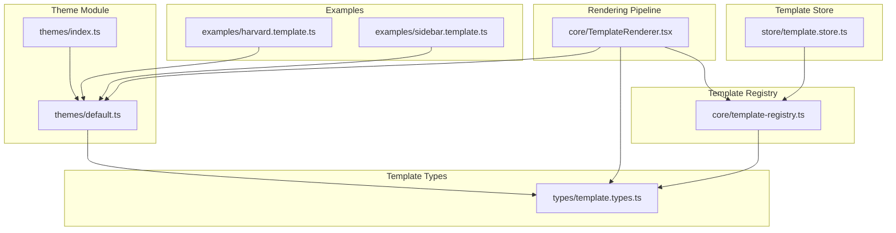
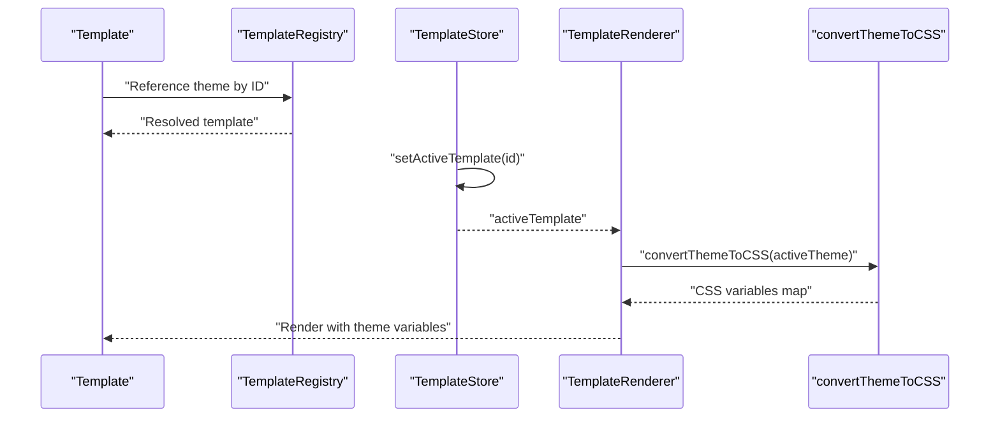
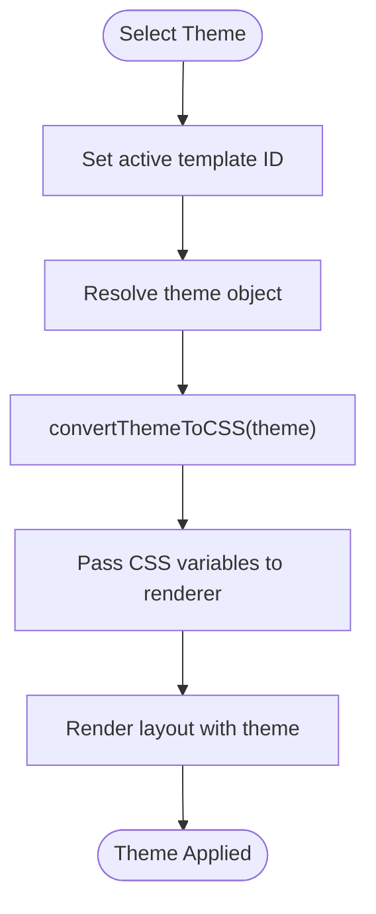
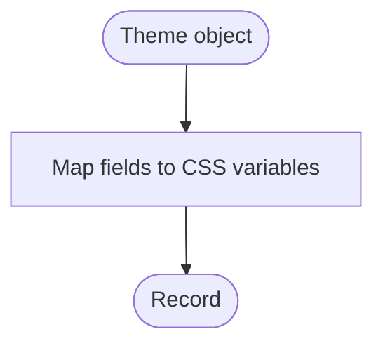
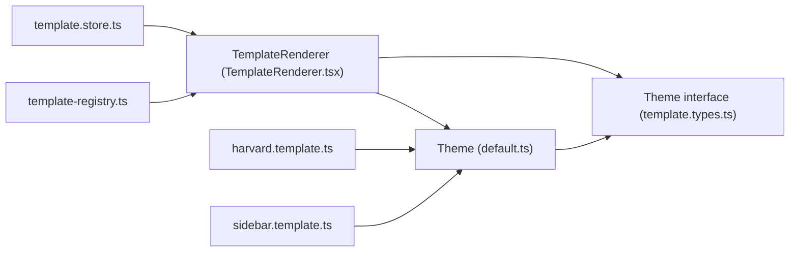

# Theme System

<cite>
**Referenced Files in This Document**
- [default.ts](file://src/templates/themes/default.ts)
- [index.ts](file://src/templates/themes/index.ts)
- [template.types.ts](file://src/templates/types/template.types.ts)
- [TemplateRenderer.tsx](file://src/templates/core/TemplateRenderer.tsx)
- [harvard.template.ts](file://src/templates/examples/harvard.template.ts)
- [sidebar.template.ts](file://src/templates/examples/sidebar.template.ts)
- [template-registry.ts](file://src/templates/core/template-registry.ts)
- [template.store.ts](file://src/templates/store/template.store.ts)
- [useTemplateEngine.ts](file://src/templates/hooks/useTemplateEngine.ts)
- [styles.css](file://src/styles.css)
</cite>

## Table of Contents
1. [Introduction](#introduction)
2. [Project Structure](#project-structure)
3. [Core Components](#core-components)
4. [Architecture Overview](#architecture-overview)
5. [Detailed Component Analysis](#detailed-component-analysis)
6. [Dependency Analysis](#dependency-analysis)
7. [Performance Considerations](#performance-considerations)
8. [Troubleshooting Guide](#troubleshooting-guide)
9. [Conclusion](#conclusion)

## Introduction
This document explains the Theme System used to enable visual customization of CV templates. The system is CSS variable–based, allowing themes to define fonts, colors, spacing, and typography scales. It includes a dedicated utility to convert theme objects into CSS variables, a theme registry, and mechanisms for theme selection and switching. The guide also covers pre-built themes, customization guidelines, and best practices for building theme-aware components.

## Project Structure
Themes are organized under a dedicated module with a simple export pattern. Templates reference themes either by importing theme objects directly or by ID via the template registry. The rendering pipeline converts active themes into CSS variables for consumption by layout components.

**Diagram sources**
- [index.ts:1-2](file://src/templates/themes/index.ts#L1-L2)
- [default.ts:1-103](file://src/templates/themes/default.ts#L1-L103)
- [template.types.ts:1-77](file://src/templates/types/template.types.ts#L1-L77)
- [TemplateRenderer.tsx:1-74](file://src/templates/core/TemplateRenderer.tsx#L1-L74)
- [template-registry.ts:1-92](file://src/templates/core/template-registry.ts#L1-L92)
- [template.store.ts:1-102](file://src/templates/store/template.store.ts#L1-L102)
- [harvard.template.ts:1-52](file://src/templates/examples/harvard.template.ts#L1-L52)
- [sidebar.template.ts:1-55](file://src/templates/examples/sidebar.template.ts#L1-L55)

**Section sources**
- [index.ts:1-2](file://src/templates/themes/index.ts#L1-L2)
- [default.ts:1-103](file://src/templates/themes/default.ts#L1-L103)
- [template.types.ts:1-77](file://src/templates/types/template.types.ts#L1-L77)
- [TemplateRenderer.tsx:1-74](file://src/templates/core/TemplateRenderer.tsx#L1-L74)
- [template-registry.ts:1-92](file://src/templates/core/template-registry.ts#L1-L92)
- [template.store.ts:1-102](file://src/templates/store/template.store.ts#L1-L102)
- [harvard.template.ts:1-52](file://src/templates/examples/harvard.template.ts#L1-L52)
- [sidebar.template.ts:1-55](file://src/templates/examples/sidebar.template.ts#L1-L55)

## Core Components
- Theme interface: Defines the structure for themes, including identifiers, font family, font sizes, color palette, and spacing units.
- Pre-built themes: Four ready-to-use themes exported from the themes module.
- Theme conversion utility: A function that transforms a theme object into a dictionary of CSS variables.
- Template integration: Templates reference themes directly or via the registry; the renderer applies theme CSS variables during rendering.

Key responsibilities:
- Theme definition and export
- Theme-to-CSS variable conversion
- Template-to-theme binding
- Theme selection and switching

**Section sources**
- [template.types.ts:9-31](file://src/templates/types/template.types.ts#L9-L31)
- [default.ts:3-102](file://src/templates/themes/default.ts#L3-L102)
- [TemplateRenderer.tsx:57-73](file://src/templates/core/TemplateRenderer.tsx#L57-L73)
- [harvard.template.ts:50-50](file://src/templates/examples/harvard.template.ts#L50-L50)
- [sidebar.template.ts:53-53](file://src/templates/examples/sidebar.template.ts#L53-L53)

## Architecture Overview
The Theme System follows a type-driven, modular architecture:
- Themes are defined as strongly typed objects.
- Templates declare their theme dependency.
- The renderer converts the active theme into CSS variables and passes them down to layout components.
- The template registry and store support theme selection and persistence.

**Diagram sources**
- [template-registry.ts:27-30](file://src/templates/core/template-registry.ts#L27-L30)
- [template.store.ts:47-51](file://src/templates/store/template.store.ts#L47-L51)
- [TemplateRenderer.tsx:13-53](file://src/templates/core/TemplateRenderer.tsx#L13-L53)
- [TemplateRenderer.tsx:57-73](file://src/templates/core/TemplateRenderer.tsx#L57-L73)

## Detailed Component Analysis

### Theme Definition and Structure
The Theme interface specifies:
- Identity: id and name
- Typography: font family and font sizes for base, heading, and small text
- Color scheme: primary, secondary, accent, text, background, and border
- Spacing: section and item spacing units

Pre-built themes demonstrate distinct personalities:
- Modern: contemporary sans-serif with balanced spacing
- Professional: classic serif with refined typography
- Creative: expressive palette with generous spacing
- Minimal: monochrome with tight spacing

These are exported as individual theme constants and aggregated into a registry map for convenience.

**Section sources**
- [template.types.ts:9-31](file://src/templates/types/template.types.ts#L9-L31)
- [default.ts:3-25](file://src/templates/themes/default.ts#L3-L25)
- [default.ts:27-48](file://src/templates/themes/default.ts#L27-L48)
- [default.ts:50-71](file://src/templates/themes/default.ts#L50-L71)
- [default.ts:73-94](file://src/templates/themes/default.ts#L73-L94)
- [default.ts:97-102](file://src/templates/themes/default.ts#L97-L102)

### Theme Registration and Discovery
Themes are exported from the themes module and referenced by templates. While a global registry exists for templates, themes are not centrally registered in the same way. Instead, templates import theme objects directly or rely on the themes map for programmatic access.

Practical implications:
- Direct import ensures type safety and tree-shaking benefits.
- Centralized registry is useful for dynamic discovery but not required for theme resolution.

**Section sources**
- [index.ts:1-2](file://src/templates/themes/index.ts#L1-L2)
- [default.ts:97-102](file://src/templates/themes/default.ts#L97-L102)
- [harvard.template.ts:9-9](file://src/templates/examples/harvard.template.ts#L9-L9)
- [sidebar.template.ts:9-9](file://src/templates/examples/sidebar.template.ts#L9-L9)

### Theme Switching Mechanisms
Theme switching is achieved by updating the active template’s theme reference:
- Set the active template ID in the template store
- Provide a theme object or ID to the renderer
- Convert the theme to CSS variables and apply them during rendering

The renderer memoizes rendering and delegates theme conversion to a pure helper function.

**Diagram sources**
- [template.store.ts:47-51](file://src/templates/store/template.store.ts#L47-L51)
- [TemplateRenderer.tsx:13-53](file://src/templates/core/TemplateRenderer.tsx#L13-L53)
- [TemplateRenderer.tsx:57-73](file://src/templates/core/TemplateRenderer.tsx#L57-L73)

**Section sources**
- [template.store.ts:47-51](file://src/templates/store/template.store.ts#L47-L51)
- [TemplateRenderer.tsx:13-53](file://src/templates/core/TemplateRenderer.tsx#L13-L53)
- [TemplateRenderer.tsx:57-73](file://src/templates/core/TemplateRenderer.tsx#L57-L73)

### convertThemeToCSS Utility Function
The utility function maps a Theme object to a flat record of CSS variables. These variables are consumed by layout components to style typography, colors, and spacing consistently.

Variable naming convention:
- Prefix: "--resume-"
- Categories: font-family, font-size-* variants, color-* variants, spacing-* variants

Usage:
- Called by the renderer before passing variables to layout components
- Returns a simple key-value map suitable for inline style injection

**Diagram sources**
- [TemplateRenderer.tsx:57-73](file://src/templates/core/TemplateRenderer.tsx#L57-L73)

**Section sources**
- [TemplateRenderer.tsx:57-73](file://src/templates/core/TemplateRenderer.tsx#L57-L73)

### Theme-Aware Components
Layout components consume the CSS variables produced by convertThemeToCSS. They should reference variables such as:
- Font family and sizes for readable hierarchy
- Color tokens for text, backgrounds, borders, and accents
- Spacing tokens for consistent rhythm

This approach ensures visual consistency across templates and easy runtime customization.

Note: The specific variable names and usage are defined by the converter and applied during rendering.

**Section sources**
- [TemplateRenderer.tsx:13-53](file://src/templates/core/TemplateRenderer.tsx#L13-L53)

### Pre-built Theme Examples
- Harvard Template: Academic single-column layout using the Professional theme
- Sidebar Template: Modern two-column layout using the Modern theme

These examples illustrate how templates bind to specific themes and how different layouts can leverage the same theme or different ones.

**Section sources**
- [harvard.template.ts:12-51](file://src/templates/examples/harvard.template.ts#L12-L51)
- [sidebar.template.ts:12-54](file://src/templates/examples/sidebar.template.ts#L12-L54)

### Creating Custom Themes
Follow these steps to add a new theme:
1. Define a theme object matching the Theme interface
2. Export it from the themes module
3. Reference it in a template configuration

Best practices:
- Keep color palettes accessible and consistent
- Use scalable spacing units
- Choose fonts appropriate to the target audience
- Ensure sufficient contrast for readability

**Section sources**
- [template.types.ts:9-31](file://src/templates/types/template.types.ts#L9-L31)
- [default.ts:97-102](file://src/templates/themes/default.ts#L97-L102)
- [harvard.template.ts:50-50](file://src/templates/examples/harvard.template.ts#L50-L50)
- [sidebar.template.ts:53-53](file://src/templates/examples/sidebar.template.ts#L53-L53)

### Modifying Existing Themes
To adjust an existing theme:
- Update the relevant field(s) in the theme constant
- Verify that the change aligns with the intended personality and accessibility standards
- Re-run previews to confirm visual impact

**Section sources**
- [default.ts:3-25](file://src/templates/themes/default.ts#L3-L25)
- [default.ts:27-48](file://src/templates/themes/default.ts#L27-L48)
- [default.ts:50-71](file://src/templates/themes/default.ts#L50-L71)
- [default.ts:73-94](file://src/templates/themes/default.ts#L73-L94)

### Implementing Theme-Aware Components
When building components:
- Consume CSS variables emitted by the renderer
- Avoid hardcoding colors, fonts, or spacing
- Use semantic variable names aligned with the theme vocabulary

This keeps components decoupled from specific theme instances and simplifies maintenance.

**Section sources**
- [TemplateRenderer.tsx:13-53](file://src/templates/core/TemplateRenderer.tsx#L13-L53)

### Theme Inheritance and Fallbacks
- No explicit inheritance mechanism exists for themes in the current implementation.
- Fallback behavior relies on the renderer’s handling of missing theme data and the presence of default CSS variables in the base stylesheet.

Recommendation:
- Provide sensible defaults in the base stylesheet for critical variables to avoid rendering issues when themes are not supplied.

**Section sources**
- [TemplateRenderer.tsx:13-53](file://src/templates/core/TemplateRenderer.tsx#L13-L53)
- [styles.css:56-137](file://src/styles.css#L56-L137)

## Dependency Analysis
The theme system exhibits low coupling and high cohesion:
- Themes are self-contained and typed
- Renderer depends only on the Theme interface and the conversion utility
- Templates depend on themes via direct imports or registry lookups
- Stores and hooks orchestrate selection and persistence

**Diagram sources**
- [default.ts:1-103](file://src/templates/themes/default.ts#L1-L103)
- [template.types.ts:9-31](file://src/templates/types/template.types.ts#L9-L31)
- [TemplateRenderer.tsx:1-74](file://src/templates/core/TemplateRenderer.tsx#L1-L74)
- [harvard.template.ts:1-52](file://src/templates/examples/harvard.template.ts#L1-L52)
- [sidebar.template.ts:1-55](file://src/templates/examples/sidebar.template.ts#L1-L55)
- [template.store.ts:1-102](file://src/templates/store/template.store.ts#L1-L102)
- [template-registry.ts:1-92](file://src/templates/core/template-registry.ts#L1-L92)

**Section sources**
- [default.ts:1-103](file://src/templates/themes/default.ts#L1-L103)
- [template.types.ts:9-31](file://src/templates/types/template.types.ts#L9-L31)
- [TemplateRenderer.tsx:1-74](file://src/templates/core/TemplateRenderer.tsx#L1-L74)
- [harvard.template.ts:1-52](file://src/templates/examples/harvard.template.ts#L1-L52)
- [sidebar.template.ts:1-55](file://src/templates/examples/sidebar.template.ts#L1-L55)
- [template.store.ts:1-102](file://src/templates/store/template.store.ts#L1-L102)
- [template-registry.ts:1-92](file://src/templates/core/template-registry.ts#L1-L92)

## Performance Considerations
- Memoization: The renderer is memoized to prevent unnecessary re-renders when theme or data props do not change.
- Pure conversion: The convertThemeToCSS function is deterministic and side-effect free, enabling efficient recomputation when themes change.
- CSS variables: Applying styles via CSS variables avoids costly DOM mutations and leverages browser optimizations.
- Store-based selection: Using a centralized store for active template and custom templates minimizes prop drilling and improves scalability.

Recommendations:
- Keep theme objects immutable to maximize memoization benefits
- Prefer direct theme imports for predictable bundling
- Avoid frequent theme switches during print/export to reduce repaints

**Section sources**
- [TemplateRenderer.tsx:13-53](file://src/templates/core/TemplateRenderer.tsx#L13-L53)
- [TemplateRenderer.tsx:57-73](file://src/templates/core/TemplateRenderer.tsx#L57-L73)
- [template.store.ts:47-51](file://src/templates/store/template.store.ts#L47-L51)

## Troubleshooting Guide
Common issues and resolutions:
- Missing theme variables: Ensure convertThemeToCSS is invoked and the resulting variables are passed to the renderer
- Incorrect font or color rendering: Verify theme fields match the expected types and values
- Theme not applying: Confirm the active template references the intended theme and that the store state reflects the change
- Accessibility concerns: Validate color contrast and font legibility across themes

Debugging tips:
- Log the theme object before conversion
- Inspect the CSS variables map returned by the converter
- Check the active template state in the store

**Section sources**
- [TemplateRenderer.tsx:13-53](file://src/templates/core/TemplateRenderer.tsx#L13-L53)
- [TemplateRenderer.tsx:57-73](file://src/templates/core/TemplateRenderer.tsx#L57-L73)
- [template.store.ts:47-51](file://src/templates/store/template.store.ts#L47-L51)

## Conclusion
The Theme System provides a robust, type-safe, and performant approach to visual customization. By structuring themes around CSS variables and centralizing conversion logic, it enables flexible, maintainable templates with straightforward theme switching. Following the provided guidelines ensures consistent results and easy extensibility.