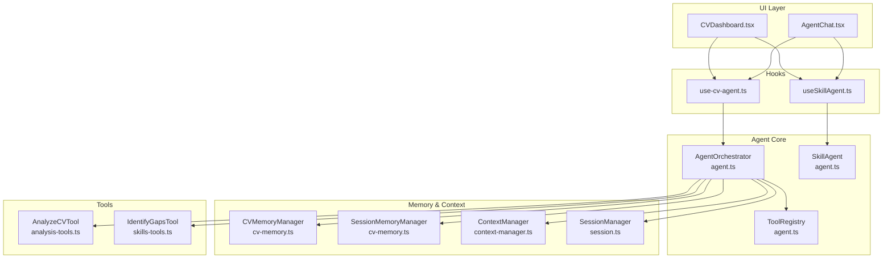
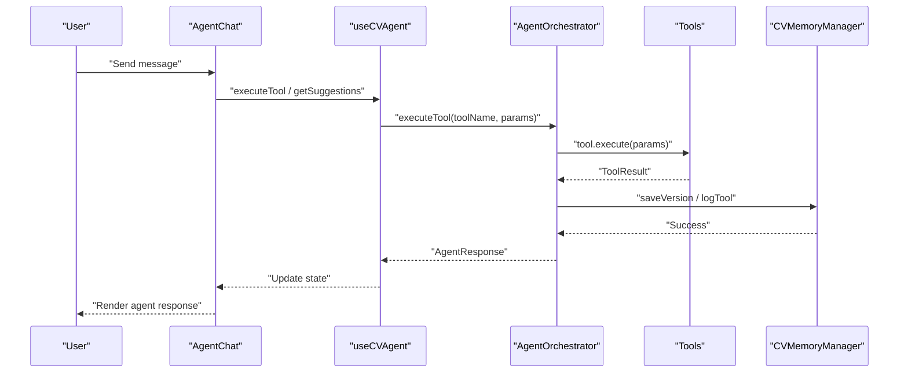
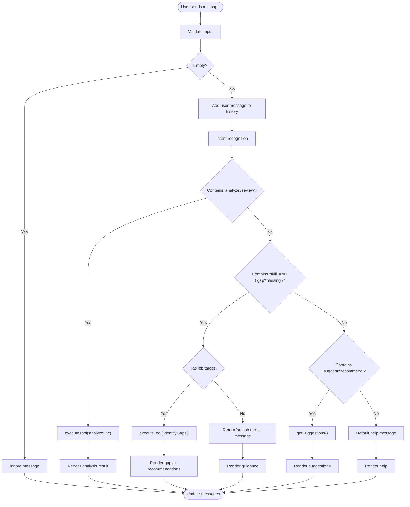
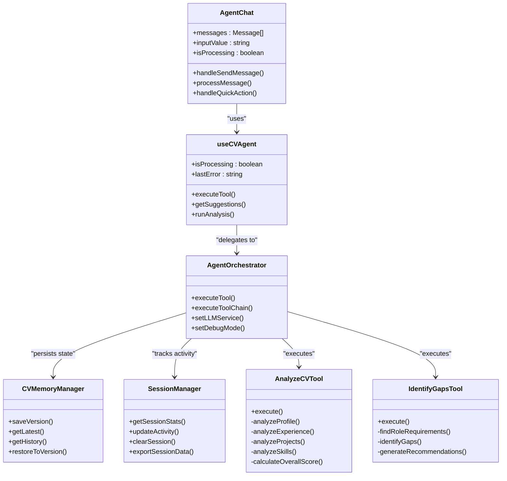

# Agent Chat Interface

<cite>
**Referenced Files in This Document**
- [AgentChat.tsx](file://src/components/agent/AgentChat.tsx)
- [use-cv-agent.ts](file://src/hooks/use-cv-agent.ts)
- [useSkillAgent.ts](file://src/agent/hooks/useSkillAgent.ts)
- [agent.ts](file://src/agent/core/agent.ts)
- [session.ts](file://src/agent/core/session.ts)
- [cv-memory.ts](file://src/agent/memory/cv-memory.ts)
- [analysis-tools.ts](file://src/agent/tools/analysis-tools.ts)
- [skills-tools.ts](file://src/agent/tools/skills-tools.ts)
- [cv.schema.ts](file://src/agent/schemas/cv.schema.ts)
- [agent.schema.ts](file://src/agent/schemas/agent.schema.ts)
- [context-manager.ts](file://src/agent/context/context-manager.ts)
- [prompts.ts](file://src/agent/services/prompts.ts)
- [AgentProvider.tsx](file://src/components/AgentProvider.tsx)
- [CVDashboard.tsx](file://src/components/agent/CVDashboard.tsx)
</cite>

## Table of Contents
1. [Introduction](#introduction)
2. [Project Structure](#project-structure)
3. [Core Components](#core-components)
4. [Architecture Overview](#architecture-overview)
5. [Detailed Component Analysis](#detailed-component-analysis)
6. [Dependency Analysis](#dependency-analysis)
7. [Performance Considerations](#performance-considerations)
8. [Troubleshooting Guide](#troubleshooting-guide)
9. [Conclusion](#conclusion)

## Introduction
The Agent Chat Interface provides an AI-powered CV assistance experience through a natural chat interface. It enables users to analyze their CVs, identify skill gaps, receive contextual suggestions, and interact with an intelligent agent via typed messages or quick action buttons. The component integrates tightly with the CV agent system, session tracking, and reactive CV memory to deliver a seamless conversational experience.

## Project Structure
The Agent Chat Interface is implemented as a React component that composes several agent subsystems:
- UI layer: AgentChat renders message bubbles, timestamps, suggestion chips, and quick actions
- State management: Uses hooks to access CV data, agent execution state, and session stats
- Agent orchestration: Delegates tool execution to the AgentOrchestrator
- Memory and context: Reactive stores for CV versions, session logs, and agent context
- Tools: Specialized tools for analysis, skill gap detection, and suggestions

**Diagram sources**
- [AgentChat.tsx:16-239](file://src/components/agent/AgentChat.tsx#L16-L239)
- [use-cv-agent.ts:13-104](file://src/hooks/use-cv-agent.ts#L13-L104)
- [useSkillAgent.ts:38-184](file://src/agent/hooks/useSkillAgent.ts#L38-L184)
- [agent.ts:60-168](file://src/agent/core/agent.ts#L60-L168)
- [cv-memory.ts:20-149](file://src/agent/memory/cv-memory.ts#L20-L149)
- [session.ts:7-200](file://src/agent/core/session.ts#L7-L200)
- [analysis-tools.ts:13-141](file://src/agent/tools/analysis-tools.ts#L13-L141)
- [skills-tools.ts:94-202](file://src/agent/tools/skills-tools.ts#L94-L202)

**Section sources**
- [AgentChat.tsx:16-239](file://src/components/agent/AgentChat.tsx#L16-L239)
- [use-cv-agent.ts:13-104](file://src/hooks/use-cv-agent.ts#L13-L104)
- [agent.ts:60-168](file://src/agent/core/agent.ts#L60-L168)
- [cv-memory.ts:20-149](file://src/agent/memory/cv-memory.ts#L20-L149)
- [session.ts:7-200](file://src/agent/core/session.ts#L7-L200)
- [analysis-tools.ts:13-141](file://src/agent/tools/analysis-tools.ts#L13-L141)
- [skills-tools.ts:94-202](file://src/agent/tools/skills-tools.ts#L94-L202)

## Core Components
- AgentChat: Renders the chat UI, manages message history, handles user input, and triggers intent recognition and tool execution
- useCVAgent: Provides execution of tools, suggestions retrieval, and session stats; exposes isProcessing and lastError
- AgentOrchestrator: Central coordinator for tool execution, logging, and session updates
- CVMemoryManager: Reactive store for CV versions and history
- SessionManager: Persistent session tracking with stats and export capabilities
- Tools: Analysis and skills tools for CV analysis, keyword optimization, consistency checks, and skill gap identification

**Section sources**
- [AgentChat.tsx:5-122](file://src/components/agent/AgentChat.tsx#L5-L122)
- [use-cv-agent.ts:13-104](file://src/hooks/use-cv-agent.ts#L13-L104)
- [agent.ts:60-168](file://src/agent/core/agent.ts#L60-L168)
- [cv-memory.ts:20-149](file://src/agent/memory/cv-memory.ts#L20-L149)
- [session.ts:7-200](file://src/agent/core/session.ts#L7-L200)
- [analysis-tools.ts:13-141](file://src/agent/tools/analysis-tools.ts#L13-L141)
- [skills-tools.ts:94-202](file://src/agent/tools/skills-tools.ts#L94-L202)

## Architecture Overview
The Agent Chat Interface follows a layered architecture:
- Presentation layer: AgentChat renders UI and delegates actions
- Hook layer: useCVAgent encapsulates agent orchestration and state
- Agent layer: AgentOrchestrator coordinates tool execution and logging
- Memory layer: CVMemoryManager and SessionMemoryManager persist state
- Tool layer: Specialized tools implement CV analysis and skill gap detection
- Context layer: ContextManager maintains agent preferences and target profile

**Diagram sources**
- [AgentChat.tsx:32-122](file://src/components/agent/AgentChat.tsx#L32-L122)
- [use-cv-agent.ts:20-49](file://src/hooks/use-cv-agent.ts#L20-L49)
- [agent.ts:78-127](file://src/agent/core/agent.ts#L78-L127)
- [cv-memory.ts:56-73](file://src/agent/memory/cv-memory.ts#L56-L73)

## Detailed Component Analysis

### AgentChat Component
AgentChat implements a complete chat interface with:
- Message handling: user messages, agent responses, and system notifications
- Intent recognition: analyzes user input to route to appropriate tools
- State management: maintains message history, processing state, and quick action buttons
- UI rendering: message bubbles, timestamps, and suggestion chips

**Diagram sources**
- [AgentChat.tsx:32-122](file://src/components/agent/AgentChat.tsx#L32-L122)

Key features:
- Message types: user, agent, and system notifications
- Timestamps: displayed below each message bubble
- Suggestion chips: clickable recommendations embedded in agent responses
- Quick action buttons: pre-defined prompts for common tasks
- Processing indicators: visual feedback during tool execution

**Section sources**
- [AgentChat.tsx:5-122](file://src/components/agent/AgentChat.tsx#L5-L122)
- [AgentChat.tsx:128-239](file://src/components/agent/AgentChat.tsx#L128-L239)

### Intent Recognition System
The intent recognition system performs simple keyword-based routing:
- Analyze requests: detect "analyze" or "review" keywords
- Skill gap detection: detect "skill" combined with "gap" or "missing"
- Suggestions: detect "suggest" or "recommend" keywords
- Default fallback: comprehensive help message with available actions

Implementation pattern:
- Lowercase input for case-insensitive matching
- Route to appropriate tool execution based on detected intent
- Generate contextual responses with suggestions where applicable

**Section sources**
- [AgentChat.tsx:61-122](file://src/components/agent/AgentChat.tsx#L61-L122)

### State Management
AgentChat maintains three primary state areas:
- Message history: array of Message objects with type, content, timestamp, and optional suggestions
- Input state: controlled input field for user messages
- Processing state: shared isProcessing flag from useCVAgent for UI feedback

Message structure:
- id: unique identifier
- type: 'user' | 'agent' | 'system'
- content: response text
- timestamp: Date object
- suggestions: optional array of recommendation strings

**Section sources**
- [AgentChat.tsx:5-11](file://src/components/agent/AgentChat.tsx#L5-L11)
- [AgentChat.tsx:17-29](file://src/components/agent/AgentChat.tsx#L17-L29)

### Chat UI Structure
The chat UI consists of four main regions:
- Header: session information display
- Messages area: scrollable container for message bubbles
- Quick actions: horizontal scrolling action buttons
- Input area: text input with send button

Visual design:
- Message bubbles: user messages right-aligned, agent/system left-aligned
- Color coding: user (blue), system (red), agent (gray)
- Suggestion chips: small clickable elements below agent messages
- Timestamps: subtle text below each message bubble

**Section sources**
- [AgentChat.tsx:128-239](file://src/components/agent/AgentChat.tsx#L128-L239)

### Integration with CV Agent Hook
The component integrates with useCVAgent through:
- executeTool: runs analysis and skill gap detection tools
- getSuggestions: retrieves contextual recommendations
- isProcessing: controls UI state during tool execution
- useCVData: accesses current CV context for gap analysis
- useSession: displays session statistics

Hook responsibilities:
- Error handling and loading state management
- Tool execution with session activity logging
- Context management for target roles and preferences
- State export for debugging and analytics

**Section sources**
- [AgentChat.tsx:28-30](file://src/components/agent/AgentChat.tsx#L28-L30)
- [use-cv-agent.ts:13-104](file://src/hooks/use-cv-agent.ts#L13-L104)

### Session Tracking
Session tracking provides:
- Duration calculation: minutes since session start
- Action counting: total actions performed
- Activity monitoring: last activity timestamp
- Persistence: localStorage-backed session state
- Export capability: complete session data serialization

Session lifecycle:
- Automatic initialization on component mount
- Periodic updates via polling
- Manual clearing and reinitialization
- Active session detection (last 30 minutes)

**Section sources**
- [AgentChat.tsx:29-30](file://src/components/agent/AgentChat.tsx#L29-L30)
- [session.ts:157-183](file://src/agent/core/session.ts#L157-L183)

### Example Chat Interactions
Common interaction patterns:
- CV Analysis: "Analyze my CV" → Returns overall score and strengths/weaknesses
- Skill Gap Detection: "What skills am I missing?" → Identifies gaps relative to target role
- Suggestions: "Give me suggestions" → Contextual recommendations based on CV and preferences
- Guidance: "How do I improve?" → Help message with available actions

**Section sources**
- [AgentChat.tsx:61-122](file://src/components/agent/AgentChat.tsx#L61-L122)

## Dependency Analysis
The Agent Chat Interface has the following key dependencies:

**Diagram sources**
- [AgentChat.tsx:28-122](file://src/components/agent/AgentChat.tsx#L28-L122)
- [use-cv-agent.ts:20-79](file://src/hooks/use-cv-agent.ts#L20-L79)
- [agent.ts:78-127](file://src/agent/core/agent.ts#L78-L127)
- [cv-memory.ts:56-109](file://src/agent/memory/cv-memory.ts#L56-L109)
- [session.ts:57-70](file://src/agent/core/session.ts#L57-L70)
- [analysis-tools.ts:21-72](file://src/agent/tools/analysis-tools.ts#L21-L72)
- [skills-tools.ts:110-201](file://src/agent/tools/skills-tools.ts#L110-L201)

**Section sources**
- [AgentChat.tsx:28-122](file://src/components/agent/AgentChat.tsx#L28-L122)
- [use-cv-agent.ts:20-79](file://src/hooks/use-cv-agent.ts#L20-L79)
- [agent.ts:78-127](file://src/agent/core/agent.ts#L78-L127)
- [cv-memory.ts:56-109](file://src/agent/memory/cv-memory.ts#L56-L109)
- [session.ts:57-70](file://src/agent/core/session.ts#L57-L70)
- [analysis-tools.ts:21-72](file://src/agent/tools/analysis-tools.ts#L21-L72)
- [skills-tools.ts:110-201](file://src/agent/tools/skills-tools.ts#L110-L201)

## Performance Considerations
- Debounce user input: Consider debouncing rapid successive messages
- Virtualized lists: Implement virtualization for long message histories
- Lazy loading: Load tools and suggestions on demand
- Caching: Cache recent analysis results for repeated queries
- Throttling: Limit concurrent tool executions to prevent resource exhaustion
- Memory management: Periodically prune old session data and message history

## Troubleshooting Guide
Common issues and resolutions:
- Tool execution failures: Check network connectivity and API keys
- Empty suggestions: Verify CV completeness and context configuration
- Stuck loading states: Monitor isProcessing flag and error boundaries
- Session persistence errors: Validate localStorage availability and quota
- Memory leaks: Ensure proper cleanup of subscriptions and intervals

Error handling patterns:
- Try/catch blocks around tool execution
- Graceful degradation for unavailable tools
- User-friendly error messages instead of raw exceptions
- Session state recovery after failures

**Section sources**
- [use-cv-agent.ts:40-46](file://src/hooks/use-cv-agent.ts#L40-L46)
- [agent.ts:115-126](file://src/agent/core/agent.ts#L115-L126)
- [session.ts:75-90](file://src/agent/core/session.ts#L75-L90)

## Conclusion
The Agent Chat Interface provides a robust foundation for AI-powered CV assistance through an intuitive chat interface. Its modular architecture enables easy extension with new tools and capabilities while maintaining clean separation of concerns. The integration with reactive memory systems and session tracking ensures persistent, context-aware interactions that adapt to user needs and preferences.