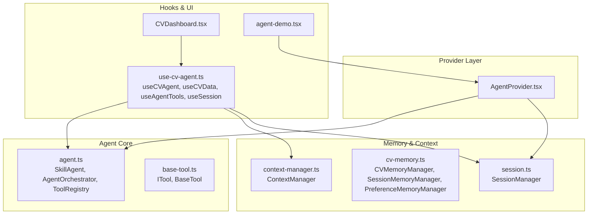
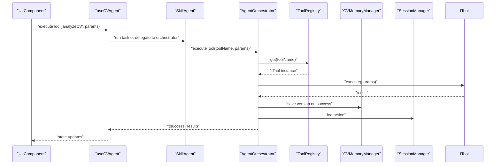
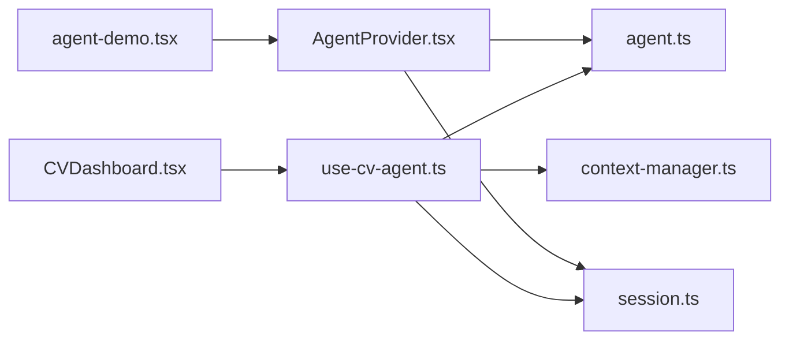

# Agent Provider System

<cite>
**Referenced Files in This Document**
- [AgentProvider.tsx](file://src/components/AgentProvider.tsx)
- [agent.ts](file://src/agent/core/agent.ts)
- [session.ts](file://src/agent/core/session.ts)
- [cv-memory.ts](file://src/agent/memory/cv-memory.ts)
- [context-manager.ts](file://src/agent/memory/context-manager.ts)
- [base-tool.ts](file://src/agent/tools/base-tool.ts)
- [agent.schema.ts](file://src/agent/schemas/agent.schema.ts)
- [cv.schema.ts](file://src/agent/schemas/cv.schema.ts)
- [use-cv-agent.ts](file://src/hooks/use-cv-agent.ts)
- [CVDashboard.tsx](file://src/components/agent/CVDashboard.tsx)
- [agent-demo.tsx](file://src/routes/agent-demo.tsx)
- [index.ts](file://src/agent/index.ts)
- [main.tsx](file://src/main.tsx)
</cite>

## Table of Contents
1. [Introduction](#introduction)
2. [Project Structure](#project-structure)
3. [Core Components](#core-components)
4. [Architecture Overview](#architecture-overview)
5. [Detailed Component Analysis](#detailed-component-analysis)
6. [Dependency Analysis](#dependency-analysis)
7. [Performance Considerations](#performance-considerations)
8. [Troubleshooting Guide](#troubleshooting-guide)
9. [Conclusion](#conclusion)

## Introduction
The Agent Provider System is a React-based state and orchestration layer that powers AI agent interactions for CV and portfolio management. It exposes a provider component that initializes global tool registries, starts persistent sessions, and shares agent capabilities across UI components via React hooks. The system integrates tightly with a TanStack Store-based memory subsystem, a context manager for user profiles, and a pluggable agent orchestrator that coordinates tool execution and logs actions.

## Project Structure
The Agent Provider lives in the components layer and orchestrates agent capabilities exported from the agent core. The hooks consume state from memory managers and session managers, while the UI components render dashboards and tool listings.

**Diagram sources**
- [AgentProvider.tsx:12-29](file://src/components/AgentProvider.tsx#L12-L29)
- [agent.ts:60-168](file://src/agent/core/agent.ts#L60-L168)
- [base-tool.ts:6-49](file://src/agent/tools/base-tool.ts#L6-L49)
- [context-manager.ts:7-140](file://src/agent/memory/context-manager.ts#L7-L140)
- [cv-memory.ts:19-289](file://src/agent/memory/cv-memory.ts#L19-L289)
- [session.ts:7-203](file://src/agent/core/session.ts#L7-L203)
- [use-cv-agent.ts:10-181](file://src/hooks/use-cv-agent.ts#L10-L181)
- [CVDashboard.tsx:7-174](file://src/components/agent/CVDashboard.tsx#L7-L174)
- [agent-demo.tsx:17-137](file://src/routes/agent-demo.tsx#L17-L137)

**Section sources**
- [AgentProvider.tsx:12-29](file://src/components/AgentProvider.tsx#L12-L29)
- [agent.ts:60-168](file://src/agent/core/agent.ts#L60-L168)
- [cv-memory.ts:19-289](file://src/agent/memory/cv-memory.ts#L19-L289)
- [context-manager.ts:7-140](file://src/agent/memory/context-manager.ts#L7-L140)
- [session.ts:7-203](file://src/agent/core/session.ts#L7-L203)
- [use-cv-agent.ts:10-181](file://src/hooks/use-cv-agent.ts#L10-L181)
- [CVDashboard.tsx:7-174](file://src/components/agent/CVDashboard.tsx#L7-L174)
- [agent-demo.tsx:17-137](file://src/routes/agent-demo.tsx#L17-L137)

## Core Components
- AgentProvider: Initializes the global tool registry and starts a session on mount; cleans up on unmount.
- SkillAgent and AgentOrchestrator: Orchestrate tasks, manage tool execution, and maintain debug mode.
- ToolRegistry: Central registry for available tools implementing ITool.
- ContextManager: Manages user profile context (job target, domain, experience level, goals).
- CVMemoryManager, SessionMemoryManager, PreferenceMemoryManager: Reactive state stores for CV versions, session logs, and user preferences.
- SessionManager: Persistent session lifecycle with localStorage-backed storage.
- Hooks: useCVAgent, useCVData, useAgentTools, useSession expose agent capabilities and state to UI components.

**Section sources**
- [AgentProvider.tsx:12-29](file://src/components/AgentProvider.tsx#L12-L29)
- [agent.ts:60-168](file://src/agent/core/agent.ts#L60-L168)
- [agent.ts:173-376](file://src/agent/core/agent.ts#L173-L376)
- [base-tool.ts:6-49](file://src/agent/tools/base-tool.ts#L6-L49)
- [context-manager.ts:7-140](file://src/agent/memory/context-manager.ts#L7-L140)
- [cv-memory.ts:19-289](file://src/agent/memory/cv-memory.ts#L19-L289)
- [session.ts:7-203](file://src/agent/core/session.ts#L7-L203)
- [use-cv-agent.ts:10-181](file://src/hooks/use-cv-agent.ts#L10-L181)

## Architecture Overview
The Agent Provider sets up the runtime environment for agent interactions. It ensures the ToolRegistry is globally accessible and starts a session. Hooks consume the agent orchestrator, memory managers, and session manager to provide UI components with reactive state and agent capabilities.

**Diagram sources**
- [use-cv-agent.ts:17-46](file://src/hooks/use-cv-agent.ts#L17-L46)
- [agent.ts:173-376](file://src/agent/core/agent.ts#L173-L376)
- [agent.ts:78-127](file://src/agent/core/agent.ts#L78-L127)
- [base-tool.ts:6-49](file://src/agent/tools/base-tool.ts#L6-L49)
- [cv-memory.ts:55-72](file://src/agent/memory/cv-memory.ts#L55-L72)
- [session.ts:57-70](file://src/agent/core/session.ts#L57-L70)

## Detailed Component Analysis

### AgentProvider
- Purpose: Initialize global tool registry and start session on mount; provide agent context to children.
- Initialization: On mount, creates a singleton ToolRegistry and attaches it to the window for hook access; starts a session via sessionManager.
- Cleanup: Logs unmount event; no explicit cleanup of registry or session is performed in the provider.

Usage pattern:
- Wrap UI routes requiring agent capabilities with the provider.
- Access tools and agent features through hooks.

**Section sources**
- [AgentProvider.tsx:12-29](file://src/components/AgentProvider.tsx#L12-L29)
- [agent.ts:11-55](file://src/agent/core/agent.ts#L11-L55)
- [session.ts:33-52](file://src/agent/core/session.ts#L33-L52)

### AgentOrchestrator and SkillAgent
- AgentOrchestrator: Executes tools, logs durations, records session actions, and supports debug mode.
- SkillAgent: Provides high-level tasks (analyze, optimize, generate summary, improve experience) and delegates to orchestrator; persists CV versions on success.

Key behaviors:
- Tool execution with structured success/error results.
- Action logging to session memory.
- Task composition returning standardized AgentResponse with metadata.

**Section sources**
- [agent.ts:60-168](file://src/agent/core/agent.ts#L60-L168)
- [agent.ts:173-376](file://src/agent/core/agent.ts#L173-L376)

### ToolRegistry and BaseTool
- ToolRegistry: Centralized registration and retrieval of tools; supports bulk registration and listing.
- BaseTool: Defines ITool contract and safe execution wrapper with validation and error handling.

**Section sources**
- [agent.ts:11-55](file://src/agent/core/agent.ts#L11-L55)
- [base-tool.ts:6-49](file://src/agent/tools/base-tool.ts#L6-L49)

### ContextManager
- Manages user profile context (job target, domain, experience level, application goals).
- Provides contextual suggestions and import/export utilities.

**Section sources**
- [context-manager.ts:7-140](file://src/agent/memory/context-manager.ts#L7-L140)

### Memory Managers and SessionManager
- CVMemoryManager: Reactive store for CV versions, derived states, and JSON import/export.
- SessionMemoryManager: Logs tool executions per session.
- PreferenceMemoryManager: Stores user preferences with reset capability.
- SessionManager: Singleton session lifecycle with localStorage persistence, activity updates, and stats.

**Section sources**
- [cv-memory.ts:19-289](file://src/agent/memory/cv-memory.ts#L19-L289)
- [session.ts:7-203](file://src/agent/core/session.ts#L7-L203)

### Hooks: useCVAgent, useCVData, useAgentTools, useSession
- useCVAgent: Exposes executeTool, getSuggestions, runAnalysis, updateContext, exportState, plus loading and error state.
- useCVData: Subscribes to reactive CV store for CV, context, completeness, skills, and lastModified.
- useAgentTools: Reads global ToolRegistry to categorize tools for UI.
- useSession: Provides session stats, periodic refresh, clear/export utilities, and activity status.

**Section sources**
- [use-cv-agent.ts:10-181](file://src/hooks/use-cv-agent.ts#L10-L181)

### UI Integration: CVDashboard and Agent Demo Route
- CVDashboard: Renders CV completeness, stats, skills breakdown, quick actions, and target profile info using hooks.
- Agent Demo Route: Wraps the dashboard and chat UI with AgentProvider and lists available tools and architecture.

**Section sources**
- [CVDashboard.tsx:7-174](file://src/components/agent/CVDashboard.tsx#L7-L174)
- [agent-demo.tsx:17-137](file://src/routes/agent-demo.tsx#L17-L137)

## Dependency Analysis
The provider depends on the agent core and session manager. Hooks depend on the agent core, memory managers, and session manager. UI components depend on hooks.

**Diagram sources**
- [AgentProvider.tsx:12-29](file://src/components/AgentProvider.tsx#L12-L29)
- [agent.ts:60-168](file://src/agent/core/agent.ts#L60-L168)
- [session.ts:7-203](file://src/agent/core/session.ts#L7-L203)
- [use-cv-agent.ts:10-181](file://src/hooks/use-cv-agent.ts#L10-L181)
- [context-manager.ts:7-140](file://src/agent/memory/context-manager.ts#L7-L140)
- [CVDashboard.tsx:7-174](file://src/components/agent/CVDashboard.tsx#L7-L174)
- [agent-demo.tsx:17-137](file://src/routes/agent-demo.tsx#L17-L137)

**Section sources**
- [AgentProvider.tsx:12-29](file://src/components/AgentProvider.tsx#L12-L29)
- [agent.ts:60-168](file://src/agent/core/agent.ts#L60-L168)
- [session.ts:7-203](file://src/agent/core/session.ts#L7-L203)
- [use-cv-agent.ts:10-181](file://src/hooks/use-cv-agent.ts#L10-L181)
- [context-manager.ts:7-140](file://src/agent/memory/context-manager.ts#L7-L140)
- [CVDashboard.tsx:7-174](file://src/components/agent/CVDashboard.tsx#L7-L174)
- [agent-demo.tsx:17-137](file://src/routes/agent-demo.tsx#L17-L137)

## Performance Considerations
- Minimize re-renders by leveraging derived states and memoized computations in hooks.
- Use useCallback for action handlers to prevent unnecessary prop changes.
- Debounce or throttle frequent updates (e.g., session stats interval) to reduce render pressure.
- Prefer granular subscriptions to reactive stores to avoid full-state churn.
- Avoid heavy synchronous work in render; defer to effects or background tasks.

## Troubleshooting Guide
Common issues and resolutions:
- Tool not found: Ensure tools are registered in the ToolRegistry before execution; verify tool names match metadata.
- Session persistence failures: Check localStorage availability and quota; fallback logic handles errors during load/save.
- Context import failures: Validate JSON structure against context schema; importContext returns boolean indicating success.
- Hook access errors: Confirm AgentProvider wraps the consuming components; global registry is attached on mount.

**Section sources**
- [agent.ts:82-89](file://src/agent/core/agent.ts#L82-L89)
- [session.ts:95-112](file://src/agent/core/session.ts#L95-L112)
- [context-manager.ts:127-136](file://src/agent/memory/context-manager.ts#L127-L136)
- [AgentProvider.tsx:12-29](file://src/components/AgentProvider.tsx#L12-L29)

## Conclusion
The Agent Provider System provides a cohesive foundation for AI agent interactions in the CV portfolio builder. It centralizes tool orchestration, maintains persistent sessions, and exposes reactive state to UI components through well-defined hooks. The architecture balances modularity and performance, enabling scalable enhancements and robust error handling.