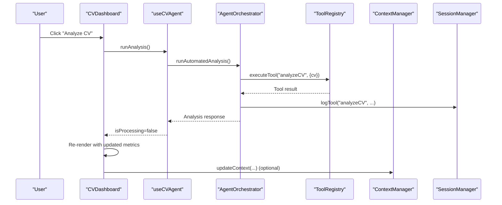
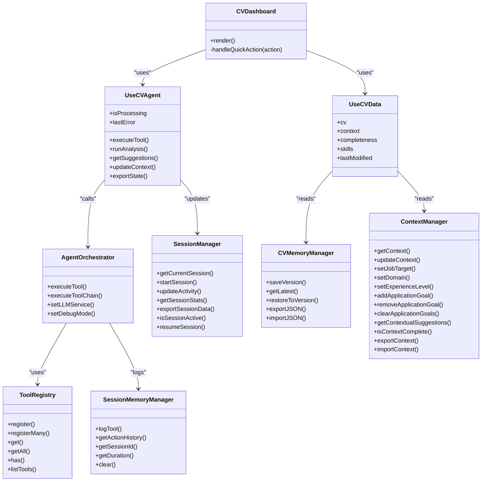
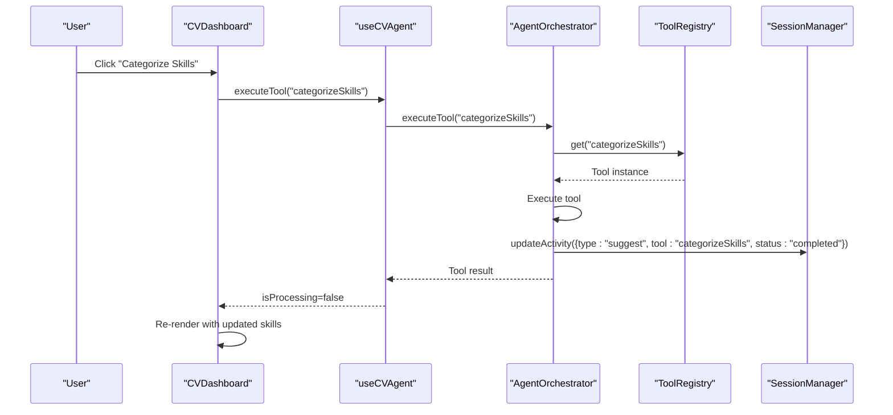
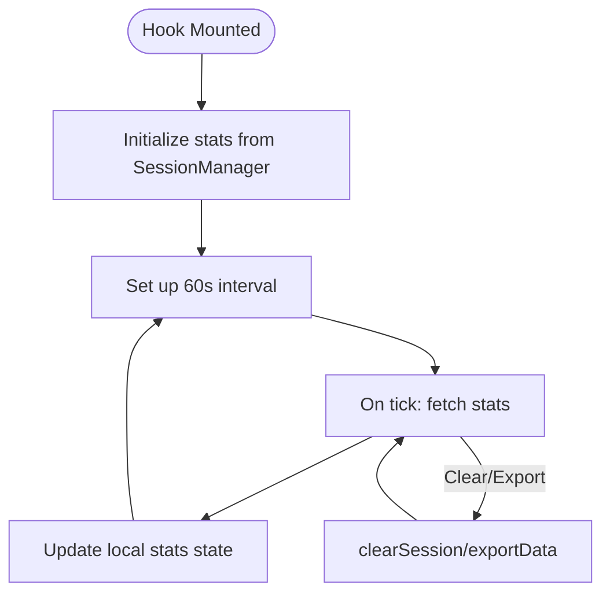
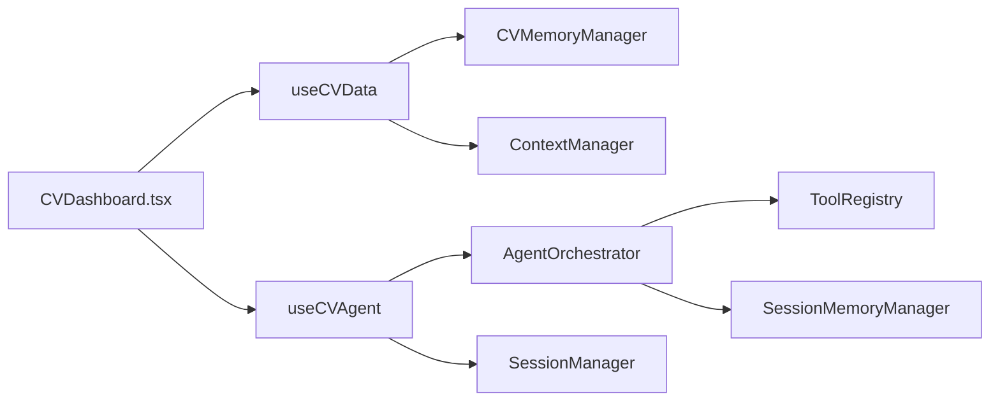

# CV Dashboard

<cite>
**Referenced Files in This Document**
- [CVDashboard.tsx](file://src/components/agent/CVDashboard.tsx)
- [use-cv-agent.ts](file://src/hooks/use-cv-agent.ts)
- [agent.ts](file://src/agent/core/agent.ts)
- [cv-memory.ts](file://src/agent/memory/cv-memory.ts)
- [session.ts](file://src/agent/core/session.ts)
- [context-manager.ts](file://src/agent/memory/context-manager.ts)
- [cv.schema.ts](file://src/agent/schemas/cv.schema.ts)
- [agent.schema.ts](file://src/agent/schemas/agent.schema.ts)
- [base-tool.ts](file://src/agent/tools/base-tool.ts)
- [skills-tools.ts](file://src/agent/tools/skills-tools.ts)
- [experience-tools.ts](file://src/agent/tools/experience-tools.ts)
- [profile-tools.ts](file://src/agent/tools/profile-tools.ts)
- [project-tools.ts](file://src/agent/tools/project-tools.ts)
</cite>

## Table of Contents
1. [Introduction](#introduction)
2. [Project Structure](#project-structure)
3. [Core Components](#core-components)
4. [Architecture Overview](#architecture-overview)
5. [Detailed Component Analysis](#detailed-component-analysis)
6. [Dependency Analysis](#dependency-analysis)
7. [Performance Considerations](#performance-considerations)
8. [Troubleshooting Guide](#troubleshooting-guide)
9. [Conclusion](#conclusion)
10. [Appendices](#appendices)

## Introduction
The CV Dashboard component is the central hub for CV management and visualization. It provides a real-time overview of CV completeness, key metrics, and actionable insights. The dashboard integrates with CV data hooks to reflect updates instantly, coordinates agent tools for analysis and optimization, and tracks session statistics to monitor engagement and progress. It also surfaces contextual information to guide users toward a tailored and effective CV.

## Project Structure
The CV Dashboard lives within the components layer and leverages hooks that connect to the agent orchestration layer and memory stores. The agent orchestrator coordinates tool execution, while memory managers persist CV data, session state, and preferences. Context and session managers track user intent and activity.

```mermaid
graph TB
subgraph "UI Layer"
Dashboard["CVDashboard.tsx"]
end
subgraph "Hooks"
Hooks["use-cv-agent.ts"]
end
subgraph "Agent Orchestration"
Agent["agent.ts<br/>AgentOrchestrator"]
Tools["BaseTool + Tools"]
end
subgraph "Memory & State"
CVStore["cv-memory.ts<br/>CVMemoryManager"]
SessionStore["cv-memory.ts<br/>SessionMemoryManager"]
ContextMgr["context-manager.ts<br/>ContextManager"]
SessionMgr["session.ts<br/>SessionManager"]
end
Dashboard --> Hooks
Hooks --> Agent
Hooks --> CVStore
Hooks --> SessionMgr
Agent --> Tools
Agent --> SessionStore
CVStore --> ContextMgr
```

**Diagram sources**
- [CVDashboard.tsx:1-175](file://src/components/agent/CVDashboard.tsx#L1-L175)
- [use-cv-agent.ts:1-185](file://src/hooks/use-cv-agent.ts#L1-L185)
- [agent.ts:1-414](file://src/agent/core/agent.ts#L1-L414)
- [cv-memory.ts:1-290](file://src/agent/memory/cv-memory.ts#L1-L290)
- [session.ts:1-204](file://src/agent/core/session.ts#L1-L204)
- [context-manager.ts:1-141](file://src/agent/memory/context-manager.ts#L1-L141)

**Section sources**
- [CVDashboard.tsx:1-175](file://src/components/agent/CVDashboard.tsx#L1-L175)
- [use-cv-agent.ts:1-185](file://src/hooks/use-cv-agent.ts#L1-L185)
- [agent.ts:1-414](file://src/agent/core/agent.ts#L1-L414)
- [cv-memory.ts:1-290](file://src/agent/memory/cv-memory.ts#L1-L290)
- [session.ts:1-204](file://src/agent/core/session.ts#L1-L204)
- [context-manager.ts:1-141](file://src/agent/memory/context-manager.ts#L1-L141)

## Core Components
- CVDashboard: Renders CV completeness, metrics, skills breakdown, quick actions, and target profile context. It reacts to reactive CV data and agent processing states.
- useCVAgent hook: Exposes agent operations (run analysis, execute tools, get suggestions), processing state, and errors. It also exposes session stats via useSession.
- useCVData hook: Provides reactive access to CV data, context, completeness score, categorized skills, and last modified timestamp.
- AgentOrchestrator: Executes tools registered in the system, logs session activity, and manages orchestration lifecycle.
- CVMemoryManager: Stores CV versions, history, and derived states (e.g., last updated).
- SessionMemoryManager: Logs tool executions and maintains session metadata.
- ContextManager: Manages agent context (job target, domain, experience level, goals) and generates contextual suggestions.
- SessionManager: Persists session state to localStorage, tracks activity, computes stats, and supports export.

**Section sources**
- [CVDashboard.tsx:7-175](file://src/components/agent/CVDashboard.tsx#L7-L175)
- [use-cv-agent.ts:13-185](file://src/hooks/use-cv-agent.ts#L13-L185)
- [agent.ts:60-168](file://src/agent/core/agent.ts#L60-L168)
- [cv-memory.ts:19-148](file://src/agent/memory/cv-memory.ts#L19-L148)
- [cv-memory.ts:164-227](file://src/agent/memory/cv-memory.ts#L164-L227)
- [context-manager.ts:7-141](file://src/agent/memory/context-manager.ts#L7-L141)
- [session.ts:7-204](file://src/agent/core/session.ts#L7-L204)

## Architecture Overview
The dashboard follows a unidirectional data flow:
- UI subscribes to reactive CV data and agent state via hooks.
- User actions trigger agent operations that update memory stores.
- Memory stores notify subscribers, causing the dashboard to re-render with fresh data.
- SessionManager records activity for analytics and persistence.



**Diagram sources**
- [CVDashboard.tsx:11-23](file://src/components/agent/CVDashboard.tsx#L11-L23)
- [use-cv-agent.ts:69-79](file://src/hooks/use-cv-agent.ts#L69-L79)
- [agent.ts:78-127](file://src/agent/core/agent.ts#L78-L127)
- [session.ts:57-70](file://src/agent/core/session.ts#L57-L70)
- [context-manager.ts:27-29](file://src/agent/memory/context-manager.ts#L27-L29)

## Detailed Component Analysis

### CVDashboard Component
Responsibilities:
- Render CV completeness score with a circular progress indicator.
- Display quick stats for experiences, projects, and skills.
- Show skills breakdown by category with horizontal bars.
- Provide quick action buttons to run analysis, categorize skills, check consistency, and request suggestions.
- Present target profile context (job target, domain, experience level).

Data sources:
- useCVData provides cv, context, completeness, skills, lastModified.
- useCVAgent provides runAnalysis, executeTool, isProcessing.

User interactions:
- Buttons are disabled during processing to prevent concurrent operations.
- Quick actions route to handler that calls appropriate agent operations.

Accessibility and responsiveness:
- Uses semantic headings and lists.
- Grid-based layout for stats and action buttons adapts to screen sizes.
- Disabled states communicate processing status.

**Section sources**
- [CVDashboard.tsx:7-175](file://src/components/agent/CVDashboard.tsx#L7-L175)
- [use-cv-agent.ts:13-104](file://src/hooks/use-cv-agent.ts#L13-L104)
- [use-cv-agent.ts:109-123](file://src/hooks/use-cv-agent.ts#L109-L123)

### Data Hooks: useCVAgent and useCVData
useCVAgent:
- Centralizes agent operations with robust error handling and loading state.
- Exposes executeTool, runAnalysis, getSuggestions, updateContext, exportState.
- Integrates with SessionManager to record activity on tool execution.

useCVData:
- Subscribes to cvStore for CV, context, and lastModified.
- Subscribes to completeness score and categorized skills.
- Returns normalized data for dashboard rendering.

useSession:
- Periodically refreshes session statistics (every minute).
- Provides clearSession and exportData utilities.
- Reports session activity status.

**Section sources**
- [use-cv-agent.ts:13-104](file://src/hooks/use-cv-agent.ts#L13-L104)
- [use-cv-agent.ts:109-123](file://src/hooks/use-cv-agent.ts#L109-L123)
- [use-cv-agent.ts:157-184](file://src/hooks/use-cv-agent.ts#L157-L184)

### Agent Orchestration: AgentOrchestrator and Tool Registry
AgentOrchestrator:
- Registers and executes tools by name.
- Wraps tool execution with logging and session memory updates.
- Supports tool chaining and debug mode.

ToolRegistry:
- Manages tool discovery and availability.
- Enables dynamic tool resolution.

BaseTool and Tool implementations:
- Define metadata, validation, and safe execution wrappers.
- Tools include skills, experience, profile, and project management capabilities.

**Section sources**
- [agent.ts:60-168](file://src/agent/core/agent.ts#L60-L168)
- [agent.ts:11-55](file://src/agent/core/agent.ts#L11-L55)
- [base-tool.ts:6-72](file://src/agent/tools/base-tool.ts#L6-L72)
- [skills-tools.ts:13-210](file://src/agent/tools/skills-tools.ts#L13-L210)
- [experience-tools.ts:14-194](file://src/agent/tools/experience-tools.ts#L14-L194)
- [profile-tools.ts:14-142](file://src/agent/tools/profile-tools.ts#L14-L142)
- [project-tools.ts:14-168](file://src/agent/tools/project-tools.ts#L14-L168)

### Memory and State: CVMemoryManager, SessionMemoryManager, ContextManager, SessionManager
CVMemoryManager:
- Stores current CV, version history, and derived states.
- Provides saveVersion, getLatest, restoreToVersion, and export/import utilities.

SessionMemoryManager:
- Logs tool executions with timestamps and parameters.
- Computes session duration and maintains action history.

ContextManager:
- Updates and persists agent context (job target, domain, experience level, goals).
- Generates contextual suggestions and validates completeness.

SessionManager:
- Singleton managing session lifecycle with localStorage persistence.
- Tracks activity, computes stats, and supports export of session data.

**Section sources**
- [cv-memory.ts:19-148](file://src/agent/memory/cv-memory.ts#L19-L148)
- [cv-memory.ts:164-227](file://src/agent/memory/cv-memory.ts#L164-L227)
- [context-manager.ts:7-141](file://src/agent/memory/context-manager.ts#L7-L141)
- [session.ts:7-204](file://src/agent/core/session.ts#L7-L204)

### CV Schema and Types
Defines structured CV data including profile, skills, experience, projects, education, and metadata. Ensures type safety across the agent and UI layers.

**Section sources**
- [cv.schema.ts:1-79](file://src/agent/schemas/cv.schema.ts#L1-L79)
- [agent.schema.ts:1-62](file://src/agent/schemas/agent.schema.ts#L1-L62)

## Architecture Overview



**Diagram sources**
- [CVDashboard.tsx:7-175](file://src/components/agent/CVDashboard.tsx#L7-L175)
- [use-cv-agent.ts:13-104](file://src/hooks/use-cv-agent.ts#L13-L104)
- [agent.ts:60-168](file://src/agent/core/agent.ts#L60-L168)
- [cv-memory.ts:19-148](file://src/agent/memory/cv-memory.ts#L19-L148)
- [cv-memory.ts:164-227](file://src/agent/memory/cv-memory.ts#L164-L227)
- [context-manager.ts:7-141](file://src/agent/memory/context-manager.ts#L7-L141)
- [session.ts:7-204](file://src/agent/core/session.ts#L7-L204)

## Detailed Component Analysis

### Quick Actions Flow
The dashboard provides four quick actions: Analyze CV, Categorize Skills, Consistency Check, and Get Suggestions. Each action triggers a specific agent operation and updates session statistics.



**Diagram sources**
- [CVDashboard.tsx:11-23](file://src/components/agent/CVDashboard.tsx#L11-L23)
- [use-cv-agent.ts:20-49](file://src/hooks/use-cv-agent.ts#L20-L49)
- [agent.ts:78-127](file://src/agent/core/agent.ts#L78-L127)
- [session.ts:57-70](file://src/agent/core/session.ts#L57-L70)

### Session Statistics Tracking
SessionManager periodically updates statistics and persists session state. The useSession hook reads these stats and exposes them to the UI.



**Diagram sources**
- [use-cv-agent.ts:157-184](file://src/hooks/use-cv-agent.ts#L157-L184)
- [session.ts:129-151](file://src/agent/core/session.ts#L129-L151)

### CV Metrics Display
The dashboard renders:
- Completeness score with color-coded thresholds and a circular progress indicator.
- Counts for experiences, projects, and skills.
- Skills breakdown by category with proportional bar widths.
- Target profile context for job target, domain, and experience level.

These metrics are derived from reactive data sources and update automatically when underlying CV data changes.

**Section sources**
- [CVDashboard.tsx:25-171](file://src/components/agent/CVDashboard.tsx#L25-L171)
- [use-cv-agent.ts:109-123](file://src/hooks/use-cv-agent.ts#L109-L123)

### Data Refresh Mechanisms
- useCVData subscribes to cvStore and derived states, ensuring automatic re-render when CV data changes.
- useCVAgent manages isProcessing state around tool execution to coordinate UI feedback.
- useSession sets up periodic polling to keep session stats current.

**Section sources**
- [use-cv-agent.ts:109-123](file://src/hooks/use-cv-agent.ts#L109-L123)
- [use-cv-agent.ts:157-184](file://src/hooks/use-cv-agent.ts#L157-L184)

### User Interaction Flows
Common usage patterns:
- Open dashboard to review completeness and metrics.
- Click "Analyze CV" to run automated analysis and receive recommendations.
- Use "Categorize Skills" to group skills into logical categories.
- Trigger "Consistency Check" to identify potential issues.
- Request "Get Suggestions" to receive contextual advice.
- Adjust target profile context to tailor recommendations.

**Section sources**
- [CVDashboard.tsx:11-23](file://src/components/agent/CVDashboard.tsx#L11-L23)
- [use-cv-agent.ts:69-79](file://src/hooks/use-cv-agent.ts#L69-L79)
- [use-cv-agent.ts:20-49](file://src/hooks/use-cv-agent.ts#L20-L49)

## Dependency Analysis
The dashboard’s dependencies form a cohesive pipeline:
- UI depends on hooks for reactive data and agent operations.
- Hooks depend on agent orchestration and memory managers.
- Agent orchestration depends on tool registry and session memory.
- Memory managers depend on typed schemas for data integrity.



**Diagram sources**
- [CVDashboard.tsx:7-175](file://src/components/agent/CVDashboard.tsx#L7-L175)
- [use-cv-agent.ts:13-104](file://src/hooks/use-cv-agent.ts#L13-L104)
- [agent.ts:60-168](file://src/agent/core/agent.ts#L60-L168)
- [cv-memory.ts:19-148](file://src/agent/memory/cv-memory.ts#L19-L148)
- [cv-memory.ts:164-227](file://src/agent/memory/cv-memory.ts#L164-L227)
- [context-manager.ts:7-141](file://src/agent/memory/context-manager.ts#L7-L141)
- [session.ts:7-204](file://src/agent/core/session.ts#L7-L204)

**Section sources**
- [CVDashboard.tsx:7-175](file://src/components/agent/CVDashboard.tsx#L7-L175)
- [use-cv-agent.ts:13-104](file://src/hooks/use-cv-agent.ts#L13-L104)
- [agent.ts:60-168](file://src/agent/core/agent.ts#L60-L168)
- [cv-memory.ts:19-148](file://src/agent/memory/cv-memory.ts#L19-L148)
- [cv-memory.ts:164-227](file://src/agent/memory/cv-memory.ts#L164-L227)
- [context-manager.ts:7-141](file://src/agent/memory/context-manager.ts#L7-L141)
- [session.ts:7-204](file://src/agent/core/session.ts#L7-L204)

## Performance Considerations
- Reactive subscriptions: useCVData and useCVAgent minimize unnecessary renders by subscribing to specific slices of state.
- Debounced or periodic updates: useSession refreshes stats every minute to balance freshness and performance.
- Tool execution: AgentOrchestrator wraps operations with timing and logging to avoid long-running UI blocks.
- Derived states: CVMemoryManager and categorizedSkills reduce recomputation overhead.

[No sources needed since this section provides general guidance]

## Troubleshooting Guide
Common issues and resolutions:
- No data displayed: Verify cvStore has a valid CV and context. Check useCVData subscription.
- Actions disabled: isProcessing indicates ongoing operations; wait until disabled state clears.
- Tool failures: executeTool captures errors and sets lastError; inspect error messages and retry.
- Session not updating: Confirm useSession interval is active and SessionManager is saving/loading from localStorage.
- Context missing: Ensure ContextManager.updateContext is called with required fields (jobTarget, domain, experienceLevel).

**Section sources**
- [use-cv-agent.ts:14-49](file://src/hooks/use-cv-agent.ts#L14-L49)
- [use-cv-agent.ts:157-184](file://src/hooks/use-cv-agent.ts#L157-L184)
- [session.ts:75-112](file://src/agent/core/session.ts#L75-L112)
- [context-manager.ts:27-29](file://src/agent/memory/context-manager.ts#L27-L29)

## Conclusion
The CV Dashboard provides a comprehensive, real-time view of CV health and progress. By integrating reactive data hooks, agent orchestration, and persistent memory, it enables efficient management and optimization of CV content. Its modular design supports easy extension with additional tools and metrics while maintaining a clean, accessible user experience.

[No sources needed since this section summarizes without analyzing specific files]

## Appendices

### Accessibility Considerations
- Semantic markup: Headings and lists improve screen reader navigation.
- Disabled states: Buttons reflect processing state to avoid confusion.
- Color contrast: Progress indicator colors convey meaning at a glance.
- Responsive layout: Grid and flexbox adapt to various screen sizes.

[No sources needed since this section provides general guidance]