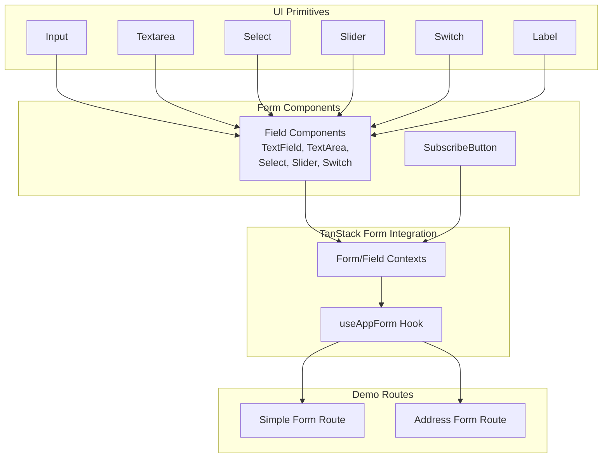
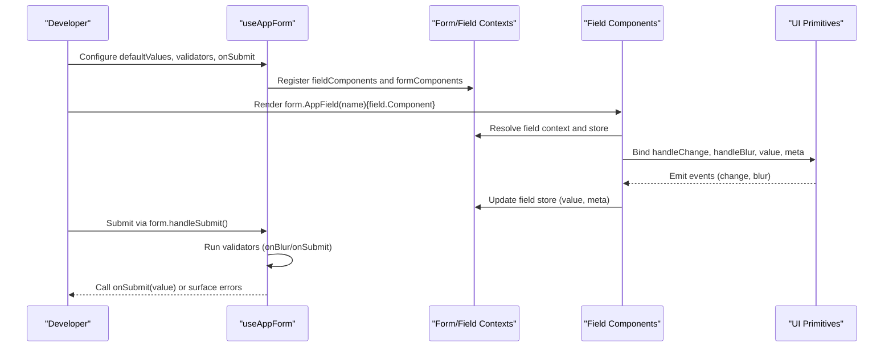
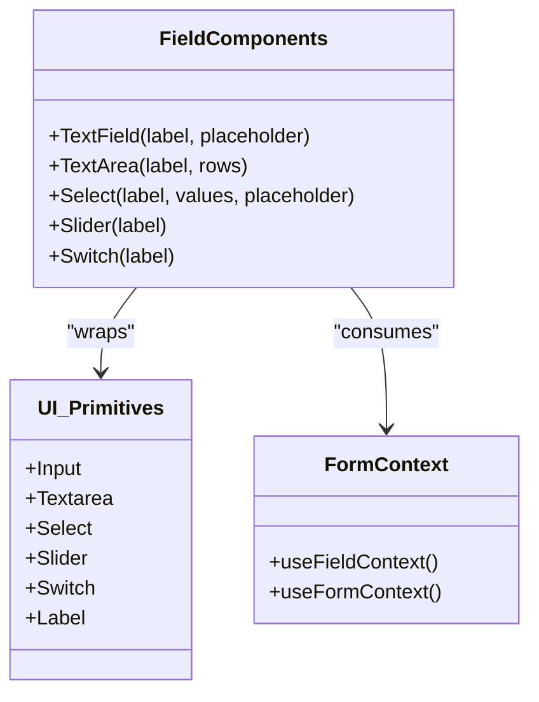
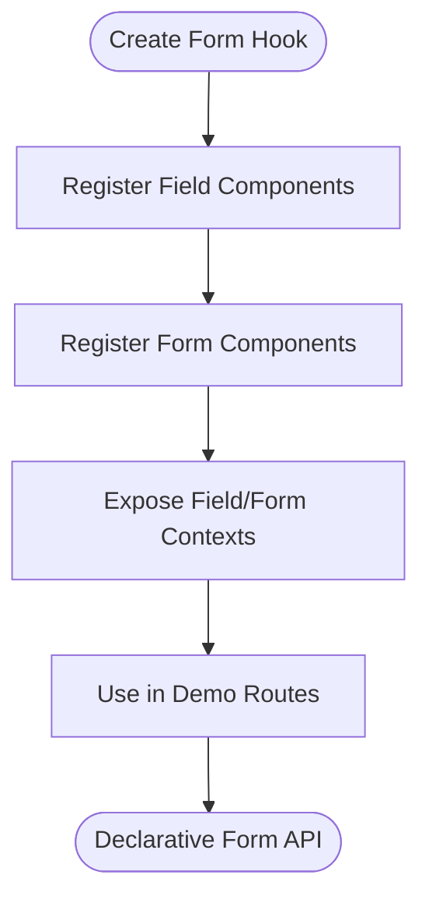
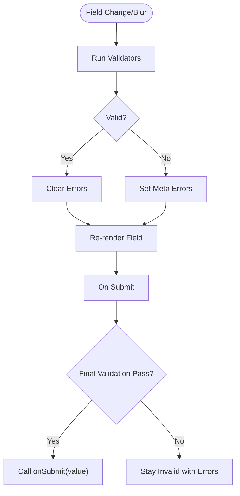
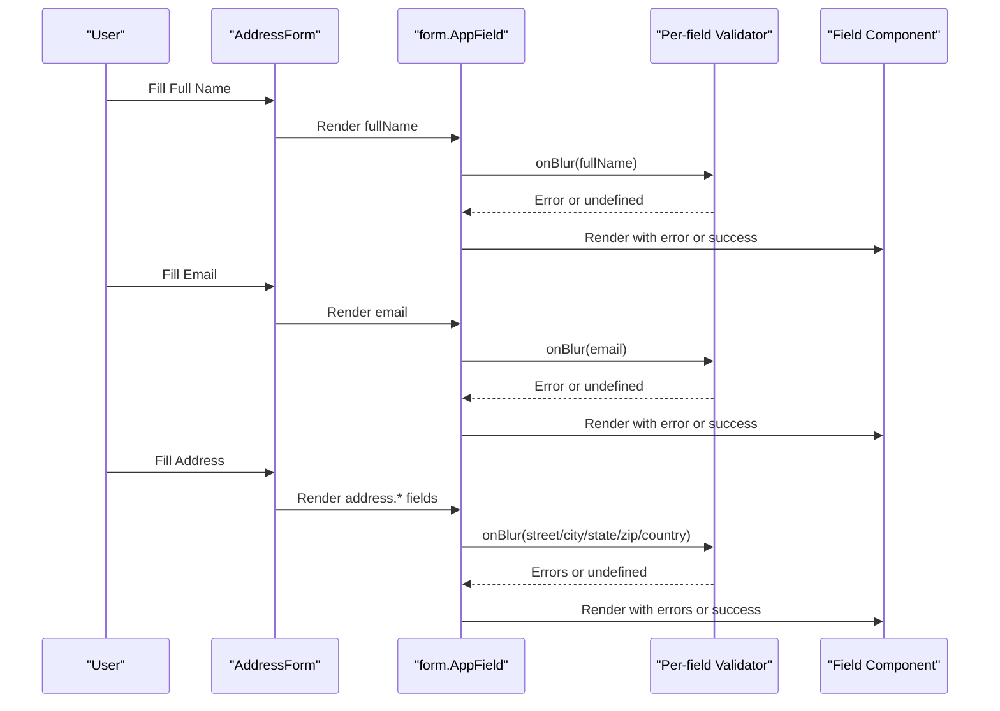
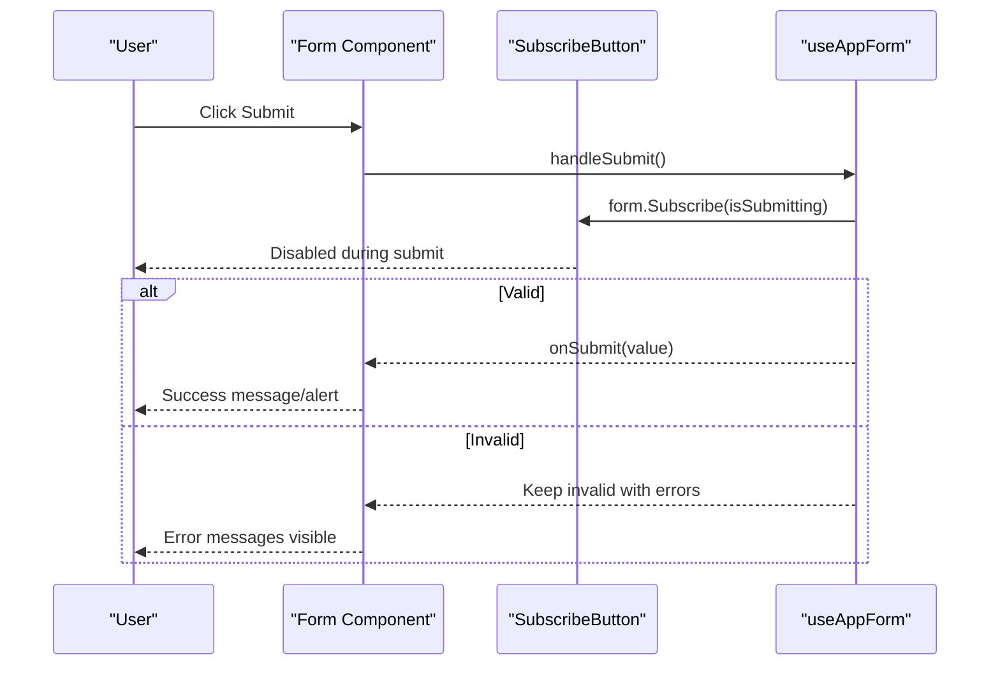
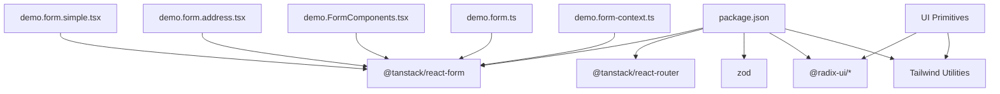

# Form Components

<cite>
**Referenced Files in This Document**
- [demo.FormComponents.tsx](file://src/components/demo.FormComponents.tsx)
- [demo.form.ts](file://src/hooks/demo.form.ts)
- [demo.form-context.ts](file://src/hooks/demo.form-context.ts)
- [demo.form.simple.tsx](file://src/routes/demo.form.simple.tsx)
- [demo.form.address.tsx](file://src/routes/demo.form.address.tsx)
- [input.tsx](file://src/components/ui/input.tsx)
- [textarea.tsx](file://src/components/ui/textarea.tsx)
- [select.tsx](file://src/components/ui/select.tsx)
- [slider.tsx](file://src/components/ui/slider.tsx)
- [switch.tsx](file://src/components/ui/switch.tsx)
- [label.tsx](file://src/components/ui/label.tsx)
- [package.json](file://package.json)
</cite>

## Table of Contents
1. [Introduction](#introduction)
2. [Project Structure](#project-structure)
3. [Core Components](#core-components)
4. [Architecture Overview](#architecture-overview)
5. [Detailed Component Analysis](#detailed-component-analysis)
6. [Dependency Analysis](#dependency-analysis)
7. [Performance Considerations](#performance-considerations)
8. [Troubleshooting Guide](#troubleshooting-guide)
9. [Conclusion](#conclusion)

## Introduction
This document describes the Form Components system used for data entry, validation, and user feedback. It explains how controlled components, uncontrolled patterns, and hybrid approaches are composed, how validation and error handling are implemented, and how TanStack Form is integrated for reactive form state management. It also covers component composition patterns, prop interfaces, customization options, conditional rendering, accessibility, submission handling, and success/error messaging.

## Project Structure
The form system is organized around:
- Reusable UI primitives for inputs (input, textarea, select, slider, switch, label)
- Composed form field components that integrate with TanStack Form
- A typed hook factory that wires field and form components into a cohesive API
- Demo routes showcasing simple and complex forms, including nested data and conditional validations

**Diagram sources**
- [demo.FormComponents.tsx:1-159](file://src/components/demo.FormComponents.tsx#L1-L159)
- [demo.form.ts:1-18](file://src/hooks/demo.form.ts#L1-L18)
- [demo.form-context.ts:1-5](file://src/hooks/demo.form-context.ts#L1-L5)
- [demo.form.simple.tsx:1-69](file://src/routes/demo.form.simple.tsx#L1-L69)
- [demo.form.address.tsx:1-200](file://src/routes/demo.form.address.tsx#L1-L200)
- [input.tsx:1-22](file://src/components/ui/input.tsx#L1-L22)
- [textarea.tsx:1-19](file://src/components/ui/textarea.tsx#L1-L19)
- [select.tsx:1-169](file://src/components/ui/select.tsx#L1-L169)
- [slider.tsx:1-59](file://src/components/ui/slider.tsx#L1-L59)
- [switch.tsx:1-27](file://src/components/ui/switch.tsx#L1-L27)
- [label.tsx:1-22](file://src/components/ui/label.tsx#L1-L22)

**Section sources**
- [demo.FormComponents.tsx:1-159](file://src/components/demo.FormComponents.tsx#L1-L159)
- [demo.form.ts:1-18](file://src/hooks/demo.form.ts#L1-L18)
- [demo.form-context.ts:1-5](file://src/hooks/demo.form-context.ts#L1-L5)
- [demo.form.simple.tsx:1-69](file://src/routes/demo.form.simple.tsx#L1-L69)
- [demo.form.address.tsx:1-200](file://src/routes/demo.form.address.tsx#L1-L200)
- [input.tsx:1-22](file://src/components/ui/input.tsx#L1-L22)
- [textarea.tsx:1-19](file://src/components/ui/textarea.tsx#L1-L19)
- [select.tsx:1-169](file://src/components/ui/select.tsx#L1-L169)
- [slider.tsx:1-59](file://src/components/ui/slider.tsx#L1-L59)
- [switch.tsx:1-27](file://src/components/ui/switch.tsx#L1-L27)
- [label.tsx:1-22](file://src/components/ui/label.tsx#L1-L22)

## Core Components
- Field Components: Controlled wrappers around UI primitives that bind to TanStack Form fields via field context. They expose handleChange, handleBlur, current value, and meta (including errors and touched state).
- Form Components: Higher-level components built on top of field components, such as SubscribeButton, which reads submission state from the form store.
- Validation: Integrated via TanStack Form’s validator configuration at form-level and per-field level. Errors are surfaced reactively to field components.
- Accessibility: UI primitives apply aria-invalid and focus-visible ring classes to support assistive technologies and keyboard navigation.

Key responsibilities:
- Controlled inputs: TextField, TextArea, Select, Slider, Switch
- Reactive subscription: SubscribeButton
- Error rendering: ErrorMessages helper used by field components
- Context wiring: fieldContext/useFieldContext and formContext/useFormContext

**Section sources**
- [demo.FormComponents.tsx:13-159](file://src/components/demo.FormComponents.tsx#L13-L159)
- [demo.form.ts:6-17](file://src/hooks/demo.form.ts#L6-L17)
- [demo.form-context.ts:3-4](file://src/hooks/demo.form-context.ts#L3-L4)
- [input.tsx:5-18](file://src/components/ui/input.tsx#L5-L18)
- [textarea.tsx:5-15](file://src/components/ui/textarea.tsx#L5-L15)
- [select.tsx:7-168](file://src/components/ui/select.tsx#L7-L168)
- [slider.tsx:8-56](file://src/components/ui/slider.tsx#L8-L56)
- [switch.tsx:6-24](file://src/components/ui/switch.tsx#L6-L24)
- [label.tsx:8-18](file://src/components/ui/label.tsx#L8-L18)

## Architecture Overview
The system composes TanStack Form with reusable UI primitives to deliver a declarative, type-safe form authoring experience. The useAppForm hook registers field and form components, enabling a concise JSX API for building forms.

**Diagram sources**
- [demo.form.ts:6-17](file://src/hooks/demo.form.ts#L6-L17)
- [demo.form-context.ts:3-4](file://src/hooks/demo.form-context.ts#L3-L4)
- [demo.FormComponents.tsx:41-159](file://src/components/demo.FormComponents.tsx#L41-L159)
- [demo.form.simple.tsx:14-27](file://src/routes/demo.form.simple.tsx#L14-L27)
- [demo.form.address.tsx:8-39](file://src/routes/demo.form.address.tsx#L8-L39)

## Detailed Component Analysis

### Field Components Composition
Field components wrap UI primitives and integrate with TanStack Form:
- TextField: Controlled text input bound to a string field
- TextArea: Controlled textarea bound to a string field
- Select: Controlled select dropdown bound to a string field
- Slider: Controlled numeric slider bound to a number field
- Switch: Controlled boolean toggle bound to a boolean field

Each field component:
- Reads the field context to access value, meta, and handlers
- Subscribes to store updates for reactive error rendering
- Renders errors only after the field is touched
- Delegates change and blur to the field’s handleChange and handleBlur

**Diagram sources**
- [demo.FormComponents.tsx:41-159](file://src/components/demo.FormComponents.tsx#L41-L159)
- [input.tsx:5-18](file://src/components/ui/input.tsx#L5-L18)
- [textarea.tsx:5-15](file://src/components/ui/textarea.tsx#L5-L15)
- [select.tsx:7-168](file://src/components/ui/select.tsx#L7-L168)
- [slider.tsx:8-56](file://src/components/ui/slider.tsx#L8-L56)
- [switch.tsx:6-24](file://src/components/ui/switch.tsx#L6-L24)
- [label.tsx:8-18](file://src/components/ui/label.tsx#L8-L18)
- [demo.form-context.ts:3-4](file://src/hooks/demo.form-context.ts#L3-L4)

**Section sources**
- [demo.FormComponents.tsx:41-159](file://src/components/demo.FormComponents.tsx#L41-L159)
- [input.tsx:5-18](file://src/components/ui/input.tsx#L5-L18)
- [textarea.tsx:5-15](file://src/components/ui/textarea.tsx#L5-L15)
- [select.tsx:7-168](file://src/components/ui/select.tsx#L7-L168)
- [slider.tsx:8-56](file://src/components/ui/slider.tsx#L8-L56)
- [switch.tsx:6-24](file://src/components/ui/switch.tsx#L6-L24)
- [label.tsx:8-18](file://src/components/ui/label.tsx#L8-L18)
- [demo.form-context.ts:3-4](file://src/hooks/demo.form-context.ts#L3-L4)

### Form Hook Factory and Context Wiring
The useAppForm hook is created from @tanstack/react-form and registers:
- Field components: TextField, Select, TextArea
- Form components: SubscribeButton
- Field and form contexts: fieldContext, formContext

This enables a consistent API across forms, allowing developers to render fields via form.AppField and subscribe to form state via form.Subscribe.

**Diagram sources**
- [demo.form.ts:6-17](file://src/hooks/demo.form.ts#L6-L17)
- [demo.form-context.ts:3-4](file://src/hooks/demo.form-context.ts#L3-L4)

**Section sources**
- [demo.form.ts:6-17](file://src/hooks/demo.form.ts#L6-L17)
- [demo.form-context.ts:3-4](file://src/hooks/demo.form-context.ts#L3-L4)

### Validation Strategies and Error Handling
Two primary strategies are demonstrated:
- Schema-driven validation: A Zod schema validates the entire form on blur
- Inline per-field validation: Custom validator functions return either undefined (valid) or an error message/string

Error handling patterns:
- Reactive error display: Field components subscribe to store meta.errors and render only after the field is touched
- ErrorMessages helper: Renders a list of error messages for a given array of errors

Submission handling:
- Forms prevent default submission and call form.handleSubmit()
- On submit, validators run and either call onSubmit(value) or keep the form in an invalid state

**Diagram sources**
- [demo.form.simple.tsx:8-27](file://src/routes/demo.form.simple.tsx#L8-L27)
- [demo.form.address.tsx:21-39](file://src/routes/demo.form.address.tsx#L21-L39)
- [demo.FormComponents.tsx:26-39](file://src/components/demo.FormComponents.tsx#L26-L39)

**Section sources**
- [demo.form.simple.tsx:8-27](file://src/routes/demo.form.simple.tsx#L8-L27)
- [demo.form.address.tsx:21-39](file://src/routes/demo.form.address.tsx#L21-L39)
- [demo.FormComponents.tsx:26-39](file://src/components/demo.FormComponents.tsx#L26-L39)

### Complex Form Scenarios and Conditional Rendering
The Address Form demonstrates:
- Nested field paths (address.street, address.city, etc.)
- Grid-based conditional layout for related fields (city/state/zip)
- Per-field validators with contextual checks (required, format)
- Select dropdown with predefined options

**Diagram sources**
- [demo.form.address.tsx:58-181](file://src/routes/demo.form.address.tsx#L58-L181)

**Section sources**
- [demo.form.address.tsx:58-181](file://src/routes/demo.form.address.tsx#L58-L181)

### Accessibility Compliance
The UI primitives apply accessibility attributes:
- aria-invalid on inputs/textareas to reflect invalid state
- Focus-visible rings for keyboard navigation
- Proper labeling via Label and htmlFor/id usage in field components
- Semantic Radix UI components for Select, Slider, and Switch

These patterns ensure screen readers and keyboard-only users receive appropriate feedback.

**Section sources**
- [input.tsx:10-15](file://src/components/ui/input.tsx#L10-L15)
- [textarea.tsx:9-12](file://src/components/ui/textarea.tsx#L9-L12)
- [select.tsx:31-38](file://src/components/ui/select.tsx#L31-L38)
- [slider.tsx:28-31](file://src/components/ui/slider.tsx#L28-L31)
- [switch.tsx:10-13](file://src/components/ui/switch.tsx#L10-L13)
- [label.tsx:10-17](file://src/components/ui/label.tsx#L10-L17)
- [demo.FormComponents.tsx:47-56](file://src/components/demo.FormComponents.tsx#L47-L56)

### Prop Interfaces and Customization Options
Common props across field components:
- label: String used for labeling and id generation
- placeholder: Optional placeholder text for inputs
- rows: Number of rows for textarea
- values: Array of { label, value } for select options
- validators: Optional per-field validator function

Field-specific behaviors:
- TextField: string value, supports placeholder
- TextArea: string value, supports rows
- Select: string value, requires values array
- Slider: number value, supports min/max defaults
- Switch: boolean value

Customization:
- Override per-field validators inline when rendering
- Customize error presentation via ErrorMessages
- Compose fields into grids or responsive layouts

**Section sources**
- [demo.FormComponents.tsx:41-159](file://src/components/demo.FormComponents.tsx#L41-L159)
- [demo.form.address.tsx:75-181](file://src/routes/demo.form.address.tsx#L75-L181)

### Submission Handling, Loading States, and Messaging
- Loading states: SubscribeButton disables itself while the form is submitting, preventing duplicate submissions
- Success messaging: onSubmit logs the value and shows an alert; production apps can replace with toast notifications or page redirects
- Error messaging: Errors are rendered immediately after blur and persist until corrected

**Diagram sources**
- [demo.FormComponents.tsx:13-24](file://src/components/demo.FormComponents.tsx#L13-L24)
- [demo.form.simple.tsx:38-56](file://src/routes/demo.form.simple.tsx#L38-L56)
- [demo.form.address.tsx:50-187](file://src/routes/demo.form.address.tsx#L50-L187)

**Section sources**
- [demo.FormComponents.tsx:13-24](file://src/components/demo.FormComponents.tsx#L13-L24)
- [demo.form.simple.tsx:38-56](file://src/routes/demo.form.simple.tsx#L38-L56)
- [demo.form.address.tsx:50-187](file://src/routes/demo.form.address.tsx#L50-L187)

## Dependency Analysis
The form system relies on TanStack Form and related packages for reactive state management and routing for demos. UI primitives depend on Radix UI and Tailwind utilities for styling and accessibility.

**Diagram sources**
- [package.json:15-44](file://package.json#L15-L44)
- [demo.form.simple.tsx:1-69](file://src/routes/demo.form.simple.tsx#L1-L69)
- [demo.form.address.tsx:1-200](file://src/routes/demo.form.address.tsx#L1-L200)
- [demo.FormComponents.tsx:1-159](file://src/components/demo.FormComponents.tsx#L1-L159)
- [demo.form.ts:1-18](file://src/hooks/demo.form.ts#L1-L18)
- [demo.form-context.ts:1-5](file://src/hooks/demo.form-context.ts#L1-L5)

**Section sources**
- [package.json:15-44](file://package.json#L15-L44)
- [demo.form.simple.tsx:1-69](file://src/routes/demo.form.simple.tsx#L1-L69)
- [demo.form.address.tsx:1-200](file://src/routes/demo.form.address.tsx#L1-L200)
- [demo.FormComponents.tsx:1-159](file://src/components/demo.FormComponents.tsx#L1-L159)
- [demo.form.ts:1-18](file://src/hooks/demo.form.ts#L1-L18)
- [demo.form-context.ts:1-5](file://src/hooks/demo.form-context.ts#L1-L5)

## Performance Considerations
- Prefer per-field validators over global re-validation to minimize re-renders
- Use form.Subscribe to selectively update UI parts (e.g., submit button) rather than re-rendering the entire form
- Memoize expensive validators and avoid heavy computations in onChange handlers
- Keep defaultValues minimal and lazy-load optional nested structures

## Troubleshooting Guide
- No errors shown after blur: Ensure the field is touched and meta.errors are subscribed to in the field component
- Submit button remains enabled: Verify form.Subscribe is used and isSubmitting is part of the selector
- Select/Slider/Checkbox not updating: Confirm handleChange and handleBlur are wired to the field’s event handlers
- Accessibility warnings: Ensure labels are associated with inputs and aria-invalid is applied by UI primitives

**Section sources**
- [demo.FormComponents.tsx:41-159](file://src/components/demo.FormComponents.tsx#L41-L159)
- [demo.FormComponents.tsx:13-24](file://src/components/demo.FormComponents.tsx#L13-L24)
- [input.tsx:10-15](file://src/components/ui/input.tsx#L10-L15)
- [textarea.tsx:9-12](file://src/components/ui/textarea.tsx#L9-L12)
- [select.tsx:31-38](file://src/components/ui/select.tsx#L31-L38)
- [slider.tsx:28-31](file://src/components/ui/slider.tsx#L28-L31)
- [switch.tsx:10-13](file://src/components/ui/switch.tsx#L10-L13)

## Conclusion
The Form Components system integrates TanStack Form with reusable UI primitives to provide a robust, accessible, and extensible solution for building forms. By composing controlled field components, leveraging per-field and schema-driven validation, and subscribing to form state reactively, developers can implement complex forms with clear user feedback, proper accessibility, and maintainable code.