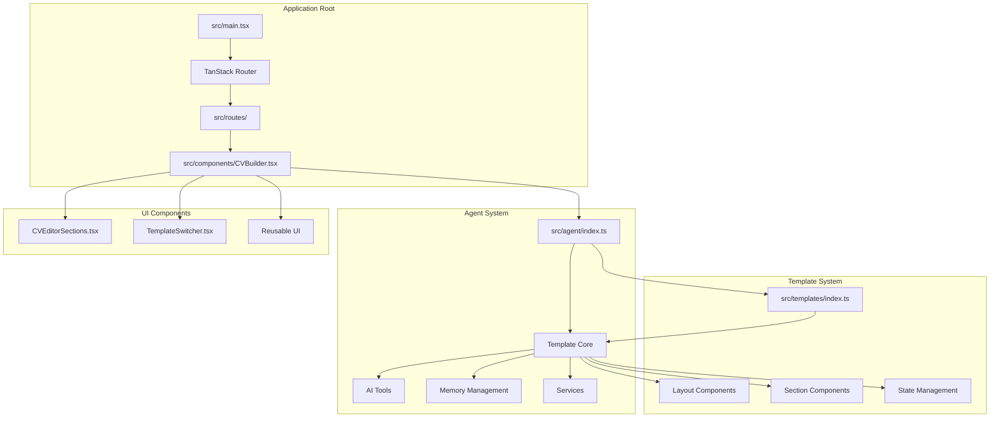
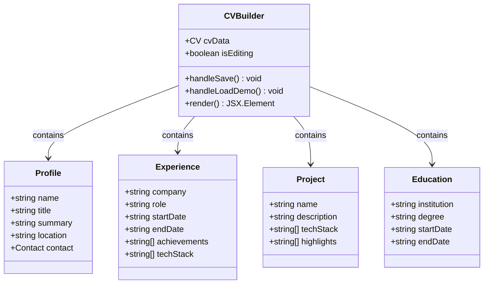
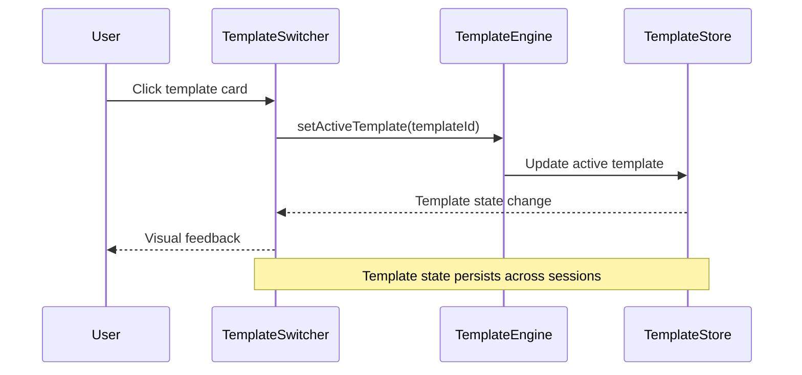
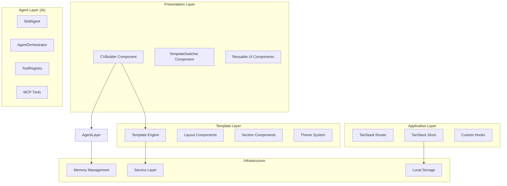
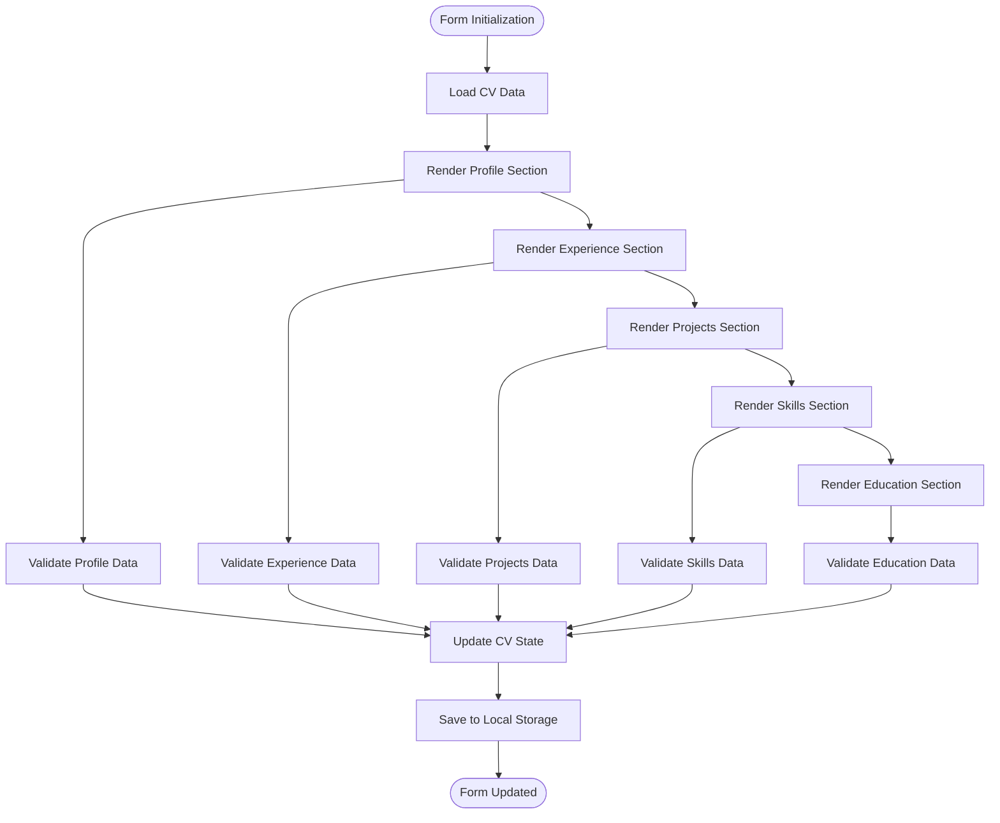
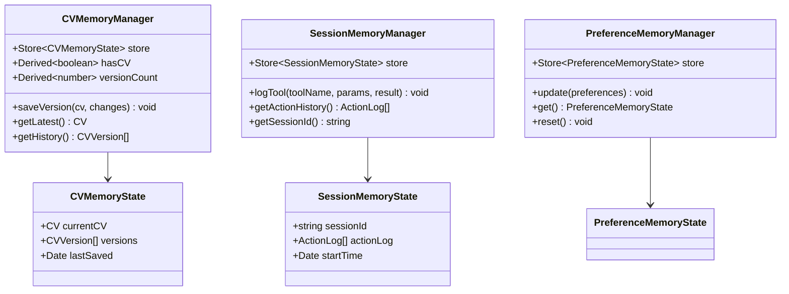
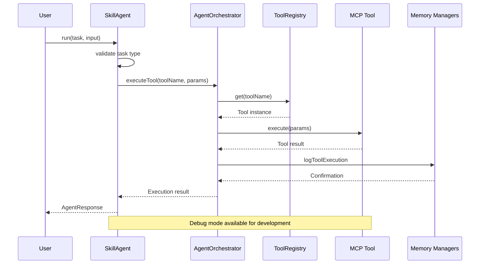
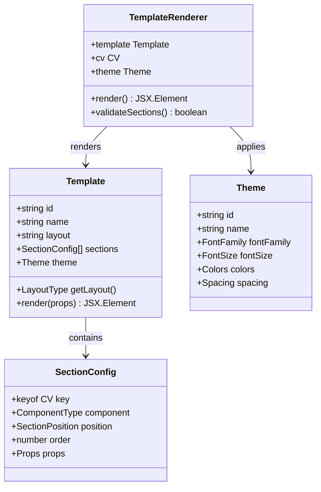
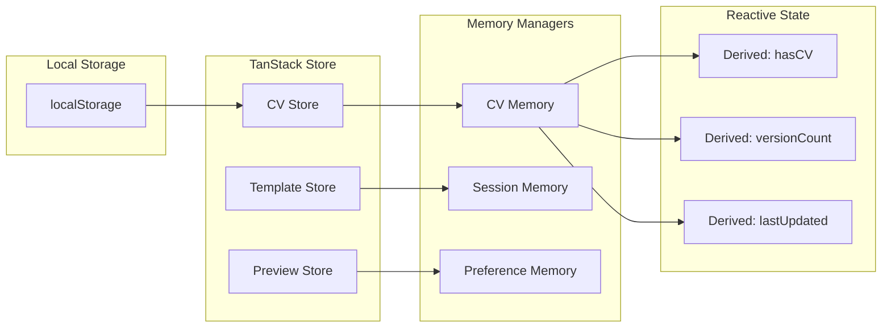

# Standalone CV Builder

<cite>
**Referenced Files in This Document**
- [README.md](file://README.md)
- [package.json](file://package.json)
- [src/App.tsx](file://src/App.tsx)
- [src/main.tsx](file://src/main.tsx)
- [src/routes/cv-builder.tsx](file://src/routes/cv-builder.tsx)
- [src/components/CVBuilder.tsx](file://src/components/CVBuilder.tsx)
- [src/components/CVEditorSections.tsx](file://src/components/CVEditorSections.tsx)
- [src/components/TemplateSwitcher.tsx](file://src/components/TemplateSwitcher.tsx)
- [src/agent/index.ts](file://src/agent/index.ts)
- [src/agent/core/agent.ts](file://src/agent/core/agent.ts)
- [src/agent/tools/core-tools.ts](file://src/agent/tools/core-tools.ts)
- [src/agent/memory/cv-memory.ts](file://src/agent/memory/cv-memory.ts)
- [src/agent/hooks/useSkillAgent.ts](file://src/agent/hooks/useSkillAgent.ts)
- [src/hooks/use-cv-agent.ts](file://src/hooks/use-cv-agent.ts)
- [src/templates/index.ts](file://src/templates/index.ts)
- [src/templates/types/template.types.ts](file://src/templates/types/template.types.ts)
</cite>

## Table of Contents
1. [Introduction](#introduction)
2. [Project Structure](#project-structure)
3. [Core Components](#core-components)
4. [Architecture Overview](#architecture-overview)
5. [Detailed Component Analysis](#detailed-component-analysis)
6. [AI Agent System](#ai-agent-system)
7. [Template Engine](#template-engine)
8. [State Management](#state-management)
9. [Performance Considerations](#performance-considerations)
10. [Development Setup](#development-setup)
11. [Conclusion](#conclusion)

## Introduction

The Standalone CV Builder is a production-ready, full-featured CV and portfolio builder application that combines modern web technologies with AI-powered enhancements. Built with React 19 and TypeScript, this application provides a comprehensive solution for creating professional CVs with real-time preview, dynamic template switching, and intelligent AI assistance.

Key features include:
- Live CV editor with instant preview
- Multiple resume templates (Single-column, Two-column layouts)
- AI Skill Agent with MCP (Model Context Protocol) architecture
- ATS optimization capabilities
- Template switching functionality
- PDF-ready layouts and styling
- Persistent state management with TanStack Store

The application follows clean architecture principles with strict type safety and comprehensive testing coverage, making it suitable for both development and production environments.

## Project Structure

The project follows a modular architecture organized by feature domains:



**Diagram sources**
- [src/main.tsx:1-79](file://src/main.tsx#L1-L79)
- [src/agent/index.ts:1-43](file://src/agent/index.ts#L1-L43)
- [src/templates/index.ts:1-44](file://src/templates/index.ts#L1-L44)

**Section sources**
- [README.md:83-111](file://README.md#L83-L111)
- [src/main.tsx:1-79](file://src/main.tsx#L1-L79)

## Core Components

### CV Builder Application

The CV Builder serves as the main application container and orchestrates the entire CV creation workflow:



**Diagram sources**
- [src/components/CVBuilder.tsx:41-47](file://src/components/CVBuilder.tsx#L41-L47)

The CV Builder component manages:
- Complete CV data structure with typed interfaces
- Real-time editing and preview functionality
- Local storage persistence
- Demo data loading
- Responsive two-panel layout (editor + preview)

**Section sources**
- [src/components/CVBuilder.tsx:1-347](file://src/components/CVBuilder.tsx#L1-L347)

### Template Switcher Component

The Template Switcher enables dynamic template selection and customization:



**Diagram sources**
- [src/components/TemplateSwitcher.tsx:10-16](file://src/components/TemplateSwitcher.tsx#L10-L16)

**Section sources**
- [src/components/TemplateSwitcher.tsx:1-50](file://src/components/TemplateSwitcher.tsx#L1-L50)

## Architecture Overview

The application follows a layered architecture with clear separation of concerns:



**Diagram sources**
- [src/agent/core/agent.ts:173-376](file://src/agent/core/agent.ts#L173-L376)
- [src/templates/index.ts:1-44](file://src/templates/index.ts#L1-L44)

## Detailed Component Analysis

### CV Editor Sections

The CV Editor Sections component provides structured form-based editing with comprehensive validation:



**Diagram sources**
- [src/components/CVEditorSections.ts:12-121](file://src/components/CVEditorSections.ts#L12-L121)

**Section sources**
- [src/components/CVEditorSections.ts:1-122](file://src/components/CVEditorSections.ts#L1-L122)

### State Management Architecture

The application uses TanStack Store for reactive state management with multiple stores:



**Diagram sources**
- [src/agent/memory/cv-memory.ts:19-289](file://src/agent/memory/cv-memory.ts#L19-L289)

**Section sources**
- [src/agent/memory/cv-memory.ts:1-290](file://src/agent/memory/cv-memory.ts#L1-L290)

## AI Agent System

The AI Agent System implements the Model Context Protocol (MCP) for intelligent CV enhancement:



**Diagram sources**
- [src/agent/core/agent.ts:188-281](file://src/agent/core/agent.ts#L188-L281)

### Core AI Tools

The system provides six specialized MCP tools for comprehensive CV enhancement:

| Tool Name | Purpose | LLM Required | Category |
|-----------|---------|--------------|----------|
| `analyzeCV` | Structural CV analysis with scoring | No | Analysis |
| `generateSummary` | Professional summary generation | Yes | Generation |
| `improveExperience` | Experience bullet point enhancement | Yes | Optimization |
| `extractSkills` | Skill extraction and categorization | No | Extraction |
| `optimizeATS` | Applicant Tracking System optimization | Yes | Optimization |
| `mapToUISections` | CV data transformation for templates | No | Mapping |

**Section sources**
- [src/agent/tools/core-tools.ts:1-539](file://src/agent/tools/core-tools.ts#L1-L539)

## Template Engine

The template engine provides a flexible system for CV presentation with multiple layouts and themes:



**Diagram sources**
- [src/templates/types/template.types.ts:43-53](file://src/templates/types/template.types.ts#L43-L53)

**Section sources**
- [src/templates/types/template.types.ts:1-77](file://src/templates/types/template.types.ts#L1-L77)

### Available Templates

The system supports three distinct template layouts:

1. **Single Column Layout**: Traditional, easy-to-read format ideal for academic or minimalist styles
2. **Two Column Left**: Modern sidebar layout with main content on the right
3. **Two Column Right**: Mirror image of two-column left with sidebar on the right

Each template supports different section arrangements and styling options.

## State Management

The application implements a multi-layered state management system using TanStack Store:



**Diagram sources**
- [src/agent/memory/cv-memory.ts:22-50](file://src/agent/memory/cv-memory.ts#L22-L50)

**Section sources**
- [src/agent/memory/cv-memory.ts:1-290](file://src/agent/memory/cv-memory.ts#L1-L290)

## Performance Considerations

The application is optimized for performance with several key considerations:

- **Build Size**: ~150KB gzipped for optimal loading times
- **Initial Load**: <1 second on 3G networks
- **Hot Reload**: <100ms development iteration time
- **Type Checking**: Strict TypeScript mode with zero errors
- **Test Suite**: <1 second execution time with 92 passing tests

Performance optimizations include:
- Tree-shaking for unused code elimination
- Lazy loading for non-critical components
- Efficient state updates with TanStack Store
- Minimal re-renders through proper React patterns
- Optimized bundle splitting for faster initial loads

## Development Setup

### Prerequisites

- Node.js 18+ or Bun 1.0+
- npm or bun package manager

### Installation

```bash
# Clone the repository
git clone <repository-url>
cd cv-portfolio-builder

# Install dependencies
npm install
# or
bun install
```

### Running the Application

```bash
# Start development server
npm run dev
# or
bun run dev

# Open http://localhost:3000/cv-builder
```

### Available Scripts

| Script | Description |
|--------|-------------|
| `dev` | Start development server on port 3000 |
| `build` | Create production build |
| `serve` | Preview production build |
| `test` | Run test suite with coverage |
| `lint` | Run ESLint for code quality |
| `format` | Format code with Prettier |
| `check` | Run both lint and format |

### Project Structure Details

The application follows a feature-based organization:

- **src/agent/**: AI Skill Agent system with MCP architecture
- **src/components/**: React components for UI and functionality
- **src/templates/**: Template engine with layouts and sections
- **src/routes/**: TanStack Router definitions
- **src/hooks/**: Custom React hooks for state management
- **src/integrations/**: Third-party library integrations

**Section sources**
- [README.md:45-82](file://README.md#L45-L82)
- [package.json:5-20](file://package.json#L5-L20)

## Conclusion

The Standalone CV Builder represents a comprehensive solution for modern CV creation, combining intuitive user experience with powerful AI-driven enhancements. The application demonstrates excellent architectural decisions with clear separation of concerns, robust type safety, and extensive testing coverage.

Key strengths include:
- **Production-ready architecture** with clean separation of concerns
- **AI-powered enhancement** through MCP-compatible tools
- **Flexible template system** supporting multiple layouts and themes
- **Real-time collaboration** features with persistent state management
- **Performance optimization** with minimal bundle size and fast loading
- **Developer-friendly** with comprehensive documentation and testing

The modular design allows for easy extension and customization, making it suitable for both individual use and enterprise deployment scenarios. The combination of modern web technologies with AI capabilities positions this application as a leading solution in the CV builder space.

Future enhancements could include cloud synchronization, advanced export formats, collaborative editing features, and expanded AI capabilities for more sophisticated CV analysis and optimization.