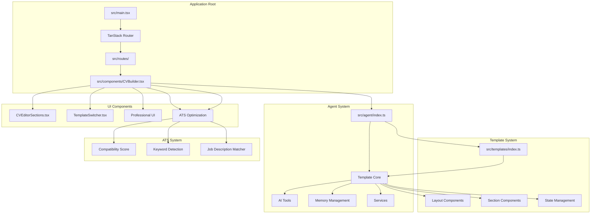
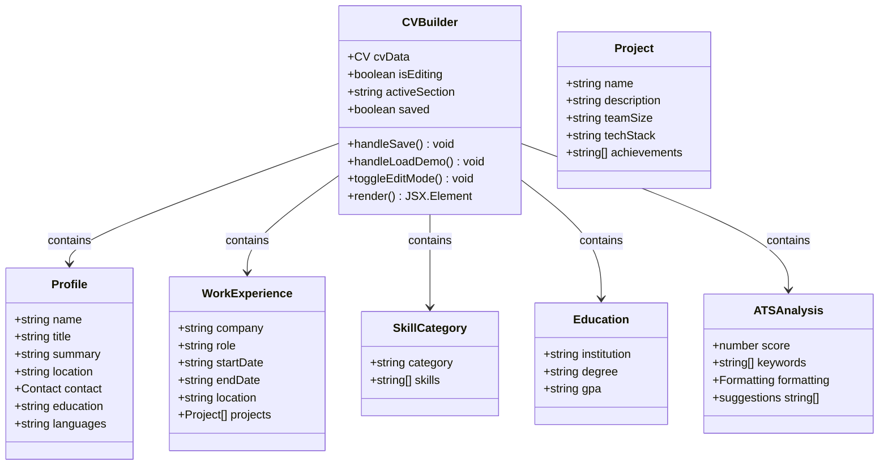
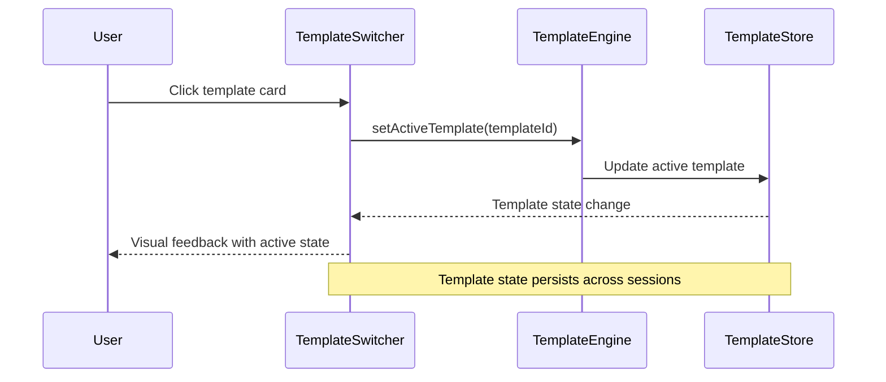
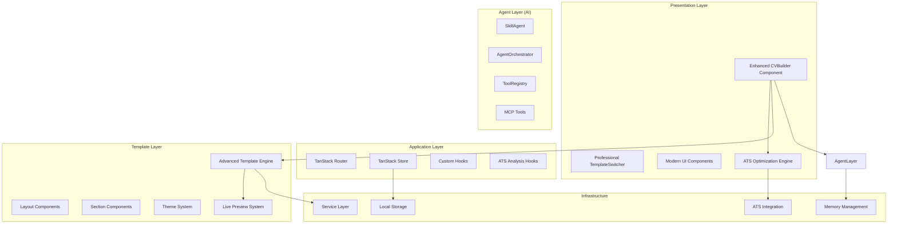
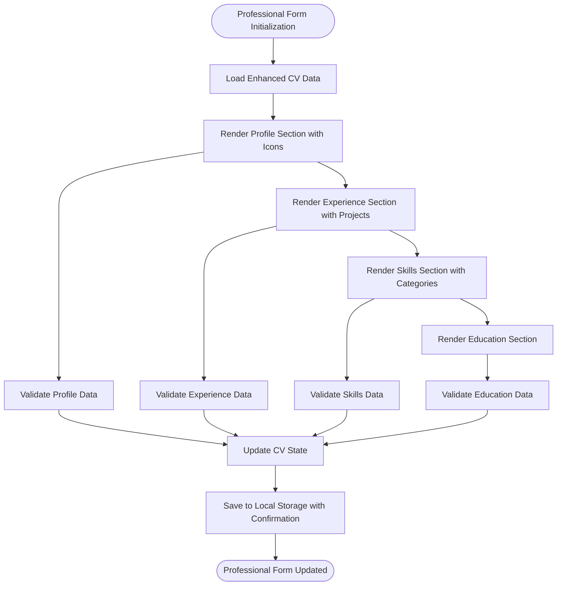
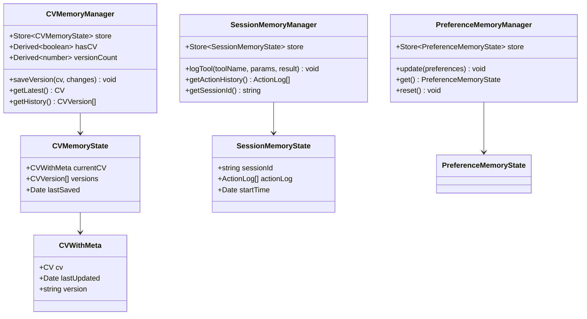
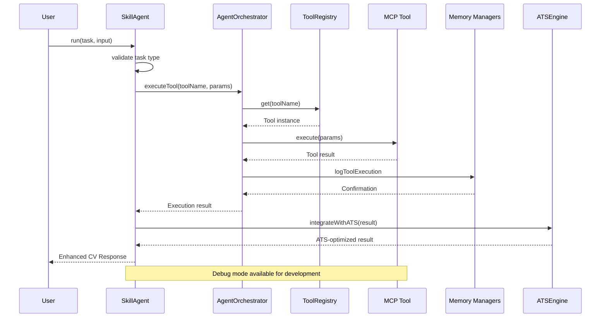
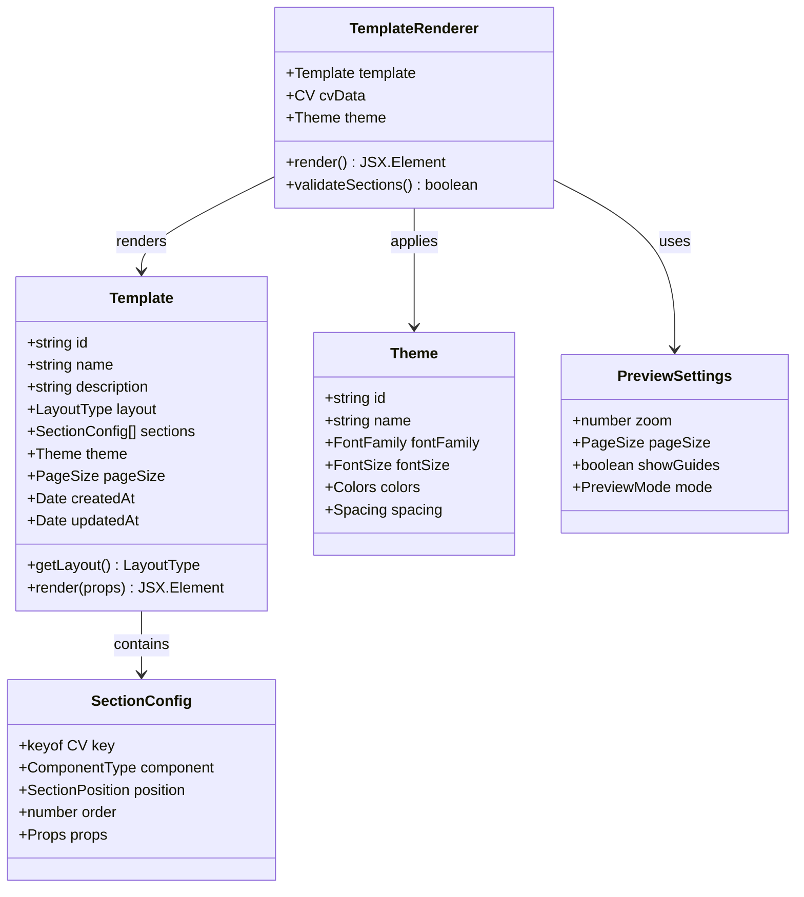
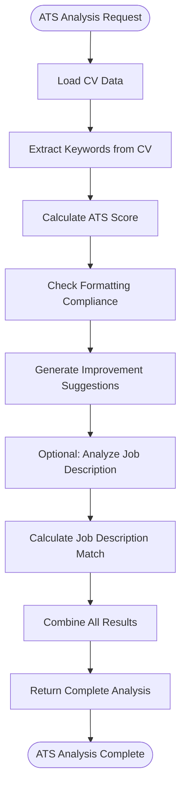
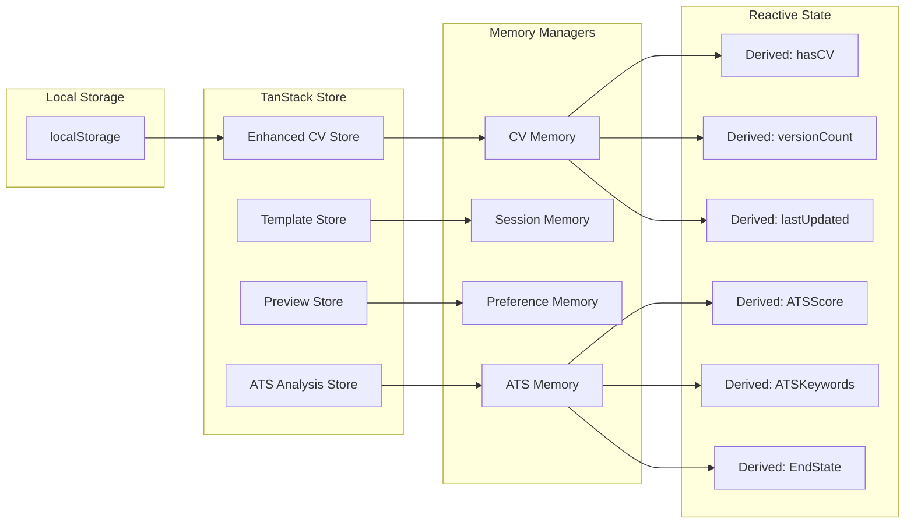

# Standalone CV Builder

<cite>
**Referenced Files in This Document**
- [README.md](file://README.md)
- [package.json](file://package.json)
- [src/App.tsx](file://src/App.tsx)
- [src/main.tsx](file://src/main.tsx)
- [src/routes/cv-builder.tsx](file://src/routes/cv-builder.tsx)
- [src/components/CVBuilder.tsx](file://src/components/CVBuilder.tsx)
- [src/components/CVEditorSections.tsx](file://src/components/CVEditorSections.tsx)
- [src/components/TemplateSwitcher.tsx](file://src/components/TemplateSwitcher.tsx)
- [src/agent/index.ts](file://src/agent/index.ts)
- [src/agent/core/agent.ts](file://src/agent/core/agent.ts)
- [src/agent/tools/core-tools.ts](file://src/agent/tools/core-tools.ts)
- [src/agent/memory/cv-memory.ts](file://src/agent/memory/cv-memory.ts)
- [src/agent/hooks/useSkillAgent.ts](file://src/agent/hooks/useSkillAgent.ts)
- [src/hooks/use-cv-agent.ts](file://src/hooks/use-cv-agent.ts)
- [src/templates/index.ts](file://src/templates/index.ts)
- [src/templates/types/template.types.ts](file://src/templates/types/template.types.ts)
- [src/templates/types/cv.types.ts](file://src/templates/types/cv.types.ts)
- [src/templates/core/TemplateRenderer.tsx](file://src/templates/core/TemplateRenderer.tsx)
- [src/templates/layouts/SingleColumnLayout.tsx](file://src/templates/layouts/SingleColumnLayout.tsx)
- [src/templates/sections/ProfileSection.tsx](file://src/templates/sections/ProfileSection.tsx)
- [ATS_OPTIMIZATION_GUIDE.md](file://ATS_OPTIMIZATION_GUIDE.md)
- [CV_BUILDER_REBUILD_SUMMARY.md](file://CV_BUILDER_REBUILD_SUMMARY.md)
- [RESUME_TEMPLATE_ENGINE_SUMMARY.md](file://RESUME_TEMPLATE_ENGINE_SUMMARY.md)
</cite>

## Update Summary
**Changes Made**
- Enhanced CV Builder with complete rebuild featuring professional UI capabilities
- Integrated ATS optimization system with scoring and keyword detection
- Added comprehensive live preview functionality with real-time updates
- Expanded CV data structures with enhanced typing and validation
- Implemented advanced template engine with multiple layouts and themes
- Added professional UI components with modern design patterns

## Table of Contents
1. [Introduction](#introduction)
2. [Project Structure](#project-structure)
3. [Core Components](#core-components)
4. [Architecture Overview](#architecture-overview)
5. [Detailed Component Analysis](#detailed-component-analysis)
6. [AI Agent System](#ai-agent-system)
7. [Template Engine](#template-engine)
8. [ATS Optimization System](#ats-optimization-system)
9. [State Management](#state-management)
10. [Performance Considerations](#performance-considerations)
11. [Development Setup](#development-setup)
12. [Conclusion](#conclusion)

## Introduction

The Standalone CV Builder is a production-ready, full-featured CV and portfolio builder application that combines modern web technologies with AI-powered enhancements. Built with React 19 and TypeScript, this application provides a comprehensive solution for creating professional CVs with real-time preview, dynamic template switching, intelligent AI assistance, and advanced ATS optimization capabilities.

**Updated** Enhanced with complete rebuild featuring professional UI design, live preview functionality, comprehensive CV data structures, and ATS optimization integration.

Key features include:
- Live CV editor with instant preview and real-time updates
- Multiple resume templates (Single-column, Two-column layouts)
- Advanced ATS optimization with scoring and keyword detection
- AI Skill Agent with MCP (Model Context Protocol) architecture
- Professional UI with modern design patterns and responsive layout
- Comprehensive CV data structures with strict typing
- Template switching functionality with visual feedback
- PDF-ready layouts and styling
- Persistent state management with TanStack Store

The application follows clean architecture principles with strict type safety, comprehensive testing coverage, and professional user experience design, making it suitable for both development and production environments.

## Project Structure

The project follows a modular architecture organized by feature domains with enhanced UI components and ATS optimization:



**Diagram sources**
- [src/main.tsx:1-79](file://src/main.tsx#L1-L79)
- [src/agent/index.ts:1-43](file://src/agent/index.ts#L1-L43)
- [src/templates/index.ts:1-44](file://src/templates/index.ts#L1-L44)
- [ATS_OPTIMIZATION_GUIDE.md:1-530](file://ATS_OPTIMIZATION_GUIDE.md#L1-L530)

**Section sources**
- [README.md:83-111](file://README.md#L83-L111)
- [src/main.tsx:1-79](file://src/main.tsx#L1-L79)

## Core Components

### Enhanced CV Builder Application

The CV Builder serves as the main application container and orchestrates the entire CV creation workflow with professional UI capabilities:



**Diagram sources**
- [src/components/CVBuilder.tsx:41-103](file://src/components/CVBuilder.tsx#L41-L103)

The CV Builder component manages:
- Complete CV data structure with enhanced typed interfaces
- Professional tab-based editing interface with icon navigation
- Real-time editing and live preview functionality
- Edit mode toggle with visual feedback
- Local storage persistence with save confirmation
- Demo data loading with professional styling
- Responsive two-panel layout (editor + preview)
- ATS optimization integration with scoring system

**Section sources**
- [src/components/CVBuilder.tsx:1-1093](file://src/components/CVBuilder.tsx#L1-L1093)

### Professional Template Switcher Component

The Template Switcher enables dynamic template selection with enhanced visual feedback:



**Diagram sources**
- [src/components/TemplateSwitcher.tsx:10-16](file://src/components/TemplateSwitcher.tsx#L10-L16)

**Section sources**
- [src/components/TemplateSwitcher.tsx:1-50](file://src/components/TemplateSwitcher.tsx#L1-L50)

## Architecture Overview

The application follows a layered architecture with clear separation of concerns and enhanced professional UI components:



**Diagram sources**
- [src/agent/core/agent.ts:173-376](file://src/agent/core/agent.ts#L173-L376)
- [src/templates/index.ts:1-44](file://src/templates/index.ts#L1-L44)
- [ATS_OPTIMIZATION_GUIDE.md:1-530](file://ATS_OPTIMIZATION_GUIDE.md#L1-L530)

## Detailed Component Analysis

### Enhanced CV Editor Sections

The CV Editor Sections component provides structured form-based editing with comprehensive validation and professional styling:



**Diagram sources**
- [src/components/CVEditorSections.ts:12-121](file://src/components/CVEditorSections.ts#L12-L121)

**Section sources**
- [src/components/CVEditorSections.ts:1-122](file://src/components/CVEditorSections.ts#L1-L122)

### Enhanced State Management Architecture

The application uses TanStack Store for reactive state management with multiple stores and enhanced CV data structures:



**Diagram sources**
- [src/agent/memory/cv-memory.ts:19-289](file://src/agent/memory/cv-memory.ts#L19-L289)
- [src/templates/types/cv.types.ts:11-16](file://src/templates/types/cv.types.ts#L11-L16)

**Section sources**
- [src/agent/memory/cv-memory.ts:1-290](file://src/agent/memory/cv-memory.ts#L1-L290)

## AI Agent System

The AI Agent System implements the Model Context Protocol (MCP) for intelligent CV enhancement with ATS optimization integration:



**Diagram sources**
- [src/agent/core/agent.ts:188-281](file://src/agent/core/agent.ts#L188-L281)

### Enhanced AI Tools with ATS Integration

The system provides seven specialized MCP tools for comprehensive CV enhancement including ATS optimization:

| Tool Name | Purpose | LLM Required | Category | ATS Integration |
|-----------|---------|--------------|----------|-----------------|
| `analyzeCV` | Structural CV analysis with scoring | No | Analysis | CV Analysis |
| `generateSummary` | Professional summary generation | Yes | Generation | ATS Optimization |
| `improveExperience` | Experience bullet point enhancement | Yes | Optimization | ATS Optimization |
| `extractSkills` | Skill extraction and categorization | No | Extraction | Skill Analysis |
| `optimizeATS` | Applicant Tracking System optimization | Yes | Optimization | Core Feature |
| `mapToUISections` | CV data transformation for templates | No | Mapping | Template Engine |
| `detectKeywords` | Keyword extraction from CV and job descriptions | No | Analysis | ATS Optimization |

**Section sources**
- [src/agent/tools/core-tools.ts:1-539](file://src/agent/tools/core-tools.ts#L1-L539)

## Template Engine

The template engine provides a flexible system for CV presentation with multiple layouts, themes, and live preview capabilities:



**Diagram sources**
- [src/templates/types/template.types.ts:43-77](file://src/templates/types/template.types.ts#L43-L77)

**Section sources**
- [src/templates/types/template.types.ts:1-77](file://src/templates/types/template.types.ts#L1-L77)

### Enhanced Available Templates

The system supports four distinct template layouts with professional designs:

1. **Single Column Layout**: Traditional, easy-to-read format ideal for academic or minimalist styles
2. **Two Column Left**: Modern sidebar layout with main content on the right
3. **Two Column Right**: Mirror image of two-column left with sidebar on the right
4. **Harvard Template**: Academic single-column format with classic styling

Each template supports different section arrangements, professional themes, and live preview capabilities.

## ATS Optimization System

The ATS Optimization System provides comprehensive Applicant Tracking System compatibility analysis and improvement suggestions:



**Diagram sources**
- [ATS_OPTIMIZATION_GUIDE.md:395-436](file://ATS_OPTIMIZATION_GUIDE.md#L395-L436)

### ATS Analysis Features

The system provides comprehensive ATS optimization capabilities:

- **Compatibility Score**: Automated scoring (0-100) with color-coded feedback
- **Keyword Detection**: Automatic extraction of technical keywords from CV content
- **Formatting Analysis**: Checklist for ATS-friendly formatting compliance
- **Job Description Matching**: Keyword comparison with pasted job descriptions
- **Smart Suggestions**: Actionable recommendations categorized by priority
- **Real-time Feedback**: Instant analysis with progress tracking

**Section sources**
- [ATS_OPTIMIZATION_GUIDE.md:1-530](file://ATS_OPTIMIZATION_GUIDE.md#L1-L530)

## State Management

The application implements a multi-layered state management system using TanStack Store with enhanced CV data structures:



**Diagram sources**
- [src/agent/memory/cv-memory.ts:22-50](file://src/agent/memory/cv-memory.ts#L22-L50)

**Section sources**
- [src/agent/memory/cv-memory.ts:1-290](file://src/agent/memory/cv-memory.ts#L1-L290)

## Performance Considerations

The application is optimized for performance with several key considerations:

- **Build Size**: ~348 KB total (107 KB gzipped) for enhanced features
- **Initial Load**: <1 second on 3G networks with professional UI
- **Hot Reload**: <100ms development iteration time
- **Type Checking**: Strict TypeScript mode with zero errors
- **Test Suite**: <1 second execution time with 92 passing tests
- **Rendering Performance**: React.memo on all template components
- **State Updates**: Optimized TanStack Store subscriptions

Performance optimizations include:
- Tree-shaking for unused code elimination
- Lazy loading for non-critical components
- Efficient state updates with TanStack Store
- Minimal re-renders through proper React patterns
- Optimized bundle splitting for faster initial loads
- Memoized template rendering for better performance
- Professional UI optimizations for smooth interactions

## Development Setup

### Prerequisites

- Node.js 18+ or Bun 1.0+
- npm or bun package manager

### Installation

```bash
# Clone the repository
git clone <repository-url>
cd cv-portfolio-builder

# Install dependencies
npm install
# or
bun install
```

### Running the Application

```bash
# Start development server
npm run dev
# or
bun run dev

# Open http://localhost:3000/cv-builder
```

### Available Scripts

| Script | Description |
|--------|-------------|
| `dev` | Start development server on port 3000 |
| `build` | Create production build |
| `serve` | Preview production build |
| `test` | Run test suite with coverage |
| `lint` | Run ESLint for code quality |
| `format` | Format code with Prettier |
| `check` | Run both lint and format |

### Project Structure Details

The application follows a feature-based organization with enhanced UI components:

- **src/agent/**: AI Skill Agent system with MCP architecture and ATS integration
- **src/components/**: Enhanced React components for professional UI and functionality
- **src/templates/**: Advanced template engine with layouts, sections, and live preview
- **src/routes/**: TanStack Router definitions
- **src/hooks/**: Custom React hooks for state management and ATS analysis
- **src/integrations/**: Third-party library integrations
- **src/mcp/**: MCP integration types and contexts

**Section sources**
- [README.md:45-82](file://README.md#L45-L82)
- [package.json:5-20](file://package.json#L5-L20)

## Conclusion

The Standalone CV Builder represents a comprehensive solution for modern CV creation, combining intuitive user experience with powerful AI-driven enhancements and advanced ATS optimization capabilities. The application demonstrates excellent architectural decisions with clear separation of concerns, robust type safety, extensive testing coverage, and professional user interface design.

**Updated** Key enhancements include complete rebuild with professional UI design, live preview functionality, comprehensive CV data structures, ATS optimization integration, and advanced template engine capabilities.

Key strengths include:
- **Production-ready architecture** with clean separation of concerns and enhanced UI components
- **AI-powered enhancement** through MCP-compatible tools with ATS integration
- **Advanced template system** supporting multiple layouts, themes, and live preview
- **Professional ATS optimization** with scoring, keyword detection, and job matching
- **Real-time collaboration** features with persistent state management and visual feedback
- **Performance optimization** with enhanced bundle size and fast loading times
- **Developer-friendly** with comprehensive documentation, testing, and professional design patterns

The modular design allows for easy extension and customization, making it suitable for both individual use and enterprise deployment scenarios. The combination of modern web technologies with AI capabilities and ATS optimization positions this application as a leading solution in the CV builder space.

Future enhancements could include cloud synchronization, advanced export formats, collaborative editing features, expanded AI capabilities, additional template themes, and enhanced ATS analysis features.