# UI Component Library

<cite>
**Referenced Files in This Document**
- [button.tsx](file://src/components/ui/button.tsx)
- [input.tsx](file://src/components/ui/input.tsx)
- [label.tsx](file://src/components/ui/label.tsx)
- [select.tsx](file://src/components/ui/select.tsx)
- [slider.tsx](file://src/components/ui/slider.tsx)
- [switch.tsx](file://src/components/ui/switch.tsx)
- [textarea.tsx](file://src/components/ui/textarea.tsx)
- [utils.ts](file://src/lib/utils.ts)
- [demo.FormComponents.tsx](file://src/components/demo.FormComponents.tsx)
- [demo.form.ts](file://src/hooks/demo.form.ts)
- [demo.form-context.ts](file://src/hooks/demo.form-context.ts)
- [demo.form.simple.tsx](file://src/routes/demo.form.simple.tsx)
- [package.json](file://package.json)
- [components.json](file://components.json)
- [styles.css](file://src/styles.css)
- [main.tsx](file://src/main.tsx)
</cite>

## Table of Contents
1. [Introduction](#introduction)
2. [Project Structure](#project-structure)
3. [Core Components](#core-components)
4. [Architecture Overview](#architecture-overview)
5. [Detailed Component Analysis](#detailed-component-analysis)
6. [Dependency Analysis](#dependency-analysis)
7. [Performance Considerations](#performance-considerations)
8. [Troubleshooting Guide](#troubleshooting-guide)
9. [Conclusion](#conclusion)
10. [Appendices](#appendices)

## Introduction
This document describes the UI Component Library that provides standardized form controls and interactive elements. It covers Button, Input, Label, Select, Slider, Switch, and Textarea components, detailing their props, variants, styling options, accessibility features, and integration with Tailwind CSS and the design token system. It also explains composition patterns, form validation best practices, and responsive design considerations.

## Project Structure
The UI components live under src/components/ui and are composed by higher-level form components under src/components/demo.FormComponents.tsx. Form wiring is handled via @tanstack/react-form hooks in src/hooks/demo.form.ts and src/hooks/demo.form-context.ts. Styling is powered by Tailwind CSS v4 with a custom theme and design tokens defined in src/styles.css. The project configuration for shadcn/ui is defined in components.json.

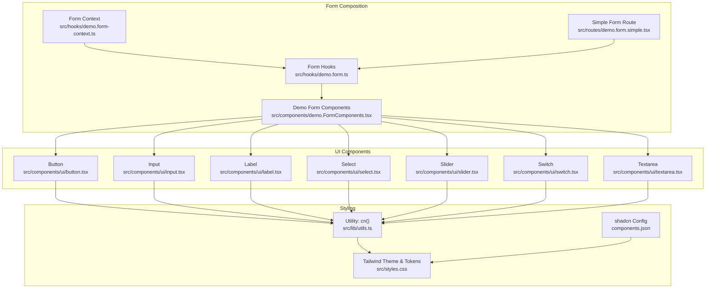

**Diagram sources**
- [button.tsx:1-58](file://src/components/ui/button.tsx#L1-L58)
- [input.tsx:1-22](file://src/components/ui/input.tsx#L1-L22)
- [label.tsx:1-22](file://src/components/ui/label.tsx#L1-L22)
- [select.tsx:1-169](file://src/components/ui/select.tsx#L1-L169)
- [slider.tsx:1-59](file://src/components/ui/slider.tsx#L1-L59)
- [switch.tsx:1-27](file://src/components/ui/switch.tsx#L1-L27)
- [textarea.tsx:1-19](file://src/components/ui/textarea.tsx#L1-L19)
- [demo.FormComponents.tsx:1-159](file://src/components/demo.FormComponents.tsx#L1-L159)
- [demo.form.ts:1-18](file://src/hooks/demo.form.ts#L1-L18)
- [demo.form-context.ts:1-5](file://src/hooks/demo.form-context.ts#L1-L5)
- [demo.form.simple.tsx:1-69](file://src/routes/demo.form.simple.tsx#L1-L69)
- [utils.ts:1-8](file://src/lib/utils.ts#L1-L8)
- [styles.css:1-138](file://src/styles.css#L1-L138)
- [components.json:1-22](file://components.json#L1-L22)

**Section sources**
- [main.tsx:1-89](file://src/main.tsx#L1-L89)
- [package.json:1-60](file://package.json#L1-L60)
- [components.json:1-22](file://components.json#L1-L22)
- [styles.css:1-138](file://src/styles.css#L1-L138)

## Core Components
This section documents each component’s purpose, props, variants, styling, and accessibility characteristics.

- Button
  - Purpose: Standard action element with multiple variants and sizes.
  - Props:
    - className: Additional Tailwind classes.
    - variant: One of default, destructive, outline, secondary, ghost, link.
    - size: One of default, sm, lg, icon.
    - asChild: Render as a Radix Slot to compose with other elements.
    - All other button attributes (e.g., type, disabled).
  - Variants and Sizes: Controlled via class-variance-authority with Tailwind utilities for colors, shadows, transitions, focus-visible rings, and invalid states.
  - Accessibility: Focus-visible ring and ring color for focus-visible and aria-invalid states; supports nested SVG icons.
  - Styling: Uses cn() to merge classes and applies focus-visible and invalid state utilities.

- Input
  - Purpose: Text input with consistent focus, disabled, and invalid states.
  - Props:
    - className: Additional Tailwind classes.
    - type: HTML input type.
    - All other input attributes (e.g., value, onChange, onBlur).
  - Styling: Border, background, focus-visible ring, selection color, and disabled opacity handled via Tailwind classes; integrates with dark mode tokens.
  - Accessibility: Focus-visible ring and invalid state ring support.

- Label
  - Purpose: Associates text with form controls; supports disabled and peer states.
  - Props:
    - className: Additional Tailwind classes.
    - All other label attributes (e.g., htmlFor).
  - Styling: Typography, alignment, disabled opacity, and peer-disabled cursor/opacity.
  - Accessibility: Works with form controls via htmlFor and peer state selectors.

- Select
  - Purpose: Accessible dropdown with trigger, content, items, and scroll controls.
  - Props:
    - Root: Accepts all SelectPrimitive.Root props.
    - Trigger: size (sm | default), className, and children.
    - Content: position (popper or item-aligned), className.
    - Group, Value, Label, Item, Separator, ScrollUpButton, ScrollDownButton: Standard primitives with className.
  - Styling: Uses Tailwind classes for layout, borders, shadows, focus-visible ring, and invalid state ring; popper positioning applied conditionally.
  - Accessibility: Built on @radix-ui/react-select with proper keyboard navigation, ARIA roles, and portal rendering.

- Slider
  - Purpose: Range slider supporting single and multi-value selections.
  - Props:
    - className: Additional Tailwind classes.
    - defaultValue, value: Number or number array.
    - min, max: Numeric bounds.
    - All other SliderPrimitive.Root props.
  - Behavior: Computes internal values from value/defaultValue and renders a track, range, and one or more thumbs.
  - Styling: Track and range sizing based on orientation; thumb styling for focus-visible ring and transitions.
  - Accessibility: Uses @radix-ui/react-slider with keyboard and touch support.

- Switch
  - Purpose: Toggle switch with checked/unchecked states.
  - Props:
    - className: Additional Tailwind classes.
    - All other SwitchPrimitive.Root props.
  - Styling: Thumb translation and background color change based on checked state; focus-visible ring and disabled states.
  - Accessibility: Built on @radix-ui/react-switch with ARIA attributes.

- Textarea
  - Purpose: Multi-line text input with consistent focus, disabled, and invalid states.
  - Props:
    - className: Additional Tailwind classes.
    - All other textarea attributes (e.g., value, onChange, onBlur).
  - Styling: Border, background, focus-visible ring, selection color, and disabled opacity; integrates with dark mode tokens.
  - Accessibility: Focus-visible ring and invalid state ring support.

**Section sources**
- [button.tsx:1-58](file://src/components/ui/button.tsx#L1-L58)
- [input.tsx:1-22](file://src/components/ui/input.tsx#L1-L22)
- [label.tsx:1-22](file://src/components/ui/label.tsx#L1-L22)
- [select.tsx:1-169](file://src/components/ui/select.tsx#L1-L169)
- [slider.tsx:1-59](file://src/components/ui/slider.tsx#L1-L59)
- [switch.tsx:1-27](file://src/components/ui/switch.tsx#L1-L27)
- [textarea.tsx:1-19](file://src/components/ui/textarea.tsx#L1-L19)

## Architecture Overview
The UI components are thin wrappers around Radix UI primitives and Tailwind utilities, with a shared cn() utility for class merging. Form composition is achieved via @tanstack/react-form, which provides typed field components and subscription helpers. The design system is driven by CSS variables in src/styles.css and configured via components.json for shadcn-style usage.

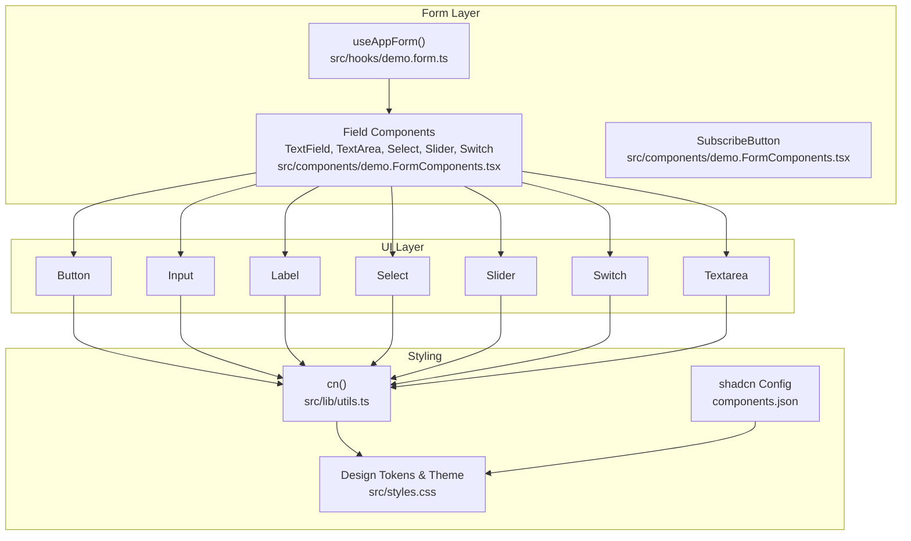

**Diagram sources**
- [demo.form.ts:1-18](file://src/hooks/demo.form.ts#L1-L18)
- [demo.FormComponents.tsx:1-159](file://src/components/demo.FormComponents.tsx#L1-L159)
- [button.tsx:1-58](file://src/components/ui/button.tsx#L1-L58)
- [input.tsx:1-22](file://src/components/ui/input.tsx#L1-L22)
- [label.tsx:1-22](file://src/components/ui/label.tsx#L1-L22)
- [select.tsx:1-169](file://src/components/ui/select.tsx#L1-L169)
- [slider.tsx:1-59](file://src/components/ui/slider.tsx#L1-L59)
- [switch.tsx:1-27](file://src/components/ui/switch.tsx#L1-L27)
- [textarea.tsx:1-19](file://src/components/ui/textarea.tsx#L1-L19)
- [utils.ts:1-8](file://src/lib/utils.ts#L1-L8)
- [styles.css:1-138](file://src/styles.css#L1-L138)
- [components.json:1-22](file://components.json#L1-L22)

## Detailed Component Analysis

### Button
- Implementation pattern: Uses class-variance-authority to define variants and sizes; merges with incoming className via cn().
- Props: variant, size, asChild, and standard button attributes.
- Styling: Focus-visible ring, disabled pointer-events and opacity, and invalid state ring classes.
- Accessibility: Focus-visible ring and aria-invalid ring classes for error states.

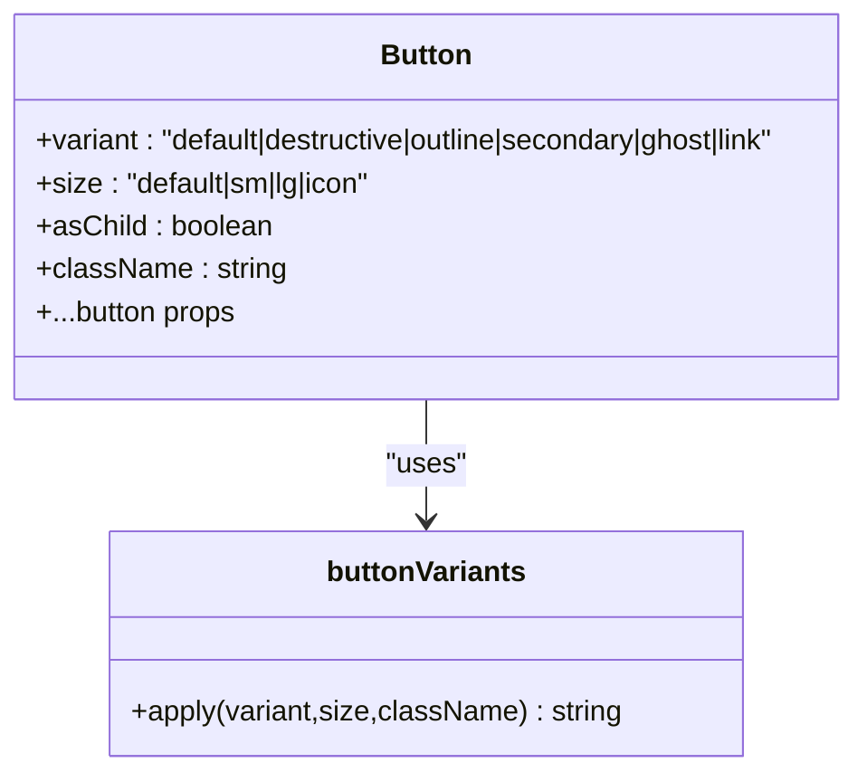

**Diagram sources**
- [button.tsx:8-34](file://src/components/ui/button.tsx#L8-L34)

**Section sources**
- [button.tsx:1-58](file://src/components/ui/button.tsx#L1-L58)

### Input
- Implementation pattern: Thin wrapper around native input with consistent focus and invalid state classes.
- Props: className, type, and standard input attributes.
- Styling: Focus-visible ring, selection color, and disabled opacity.

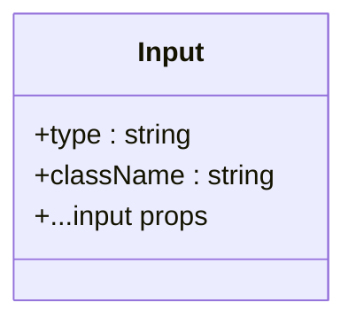

**Diagram sources**
- [input.tsx:5-19](file://src/components/ui/input.tsx#L5-L19)

**Section sources**
- [input.tsx:1-22](file://src/components/ui/input.tsx#L1-L22)

### Label
- Implementation pattern: Wrapper around @radix-ui/react-label with consistent typography and disabled states.
- Props: className and standard label attributes.
- Styling: Disabled opacity and peer-disabled cursor/opacity.

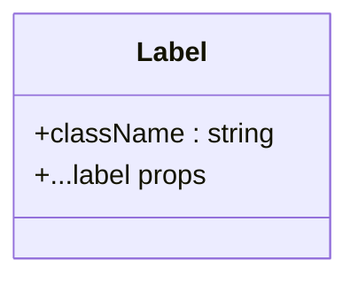

**Diagram sources**
- [label.tsx:8-19](file://src/components/ui/label.tsx#L8-L19)

**Section sources**
- [label.tsx:1-22](file://src/components/ui/label.tsx#L1-L22)

### Select
- Implementation pattern: Composite component built from multiple @radix-ui/react-select primitives (Root, Trigger, Content, Item, etc.). Provides convenience wrappers for Trigger size and Content positioning.
- Props:
  - Root accepts primitive props.
  - Trigger: size, className, children.
  - Content: position, className.
  - Other primitives accept standard props.
- Styling: Focus-visible ring, invalid state ring, and conditional popper positioning.
- Accessibility: Portal rendering, ARIA roles, keyboard navigation, and scroll buttons.

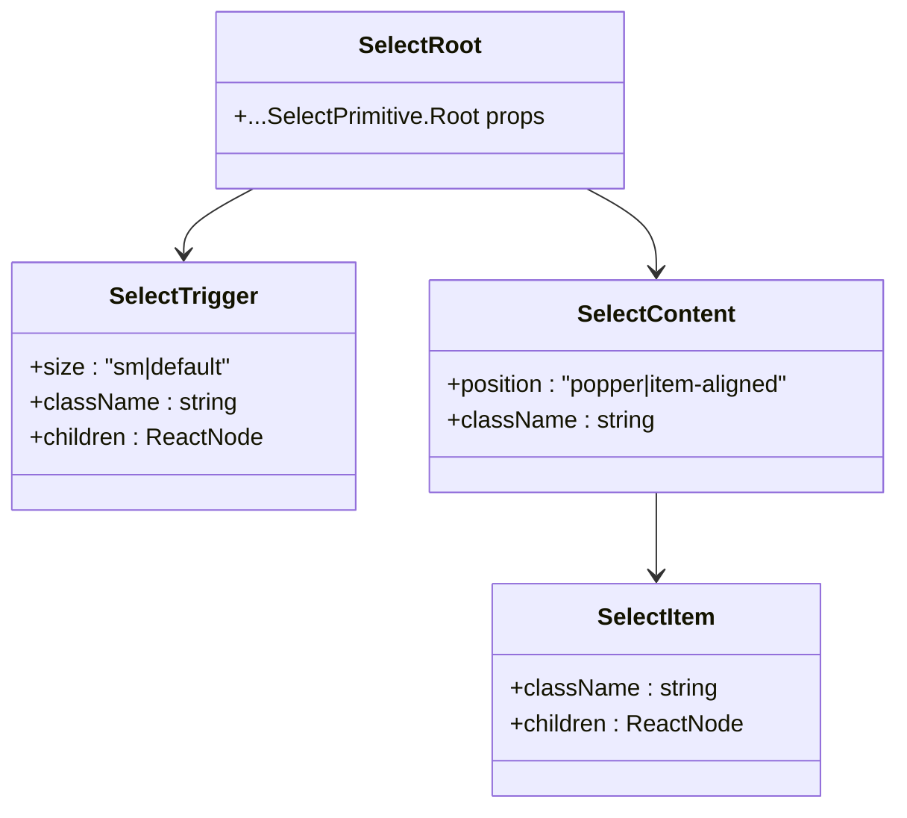

**Diagram sources**
- [select.tsx:7-167](file://src/components/ui/select.tsx#L7-L167)

**Section sources**
- [select.tsx:1-169](file://src/components/ui/select.tsx#L1-L169)

### Slider
- Implementation pattern: Uses @radix-ui/react-slider with computed values from value/defaultValue; renders track, range, and one or more thumbs.
- Props: className, defaultValue, value (number or number[]), min, max, and primitive props.
- Styling: Orientation-aware sizing and focus-visible ring on thumbs.

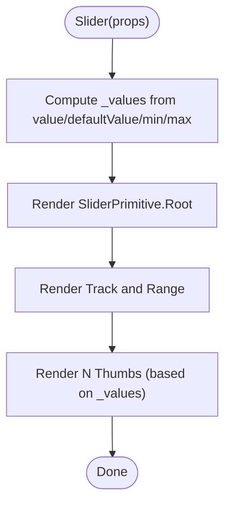

**Diagram sources**
- [slider.tsx:8-56](file://src/components/ui/slider.tsx#L8-L56)

**Section sources**
- [slider.tsx:1-59](file://src/components/ui/slider.tsx#L1-L59)

### Switch
- Implementation pattern: Wrapper around @radix-ui/react-switch with checked/unchecked state styling and focus-visible ring.
- Props: className and primitive props.
- Styling: Thumb translateX and background color based on checked state.

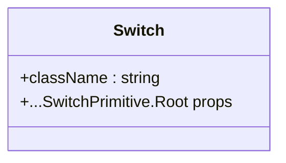

**Diagram sources**
- [switch.tsx:6-24](file://src/components/ui/switch.tsx#L6-L24)

**Section sources**
- [switch.tsx:1-27](file://src/components/ui/switch.tsx#L1-L27)

### Textarea
- Implementation pattern: Thin wrapper around native textarea with consistent focus and invalid state classes.
- Props: className and standard textarea attributes.
- Styling: Focus-visible ring, selection color, and disabled opacity.

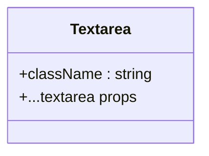

**Diagram sources**
- [textarea.tsx:5-15](file://src/components/ui/textarea.tsx#L5-L15)

**Section sources**
- [textarea.tsx:1-19](file://src/components/ui/textarea.tsx#L1-L19)

### Form Composition and Validation Flow
The demo form demonstrates composing fields with @tanstack/react-form. Field components subscribe to store state and render errors. The simple form route wires up validation on blur and submits with success feedback.

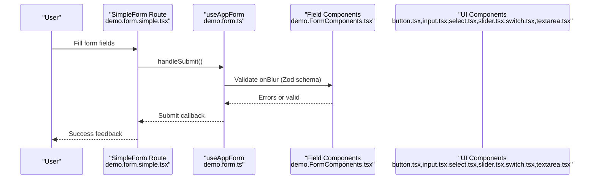

**Diagram sources**
- [demo.form.simple.tsx:13-61](file://src/routes/demo.form.simple.tsx#L13-L61)
- [demo.form.ts:6-17](file://src/hooks/demo.form.ts#L6-L17)
- [demo.FormComponents.tsx:13-159](file://src/components/demo.FormComponents.tsx#L13-L159)
- [button.tsx:36-55](file://src/components/ui/button.tsx#L36-L55)
- [input.tsx:5-19](file://src/components/ui/input.tsx#L5-L19)
- [select.tsx:82-112](file://src/components/ui/select.tsx#L82-L112)
- [slider.tsx:120-138](file://src/components/ui/slider.tsx#L120-L138)
- [switch.tsx:140-158](file://src/components/ui/switch.tsx#L140-L158)
- [textarea.tsx:60-79](file://src/components/ui/textarea.tsx#L60-L79)

**Section sources**
- [demo.form.simple.tsx:1-69](file://src/routes/demo.form.simple.tsx#L1-L69)
- [demo.form.ts:1-18](file://src/hooks/demo.form.ts#L1-L18)
- [demo.form-context.ts:1-5](file://src/hooks/demo.form-context.ts#L1-L5)
- [demo.FormComponents.tsx:1-159](file://src/components/demo.FormComponents.tsx#L1-L159)

## Dependency Analysis
External libraries and their roles:
- @radix-ui/react-*: Accessible primitives for Select, Slider, Switch, and Label.
- class-variance-authority: Variants and sizes for Button.
- tailwind-merge and clsx: Safe class merging.
- @tanstack/react-form: Form state, validation, and field composition.
- lucide-react: Icons used in Select and Slider.
- tailwindcss v4: Utility-first styling with design tokens.

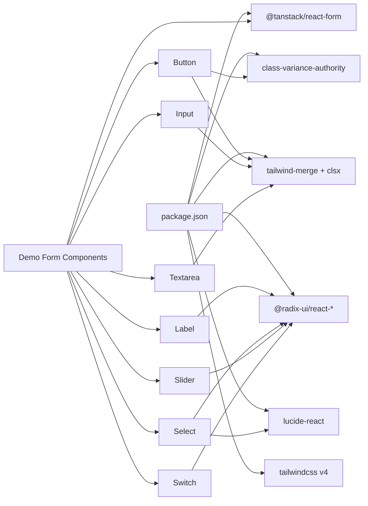

**Diagram sources**
- [package.json:15-43](file://package.json#L15-L43)
- [button.tsx:1-7](file://src/components/ui/button.tsx#L1-L7)
- [input.tsx:1-4](file://src/components/ui/input.tsx#L1-L4)
- [label.tsx:1-7](file://src/components/ui/label.tsx#L1-L7)
- [select.tsx:1-6](file://src/components/ui/select.tsx#L1-L6)
- [slider.tsx:1-7](file://src/components/ui/slider.tsx#L1-L7)
- [switch.tsx:1-5](file://src/components/ui/switch.tsx#L1-L5)
- [textarea.tsx:1-4](file://src/components/ui/textarea.tsx#L1-L4)
- [demo.FormComponents.tsx:1-12](file://src/components/demo.FormComponents.tsx#L1-L12)
- [demo.form.ts:1-4](file://src/hooks/demo.form.ts#L1-L4)

**Section sources**
- [package.json:1-60](file://package.json#L1-L60)

## Performance Considerations
- Prefer minimal re-renders by lifting state to @tanstack/react-form where appropriate.
- Use cn() to avoid excessive class concatenation and ensure deterministic class ordering.
- Limit heavy computations inside render; memoize derived values (e.g., Slider values) as shown in Slider.
- Keep variant sets small to reduce CSS bundle size; leverage shared Tailwind utilities.

## Troubleshooting Guide
- Focus ring not visible:
  - Ensure focus-visible ring utilities are present on interactive components.
  - Verify Tailwind base layer is applied and CSS variables are set.
- Invalid state styling not appearing:
  - Confirm aria-invalid is set on inputs/fields and that ring classes are included.
- Select content not positioned correctly:
  - Check position prop and popper positioning classes; ensure portal rendering is active.
- Slider thumb not visible:
  - Verify focus-visible ring classes and disabled state handling.
- Switch thumb misalignment:
  - Confirm translateX classes for checked state and thumb sizing.

**Section sources**
- [button.tsx:8-34](file://src/components/ui/button.tsx#L8-L34)
- [input.tsx:10-15](file://src/components/ui/input.tsx#L10-L15)
- [select.tsx:50-77](file://src/components/ui/select.tsx#L50-L77)
- [slider.tsx:28-54](file://src/components/ui/slider.tsx#L28-L54)
- [switch.tsx:10-22](file://src/components/ui/switch.tsx#L10-L22)
- [styles.css:130-138](file://src/styles.css#L130-L138)

## Conclusion
The UI Component Library provides a cohesive set of accessible, styled form controls built on Radix UI primitives and Tailwind CSS. Variants, sizes, and focus/invalid states are standardized, while @tanstack/react-form enables robust form composition and validation. The design system is driven by CSS variables and shadcn-compatible configuration, enabling consistent theming and easy customization.

## Appendices

### Design System Integration and Tokens
- Design tokens are defined as CSS variables in :root and .dark, mapped to Tailwind theme variables.
- Base layer applies border and outline ring utilities globally.
- Tailwind v4 is configured via components.json with CSS variables enabled and aliases for components/utils/ui.

**Section sources**
- [styles.css:20-89](file://src/styles.css#L20-L89)
- [styles.css:91-128](file://src/styles.css#L91-L128)
- [styles.css:130-138](file://src/styles.css#L130-L138)
- [components.json:1-22](file://components.json#L1-L22)

### Tailwind CSS Classes and Utilities
- Shared cn() utility merges clsx and tailwind-merge to prevent conflicting classes.
- Components apply focus-visible rings, disabled states, and aria-invalid rings consistently.
- Dark mode tokens are integrated via CSS variables and dark variant.

**Section sources**
- [utils.ts:1-8](file://src/lib/utils.ts#L1-L8)
- [button.tsx:8-34](file://src/components/ui/button.tsx#L8-L34)
- [input.tsx:10-15](file://src/components/ui/input.tsx#L10-L15)
- [textarea.tsx:9-12](file://src/components/ui/textarea.tsx#L9-L12)
- [select.tsx:31-60](file://src/components/ui/select.tsx#L31-L60)
- [slider.tsx:28-54](file://src/components/ui/slider.tsx#L28-L54)
- [switch.tsx:10-22](file://src/components/ui/switch.tsx#L10-L22)
- [styles.css:56-89](file://src/styles.css#L56-L89)

### Form Validation Best Practices
- Use Zod schema for validation; validate on blur for immediate feedback.
- Render error messages conditionally when fields are touched.
- Disable submit button during submission to prevent duplicate submissions.
- Provide clear labeling with Label and htmlFor to improve accessibility.

**Section sources**
- [demo.form.simple.tsx:8-27](file://src/routes/demo.form.simple.tsx#L8-L27)
- [demo.FormComponents.tsx:26-39](file://src/components/demo.FormComponents.tsx#L26-L39)
- [demo.FormComponents.tsx:13-24](file://src/components/demo.FormComponents.tsx#L13-L24)

### Responsive Design Considerations
- Components use responsive text utilities (e.g., md:text-sm) and flexible widths (w-full).
- Inputs and Textareas adapt to container widths; Select trigger uses fit-content with whitespace handling.
- Slider supports horizontal and vertical orientations with appropriate sizing utilities.

**Section sources**
- [input.tsx:10-15](file://src/components/ui/input.tsx#L10-L15)
- [textarea.tsx:9-12](file://src/components/ui/textarea.tsx#L9-L12)
- [select.tsx:31-42](file://src/components/ui/select.tsx#L31-L42)
- [slider.tsx:28-54](file://src/components/ui/slider.tsx#L28-L54)