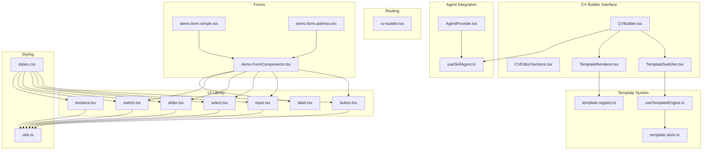
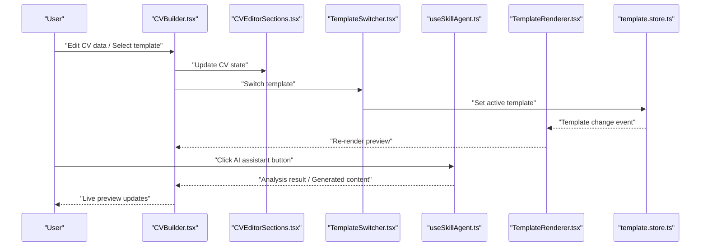
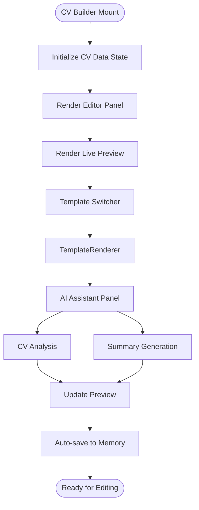
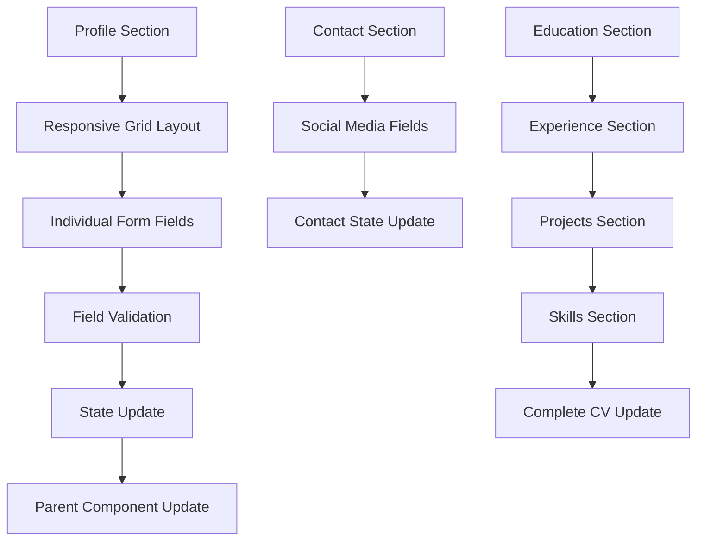
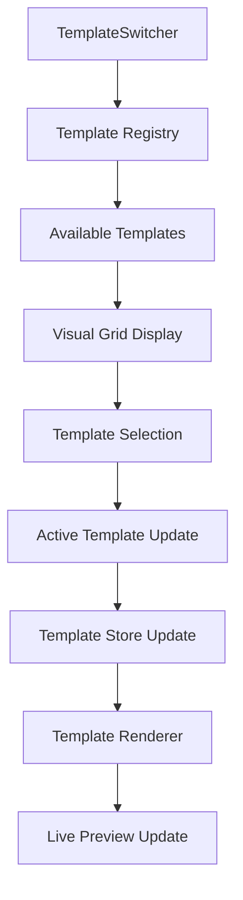
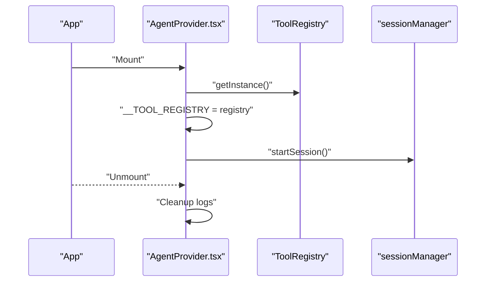
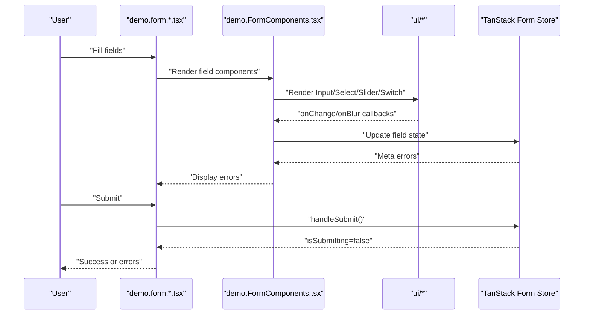
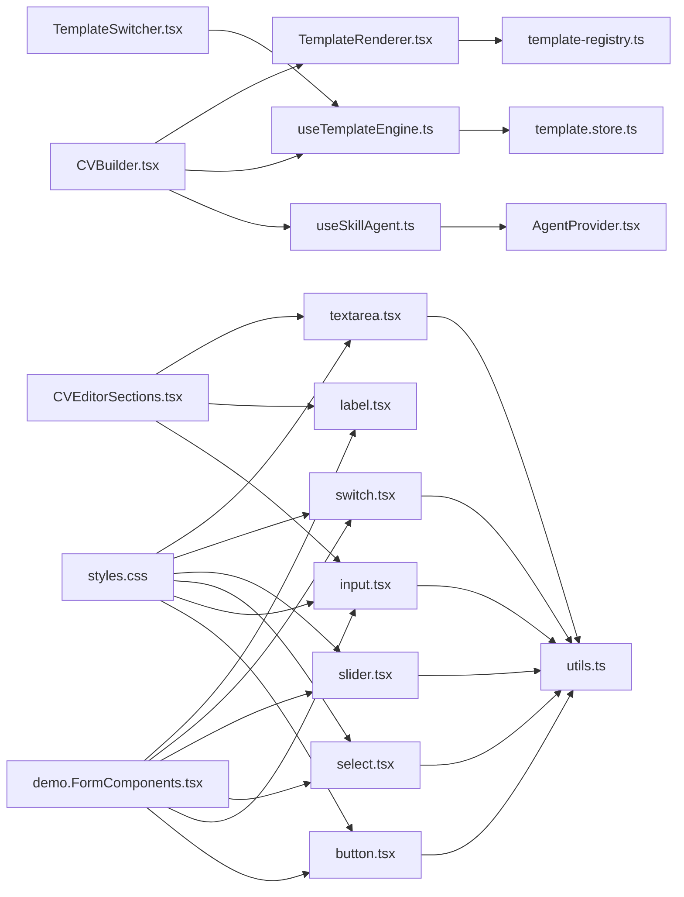

# User Interface Components

<cite>
**Referenced Files in This Document**
- [CVBuilder.tsx](file://src/components/CVBuilder.tsx)
- [CVEditorSections.tsx](file://src/components/CVEditorSections.tsx)
- [TemplateSwitcher.tsx](file://src/components/TemplateSwitcher.tsx)
- [AgentProvider.tsx](file://src/components/AgentProvider.tsx)
- [button.tsx](file://src/components/ui/button.tsx)
- [input.tsx](file://src/components/ui/input.tsx)
- [label.tsx](file://src/components/ui/label.tsx)
- [select.tsx](file://src/components/ui/select.tsx)
- [slider.tsx](file://src/components/ui/slider.tsx)
- [switch.tsx](file://src/components/ui/switch.tsx)
- [textarea.tsx](file://src/components/ui/textarea.tsx)
- [useSkillAgent.ts](file://src/agent/hooks/useSkillAgent.ts)
- [useTemplateEngine.ts](file://src/templates/hooks/useTemplateEngine.ts)
- [TemplateRenderer.tsx](file://src/templates/core/TemplateRenderer.tsx)
- [template.store.ts](file://src/templates/store/template.store.ts)
- [template-registry.ts](file://src/templates/core/template-registry.ts)
- [cv-builder.tsx](file://src/routes/cv-builder.tsx)
- [demo.FormComponents.tsx](file://src/components/demo.FormComponents.tsx)
- [demo.form.simple.tsx](file://src/routes/demo.form.simple.tsx)
- [demo.form.address.tsx](file://src/routes/demo.form.address.tsx)
- [utils.ts](file://src/lib/utils.ts)
- [styles.css](file://src/styles.css)
</cite>

## Update Summary
**Changes Made**
- Added comprehensive documentation for the CV Builder main interface (CVBuilder.tsx)
- Documented the CV Editor Sections component for structured CV editing
- Added Template Switcher component documentation with template management capabilities
- Integrated AI Skill Agent system documentation showing real-time editing and preview functionality
- Updated architecture diagrams to reflect the new CV Builder workflow
- Enhanced component composition patterns and prop interfaces for the new components

## Table of Contents
1. [Introduction](#introduction)
2. [Project Structure](#project-structure)
3. [Core Components](#core-components)
4. [Architecture Overview](#architecture-overview)
5. [Detailed Component Analysis](#detailed-component-analysis)
6. [Dependency Analysis](#dependency-analysis)
7. [Performance Considerations](#performance-considerations)
8. [Troubleshooting Guide](#troubleshooting-guide)
9. [Conclusion](#conclusion)
10. [Appendices](#appendices)

## Introduction
This document describes the User Interface components that power the CV Portfolio Builder's interactive experience. It covers:
- The CV Builder main interface for real-time CV editing and preview
- CV Editor Sections for structured data entry and validation
- The Template Switcher for dynamic template selection and management
- The AI Skill Agent integration for intelligent CV assistance
- The UI component library (buttons, inputs, forms, and layout helpers)
- The Agent Provider system for managing AI interactions and state
- Form components with validation, error handling, and user feedback
- Component composition patterns, prop interfaces, and customization options
- Examples of component usage, styling customization, and accessibility considerations
- Responsive design and cross-browser compatibility guidance

## Project Structure
The UI layer is organized around:
- CV Builder components under src/components
- Template management system under src/templates
- Agent integration under src/agent
- Reusable UI primitives under src/components/ui
- Hooks for agent state and CV data under src/hooks
- Demo forms and routing under src/routes
- Shared utilities and global styles under src/lib and src/styles.css

**Diagram sources**
- [CVBuilder.tsx:1-270](file://src/components/CVBuilder.tsx#L1-L270)
- [CVEditorSections.tsx:1-122](file://src/components/CVEditorSections.tsx#L1-L122)
- [TemplateSwitcher.tsx:1-50](file://src/components/TemplateSwitcher.tsx#L1-L50)
- [TemplateRenderer.tsx:1-74](file://src/templates/core/TemplateRenderer.tsx#L1-L74)
- [AgentProvider.tsx:1-30](file://src/components/AgentProvider.tsx#L1-L30)
- [useSkillAgent.ts:1-243](file://src/agent/hooks/useSkillAgent.ts#L1-L243)
- [useTemplateEngine.ts:1-57](file://src/templates/hooks/useTemplateEngine.ts#L1-L57)
- [template.store.ts:1-103](file://src/templates/store/template.store.ts#L1-L103)
- [template-registry.ts:1-92](file://src/templates/core/template-registry.ts#L1-L92)
- [cv-builder.tsx:1-15](file://src/routes/cv-builder.tsx#L1-L15)

**Section sources**
- [CVBuilder.tsx:1-270](file://src/components/CVBuilder.tsx#L1-L270)
- [CVEditorSections.tsx:1-122](file://src/components/CVEditorSections.tsx#L1-L122)
- [TemplateSwitcher.tsx:1-50](file://src/components/TemplateSwitcher.tsx#L1-L50)
- [TemplateRenderer.tsx:1-74](file://src/templates/core/TemplateRenderer.tsx#L1-L74)
- [AgentProvider.tsx:1-30](file://src/components/AgentProvider.tsx#L1-L30)
- [useSkillAgent.ts:1-243](file://src/agent/hooks/useSkillAgent.ts#L1-L243)
- [useTemplateEngine.ts:1-57](file://src/templates/hooks/useTemplateEngine.ts#L1-L57)
- [template.store.ts:1-103](file://src/templates/store/template.store.ts#L1-L103)
- [template-registry.ts:1-92](file://src/templates/core/template-registry.ts#L1-L92)
- [cv-builder.tsx:1-15](file://src/routes/cv-builder.tsx#L1-L15)

## Core Components
This section introduces the primary UI components and their responsibilities.

- CV Builder Main Interface
  - Provides a split-pane editor with live preview functionality
  - Manages CV data state with real-time editing capabilities
  - Integrates AI assistant for CV analysis and optimization
  - Supports template switching with instant preview updates

- CV Editor Sections
  - Structured form components for different CV sections
  - Comprehensive validation and error handling
  - Responsive grid layouts for optimal editing experience
  - Integration with CV data model for seamless updates

- Template Switcher
  - Dynamic template selection with visual previews
  - Category-based filtering and search capabilities
  - Real-time template application with live preview
  - Custom template management support

- Agent Provider
  - Initializes the tool registry and starts the session lifecycle
  - Exposes global access to tools for hook consumption
  - Manages AI Skill Agent integration and state

- UI Component Library
  - Buttons, Inputs, Labels, Selects, Sliders, Switches, and Textareas
  - Variants and sizes for consistent styling
  - Accessibility attributes and focus states

- Form Components and Validation
  - Demo form components wrap UI primitives with field context and validation
  - Routes demonstrate simple and address forms with Zod-like validation patterns

**Section sources**
- [CVBuilder.tsx:14-209](file://src/components/CVBuilder.tsx#L14-L209)
- [CVEditorSections.tsx:12-121](file://src/components/CVEditorSections.tsx#L12-L121)
- [TemplateSwitcher.tsx:10-49](file://src/components/TemplateSwitcher.tsx#L10-L49)
- [AgentProvider.tsx:9-26](file://src/components/AgentProvider.tsx#L9-L26)
- [button.tsx:8-34](file://src/components/ui/button.tsx#L8-L34)
- [input.tsx:5-18](file://src/components/ui/input.tsx#L5-L18)
- [demo.FormComponents.tsx:13-159](file://src/components/demo.FormComponents.tsx#L13-L159)
- [demo.form.simple.tsx:8-27](file://src/routes/demo.form.simple.tsx#L8-L27)
- [demo.form.address.tsx:7-39](file://src/routes/demo.form.address.tsx#L7-L39)

## Architecture Overview
The UI architecture centers on a Provider pattern that initializes agent state and exposes it via React hooks. Components consume hooks to render agent-driven experiences and manage CV data with real-time editing capabilities.

**Diagram sources**
- [CVBuilder.tsx:15-209](file://src/components/CVBuilder.tsx#L15-L209)
- [CVEditorSections.tsx:12-121](file://src/components/CVEditorSections.tsx#L12-L121)
- [TemplateSwitcher.tsx:10-49](file://src/components/TemplateSwitcher.tsx#L10-L49)
- [useSkillAgent.ts:38-184](file://src/agent/hooks/useSkillAgent.ts#L38-L184)
- [TemplateRenderer.tsx:13-53](file://src/templates/core/TemplateRenderer.tsx#L13-L53)
- [template.store.ts:46-98](file://src/templates/store/template.store.ts#L46-L98)

**Section sources**
- [CVBuilder.tsx:1-270](file://src/components/CVBuilder.tsx#L1-L270)
- [useSkillAgent.ts:1-243](file://src/agent/hooks/useSkillAgent.ts#L1-L243)
- [AgentProvider.tsx:1-30](file://src/components/AgentProvider.tsx#L1-L30)

## Detailed Component Analysis

### CV Builder Main Interface
The CV Builder provides a comprehensive editing experience with split-pane layout, real-time preview, and AI assistance integration.

Key features:
- Split-pane layout with editor on left and live preview on right
- Real-time CV data binding with automatic saving
- AI assistant panel with analysis and generation capabilities
- Template switching with instant preview updates
- Demo data loading for quick prototyping

Component architecture:
- State management for CV data and editing mode
- Integration with CV memory for persistence
- Template engine integration for preview rendering
- AI Skill Agent integration for intelligent assistance

**Diagram sources**
- [CVBuilder.tsx:14-209](file://src/components/CVBuilder.tsx#L14-L209)

**Section sources**
- [CVBuilder.tsx:1-270](file://src/components/CVBuilder.tsx#L1-L270)
- [useSkillAgent.ts:38-184](file://src/agent/hooks/useSkillAgent.ts#L38-L184)
- [useTemplateEngine.ts:10-56](file://src/templates/hooks/useTemplateEngine.ts#L10-L56)

### CV Editor Sections
The CV Editor Sections component provides structured, validated editing for different CV sections with responsive layouts.

Key features:
- Grid-based responsive layouts for optimal editing experience
- Comprehensive form validation with required field enforcement
- Contact information management with social media integration
- Professional summary editing with character limits
- Integration with CV data model for seamless updates

Validation patterns:
- Required field validation with asterisk indicators
- Email format validation for contact information
- Dynamic field updates with proper state propagation
- Placeholder text for better user guidance

**Diagram sources**
- [CVEditorSections.tsx:12-121](file://src/components/CVEditorSections.tsx#L12-L121)

**Section sources**
- [CVEditorSections.tsx:1-122](file://src/components/CVEditorSections.tsx#L1-L122)
- [input.tsx:5-18](file://src/components/ui/input.tsx#L5-L18)
- [label.tsx:8-18](file://src/components/ui/label.tsx#L8-L18)
- [textarea.tsx:5-15](file://src/components/ui/textarea.tsx#L5-L15)

### Template Switcher
The Template Switcher enables dynamic template selection with visual previews and real-time application.

Key features:
- Grid-based template visualization with category filtering
- Active template highlighting with visual indicators
- Template metadata display (layout, sections, category)
- Real-time template application with instant preview updates
- Custom template support with CRUD operations

Template management:
- Registry-based template discovery and loading
- Custom template storage and retrieval
- Template validation and metadata management
- Category-based filtering and search capabilities

**Diagram sources**
- [TemplateSwitcher.tsx:10-49](file://src/components/TemplateSwitcher.tsx#L10-L49)
- [useTemplateEngine.ts:10-56](file://src/templates/hooks/useTemplateEngine.ts#L10-L56)
- [template.store.ts:46-98](file://src/templates/store/template.store.ts#L46-L98)
- [template-registry.ts:10-92](file://src/templates/core/template-registry.ts#L10-L92)

**Section sources**
- [TemplateSwitcher.tsx:1-50](file://src/components/TemplateSwitcher.tsx#L1-L50)
- [useTemplateEngine.ts:1-57](file://src/templates/hooks/useTemplateEngine.ts#L1-L57)
- [template.store.ts:1-103](file://src/templates/store/template.store.ts#L1-L103)
- [template-registry.ts:1-92](file://src/templates/core/template-registry.ts#L1-L92)

### Agent Provider System
The Agent Provider initializes the tool registry and starts the session, exposing global tool access for hooks.

Responsibilities:
- Initialize ToolRegistry singleton and attach to window for hook access
- Start session lifecycle
- Cleanup on unmount

**Diagram sources**
- [AgentProvider.tsx:12-26](file://src/components/AgentProvider.tsx#L12-L26)

**Section sources**
- [AgentProvider.tsx:1-30](file://src/components/AgentProvider.tsx#L1-L30)
- [useSkillAgent.ts:189-215](file://src/agent/hooks/useSkillAgent.ts#L189-L215)

### UI Component Library

#### Button
- Variants: default, destructive, outline, secondary, ghost, link
- Sizes: default, sm, lg, icon
- Composition: Uses class variance authority and slot composition for semantic rendering.

Customization:
- Pass variant and size props.
- Use asChild to render as another element (e.g., Link).

**Section sources**
- [button.tsx:8-58](file://src/components/ui/button.tsx#L8-L58)
- [utils.ts:5-7](file://src/lib/utils.ts#L5-L7)

#### Input
- Focus and invalid states with ring emphasis.
- Accessible placeholder and selection styling.

Customization:
- Extend className for overrides.
- Use aria-invalid for validation feedback.

**Section sources**
- [input.tsx:5-18](file://src/components/ui/input.tsx#L5-L18)
- [utils.ts:5-7](file://src/lib/utils.ts#L5-L7)

#### Label
- Associated with form controls for accessibility.
- Disabled state support via group/disabled data attributes.

**Section sources**
- [label.tsx:8-18](file://src/components/ui/label.tsx#L8-L18)

#### Select
- Trigger, Content, Item, Label, Separator, Scroll Up/Down buttons.
- Supports size variants and portal rendering.

Customization:
- Control size via trigger prop.
- Style content positioning and animations via data attributes.

**Section sources**
- [select.tsx:19-78](file://src/components/ui/select.tsx#L19-L78)
- [utils.ts:5-7](file://src/lib/utils.ts#L5-L7)

#### Slider
- Single-handle range with track and thumb.
- Orientation support (horizontal/vertical).

**Section sources**
- [slider.tsx:8-56](file://src/components/ui/slider.tsx#L8-L56)

#### Switch
- Toggle with thumb translation.
- Checked/unchecked states with focus rings.

**Section sources**
- [switch.tsx:6-24](file://src/components/ui/switch.tsx#L6-L24)

#### Textarea
- Focus and invalid states.
- Field sizing and responsive text size.

**Section sources**
- [textarea.tsx:5-15](file://src/components/ui/textarea.tsx#L5-L15)

### Form Components and Validation
The demo form components integrate UI primitives with field context and validation. They render errors conditionally and disable submit while submitting.

Patterns:
- Field wrappers bind handleChange, handleBlur, and read meta.errors.
- ErrorMessages renders array of error strings or objects.
- SubscribeButton reads submission state from form.Subscribe.

Validation examples:
- Simple form enforces required fields via onBlur schema.
- Address form demonstrates nested field validation and custom regex patterns.

**Diagram sources**
- [demo.FormComponents.tsx:41-159](file://src/components/demo.FormComponents.tsx#L41-L159)
- [demo.form.simple.tsx:13-61](file://src/routes/demo.form.simple.tsx#L13-L61)
- [demo.form.address.tsx:7-192](file://src/routes/demo.form.address.tsx#L7-L192)

**Section sources**
- [demo.FormComponents.tsx:1-159](file://src/components/demo.FormComponents.tsx#L1-L159)
- [demo.form.simple.tsx:1-69](file://src/routes/demo.form.simple.tsx#L1-L69)
- [demo.form.address.tsx:1-200](file://src/routes/demo.form.address.tsx#L1-L200)

## Dependency Analysis
The UI components depend on:
- Tailwind-based styling and theme tokens
- Radix UI primitives for accessible controls
- TanStack Form for form state and validation
- Agent hooks for orchestration and session stats
- Template engine for dynamic rendering
- AI Skill Agent for intelligent assistance

**Diagram sources**
- [CVBuilder.tsx:1-270](file://src/components/CVBuilder.tsx#L1-L270)
- [CVEditorSections.tsx:1-122](file://src/components/CVEditorSections.tsx#L1-L122)
- [TemplateSwitcher.tsx:1-50](file://src/components/TemplateSwitcher.tsx#L1-L50)
- [TemplateRenderer.tsx:1-74](file://src/templates/core/TemplateRenderer.tsx#L1-L74)
- [useSkillAgent.ts:1-243](file://src/agent/hooks/useSkillAgent.ts#L1-L243)
- [useTemplateEngine.ts:1-57](file://src/templates/hooks/useTemplateEngine.ts#L1-L57)
- [template.store.ts:1-103](file://src/templates/store/template.store.ts#L1-L103)
- [template-registry.ts:1-92](file://src/templates/core/template-registry.ts#L1-L92)
- [AgentProvider.tsx:1-30](file://src/components/AgentProvider.tsx#L1-L30)

**Section sources**
- [CVBuilder.tsx:1-270](file://src/components/CVBuilder.tsx#L1-L270)
- [CVEditorSections.tsx:1-122](file://src/components/CVEditorSections.tsx#L1-L122)
- [TemplateSwitcher.tsx:1-50](file://src/components/TemplateSwitcher.tsx#L1-L50)
- [TemplateRenderer.tsx:1-74](file://src/templates/core/TemplateRenderer.tsx#L1-L74)
- [useSkillAgent.ts:1-243](file://src/agent/hooks/useSkillAgent.ts#L1-L243)
- [useTemplateEngine.ts:1-57](file://src/templates/hooks/useTemplateEngine.ts#L1-L57)
- [template.store.ts:1-103](file://src/templates/store/template.store.ts#L1-L103)
- [template-registry.ts:1-92](file://src/templates/core/template-registry.ts#L1-L92)
- [AgentProvider.tsx:1-30](file://src/components/AgentProvider.tsx#L1-L30)

## Performance Considerations
- Prefer memoized callbacks in hooks to avoid unnecessary re-renders.
- Debounce or batch frequent updates when integrating with agent tools.
- Use virtualized lists for long message histories if scaling up.
- Keep DOM updates minimal by rendering only visible suggestions and truncated lists.
- Lazy-load heavy tool results and cache computed metrics (e.g., completeness score).
- Implement proper state normalization for CV data to prevent excessive re-renders.
- Use React.memo for template renderer components to optimize preview updates.
- Implement efficient template switching with proper cleanup of previous templates.

## Troubleshooting Guide
Common issues and resolutions:
- Templates not loading in Template Switcher
  - Ensure template registry is properly initialized and populated.
  - Verify template IDs match between registry and store.
  - Check template metadata and category assignments.
- AI assistant not responding
  - Ensure AgentProvider is mounted and ToolRegistry is initialized.
  - Verify the registry is attached to the window for hook access.
  - Check LLM service configuration and API keys.
- CV data not persisting
  - Confirm CV memory is properly configured and accessible.
  - Verify saveCV function is being called with proper parameters.
  - Check for localStorage or memory store availability.
- Live preview not updating
  - Ensure TemplateRenderer receives proper template and CV data props.
  - Verify template engine is properly configured.
  - Check for React key changes that might prevent updates.
- Forms not validating
  - Confirm field wrappers subscribe to meta.errors and handle blur/change.
  - Check validator functions return either undefined or an error message.
  - Ensure required field attributes are properly set.

**Section sources**
- [AgentProvider.tsx:13-19](file://src/components/AgentProvider.tsx#L13-L19)
- [useSkillAgent.ts:189-215](file://src/agent/hooks/useSkillAgent.ts#L189-L215)
- [useTemplateEngine.ts:10-56](file://src/templates/hooks/useTemplateEngine.ts#L10-L56)
- [demo.FormComponents.tsx:26-39](file://src/components/demo.FormComponents.tsx#L26-L39)
- [utils.ts:5-7](file://src/lib/utils.ts#L5-L7)

## Conclusion
The CV Portfolio Builder's UI combines agent-driven interactions with a robust, accessible component library. The CV Builder provides comprehensive real-time editing capabilities with instant preview functionality, while the CV Editor Sections ensure structured and validated data entry. The Template Switcher enables dynamic template management with visual previews, and the AI Skill Agent integration delivers intelligent assistance. Together, these components create a responsive, customizable, and inclusive user experience for building professional CV portfolios.

## Appendices

### Accessibility Checklist
- Ensure labels are associated with inputs and selects.
- Provide keyboard navigation for selects, sliders, and switches.
- Announce dynamic content updates (e.g., suggestions) to assistive technologies.
- Maintain sufficient color contrast for completeness indicators and status messages.
- Use aria-invalid and aria-describedby for validation feedback.
- Implement proper focus management for modal dialogs and form sections.
- Ensure template switching is accessible via keyboard navigation.

### Responsive Design Notes
- Components use relative units and grid layouts for adaptive spacing.
- Inputs and buttons scale with size variants and viewport-aware text sizes.
- Long content areas (chat messages, dashboards) use overflow and scrollable containers.
- Template switcher adapts to different screen sizes with responsive grid layouts.
- CV builder maintains optimal editing experience across mobile, tablet, and desktop.

### Cross-Browser Compatibility
- Radix UI primitives provide consistent behavior across browsers.
- Tailwind utilities and CSS custom properties are broadly supported.
- Test form controls and focus rings on Safari, Firefox, and Chromium-based browsers.
- Template rendering works consistently across modern browsers with CSS custom properties support.
- AI assistant functionality tested on latest browser versions with proper fallbacks.