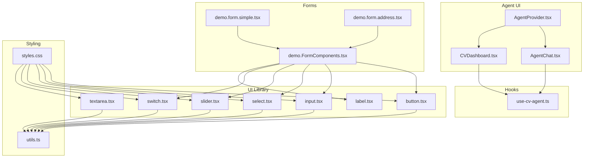
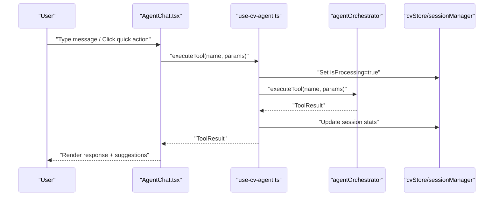
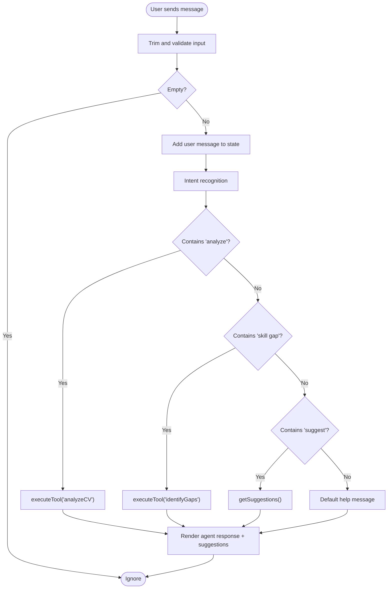
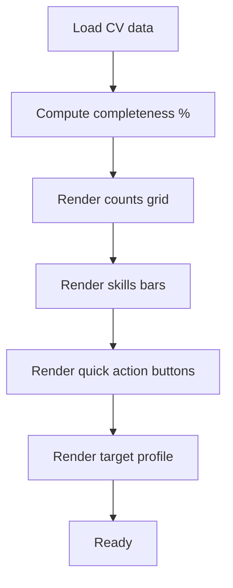
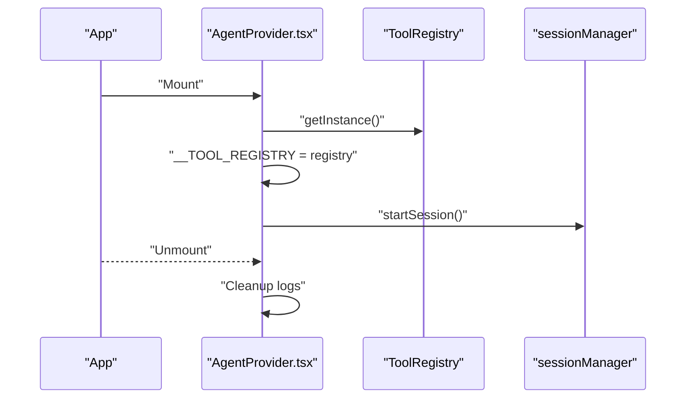
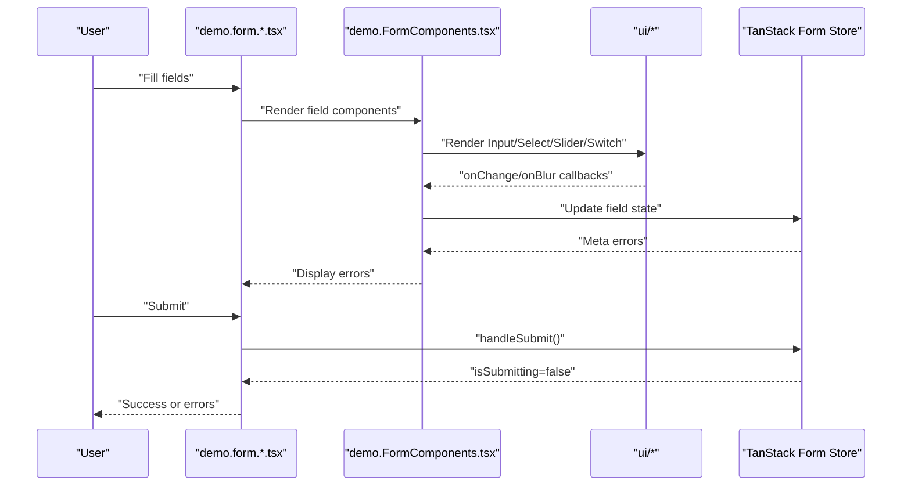
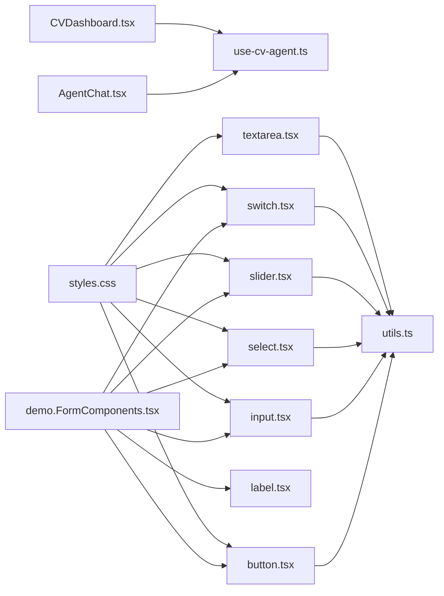

# User Interface Components

<cite>
**Referenced Files in This Document**
- [AgentChat.tsx](file://src/components/agent/AgentChat.tsx)
- [CVDashboard.tsx](file://src/components/agent/CVDashboard.tsx)
- [AgentProvider.tsx](file://src/components/AgentProvider.tsx)
- [button.tsx](file://src/components/ui/button.tsx)
- [input.tsx](file://src/components/ui/input.tsx)
- [label.tsx](file://src/components/ui/label.tsx)
- [select.tsx](file://src/components/ui/select.tsx)
- [slider.tsx](file://src/components/ui/slider.tsx)
- [switch.tsx](file://src/components/ui/switch.tsx)
- [textarea.tsx](file://src/components/ui/textarea.tsx)
- [use-cv-agent.ts](file://src/hooks/use-cv-agent.ts)
- [demo.FormComponents.tsx](file://src/components/demo.FormComponents.tsx)
- [demo.form.simple.tsx](file://src/routes/demo.form.simple.tsx)
- [demo.form.address.tsx](file://src/routes/demo.form.address.tsx)
- [utils.ts](file://src/lib/utils.ts)
- [styles.css](file://src/styles.css)
</cite>

## Table of Contents
1. [Introduction](#introduction)
2. [Project Structure](#project-structure)
3. [Core Components](#core-components)
4. [Architecture Overview](#architecture-overview)
5. [Detailed Component Analysis](#detailed-component-analysis)
6. [Dependency Analysis](#dependency-analysis)
7. [Performance Considerations](#performance-considerations)
8. [Troubleshooting Guide](#troubleshooting-guide)
9. [Conclusion](#conclusion)
10. [Appendices](#appendices)

## Introduction
This document describes the User Interface components that power the CV Portfolio Builder’s interactive experience. It covers:
- The Agent Chat Interface for AI-powered CV assistance
- The CV Dashboard for data management and quick insights
- The UI component library (buttons, inputs, forms, and layout helpers)
- The Agent Provider system for managing AI interactions and state
- Form components with validation, error handling, and user feedback
- Component composition patterns, prop interfaces, and customization options
- Examples of component usage, styling customization, and accessibility considerations
- Responsive design and cross-browser compatibility guidance

## Project Structure
The UI layer is organized around:
- Agent-facing components under src/components/agent
- Reusable UI primitives under src/components/ui
- Hooks for agent state and CV data under src/hooks
- Demo forms and routing under src/routes
- Shared utilities and global styles under src/lib and src/styles.css

**Diagram sources**
- [AgentChat.tsx:1-238](file://src/components/agent/AgentChat.tsx#L1-L238)
- [CVDashboard.tsx:1-175](file://src/components/agent/CVDashboard.tsx#L1-L175)
- [AgentProvider.tsx:1-30](file://src/components/AgentProvider.tsx#L1-L30)
- [button.tsx:1-58](file://src/components/ui/button.tsx#L1-L58)
- [input.tsx:1-22](file://src/components/ui/input.tsx#L1-L22)
- [label.tsx:1-22](file://src/components/ui/label.tsx#L1-L22)
- [select.tsx:1-169](file://src/components/ui/select.tsx#L1-L169)
- [slider.tsx:1-59](file://src/components/ui/slider.tsx#L1-L59)
- [switch.tsx:1-27](file://src/components/ui/switch.tsx#L1-L27)
- [textarea.tsx:1-19](file://src/components/ui/textarea.tsx#L1-L19)
- [use-cv-agent.ts:1-185](file://src/hooks/use-cv-agent.ts#L1-L185)
- [demo.FormComponents.tsx:1-159](file://src/components/demo.FormComponents.tsx#L1-L159)
- [demo.form.simple.tsx:1-69](file://src/routes/demo.form.simple.tsx#L1-L69)
- [demo.form.address.tsx:1-200](file://src/routes/demo.form.address.tsx#L1-L200)
- [utils.ts:1-8](file://src/lib/utils.ts#L1-L8)
- [styles.css:1-138](file://src/styles.css#L1-L138)

**Section sources**
- [AgentChat.tsx:1-238](file://src/components/agent/AgentChat.tsx#L1-L238)
- [CVDashboard.tsx:1-175](file://src/components/agent/CVDashboard.tsx#L1-L175)
- [AgentProvider.tsx:1-30](file://src/components/AgentProvider.tsx#L1-L30)
- [button.tsx:1-58](file://src/components/ui/button.tsx#L1-L58)
- [input.tsx:1-22](file://src/components/ui/input.tsx#L1-L22)
- [label.tsx:1-22](file://src/components/ui/label.tsx#L1-L22)
- [select.tsx:1-169](file://src/components/ui/select.tsx#L1-L169)
- [slider.tsx:1-59](file://src/components/ui/slider.tsx#L1-L59)
- [switch.tsx:1-27](file://src/components/ui/switch.tsx#L1-L27)
- [textarea.tsx:1-19](file://src/components/ui/textarea.tsx#L1-L19)
- [use-cv-agent.ts:1-185](file://src/hooks/use-cv-agent.ts#L1-L185)
- [demo.FormComponents.tsx:1-159](file://src/components/demo.FormComponents.tsx#L1-L159)
- [demo.form.simple.tsx:1-69](file://src/routes/demo.form.simple.tsx#L1-L69)
- [demo.form.address.tsx:1-200](file://src/routes/demo.form.address.tsx#L1-L200)
- [utils.ts:1-8](file://src/lib/utils.ts#L1-L8)
- [styles.css:1-138](file://src/styles.css#L1-L138)

## Core Components
This section introduces the primary UI components and their responsibilities.

- Agent Chat Interface
  - Provides a chat-like UI for interacting with the CV agent.
  - Manages messages, user input, and quick actions.
  - Integrates with hooks for agent orchestration and CV data.
  - Renders suggestions as clickable quick actions.

- CV Dashboard
  - Presents a quick overview of CV completeness, counts, and skills breakdown.
  - Offers quick action buttons to trigger agent tools.
  - Displays target profile context for personalized assistance.

- Agent Provider
  - Initializes the tool registry and starts the session lifecycle.
  - Exposes global access to tools for hook consumption.

- UI Component Library
  - Buttons, Inputs, Labels, Selects, Sliders, Switches, and Textareas.
  - Variants and sizes for consistent styling.
  - Accessibility attributes and focus states.

- Form Components and Validation
  - Demo form components wrap UI primitives with field context and validation.
  - Routes demonstrate simple and address forms with Zod-like validation patterns.

**Section sources**
- [AgentChat.tsx:12-121](file://src/components/agent/AgentChat.tsx#L12-L121)
- [CVDashboard.tsx:4-23](file://src/components/agent/CVDashboard.tsx#L4-L23)
- [AgentProvider.tsx:9-26](file://src/components/AgentProvider.tsx#L9-L26)
- [button.tsx:8-34](file://src/components/ui/button.tsx#L8-L34)
- [input.tsx:5-18](file://src/components/ui/input.tsx#L5-L18)
- [demo.FormComponents.tsx:13-159](file://src/components/demo.FormComponents.tsx#L13-L159)
- [demo.form.simple.tsx:8-27](file://src/routes/demo.form.simple.tsx#L8-L27)
- [demo.form.address.tsx:7-39](file://src/routes/demo.form.address.tsx#L7-L39)

## Architecture Overview
The UI architecture centers on a Provider pattern that initializes agent state and exposes it via React hooks. Components consume hooks to render agent-driven experiences and manage CV data.

**Diagram sources**
- [AgentChat.tsx:31-58](file://src/components/agent/AgentChat.tsx#L31-L58)
- [use-cv-agent.ts:20-49](file://src/hooks/use-cv-agent.ts#L20-L49)
- [AgentProvider.tsx:13-19](file://src/components/AgentProvider.tsx#L13-L19)

**Section sources**
- [AgentChat.tsx:1-238](file://src/components/agent/AgentChat.tsx#L1-L238)
- [use-cv-agent.ts:1-185](file://src/hooks/use-cv-agent.ts#L1-L185)
- [AgentProvider.tsx:1-30](file://src/components/AgentProvider.tsx#L1-L30)

## Detailed Component Analysis

### Agent Chat Interface
The Agent Chat renders a conversation history, suggestion chips, and a typed input. It integrates with agent hooks to process messages and surface actionable suggestions.

Key behaviors:
- Maintains a local message list with user, agent, and system messages.
- Processes natural-language intents to route to specific tools.
- Displays a “thinking” indicator while processing.
- Provides quick-action buttons mapped to common intents.

Prop interface and composition:
- Props: none (self-contained state)
- Composition: Uses useCVAgent for execution and suggestions, useCVData for context, useSession for stats.

Accessibility and UX:
- Focus states and disabled states for input and buttons.
- Timestamps and suggestion chips with hover affordances.
- Disabled input during processing.

**Diagram sources**
- [AgentChat.tsx:31-121](file://src/components/agent/AgentChat.tsx#L31-L121)

**Section sources**
- [AgentChat.tsx:1-238](file://src/components/agent/AgentChat.tsx#L1-L238)
- [use-cv-agent.ts:13-104](file://src/hooks/use-cv-agent.ts#L13-L104)

### CV Dashboard
The CV Dashboard presents a compact overview of CV completeness, counts, and skills distribution, plus quick actions to run agent tools.

Highlights:
- Circular progress for completeness with color-coded thresholds.
- Counts for experiences, projects, and skills.
- Skills breakdown bars per category.
- Quick action buttons for analysis, categorization, consistency checks, and suggestions.
- Target profile context display.

**Diagram sources**
- [CVDashboard.tsx:25-172](file://src/components/agent/CVDashboard.tsx#L25-L172)

**Section sources**
- [CVDashboard.tsx:1-175](file://src/components/agent/CVDashboard.tsx#L1-L175)
- [use-cv-agent.ts:109-123](file://src/hooks/use-cv-agent.ts#L109-L123)

### Agent Provider System
The Agent Provider initializes the tool registry and starts the session, exposing global tool access for hooks.

Responsibilities:
- Initialize ToolRegistry singleton and attach to window for hook access.
- Start session lifecycle.
- Cleanup on unmount.

**Diagram sources**
- [AgentProvider.tsx:12-26](file://src/components/AgentProvider.tsx#L12-L26)

**Section sources**
- [AgentProvider.tsx:1-30](file://src/components/AgentProvider.tsx#L1-L30)
- [use-cv-agent.ts:128-152](file://src/hooks/use-cv-agent.ts#L128-L152)

### UI Component Library

#### Button
- Variants: default, destructive, outline, secondary, ghost, link
- Sizes: default, sm, lg, icon
- Composition: Uses class variance authority and slot composition for semantic rendering.

Customization:
- Pass variant and size props.
- Use asChild to render as another element (e.g., Link).

**Section sources**
- [button.tsx:8-58](file://src/components/ui/button.tsx#L8-L58)
- [utils.ts:5-7](file://src/lib/utils.ts#L5-L7)

#### Input
- Focus and invalid states with ring emphasis.
- Accessible placeholder and selection styling.

Customization:
- Extend className for overrides.
- Use aria-invalid for validation feedback.

**Section sources**
- [input.tsx:5-18](file://src/components/ui/input.tsx#L5-L18)
- [utils.ts:5-7](file://src/lib/utils.ts#L5-L7)

#### Label
- Associated with form controls for accessibility.
- Disabled state support via group/disabled data attributes.

**Section sources**
- [label.tsx:8-18](file://src/components/ui/label.tsx#L8-L18)

#### Select
- Trigger, Content, Item, Label, Separator, Scroll Up/Down buttons.
- Supports size variants and portal rendering.

Customization:
- Control size via trigger prop.
- Style content positioning and animations via data attributes.

**Section sources**
- [select.tsx:19-78](file://src/components/ui/select.tsx#L19-L78)
- [utils.ts:5-7](file://src/lib/utils.ts#L5-L7)

#### Slider
- Single-handle range with track and thumb.
- Orientation support (horizontal/vertical).

**Section sources**
- [slider.tsx:8-56](file://src/components/ui/slider.tsx#L8-L56)

#### Switch
- Toggle with thumb translation.
- Checked/unchecked states with focus rings.

**Section sources**
- [switch.tsx:6-24](file://src/components/ui/switch.tsx#L6-L24)

#### Textarea
- Focus and invalid states.
- Field sizing and responsive text size.

**Section sources**
- [textarea.tsx:5-15](file://src/components/ui/textarea.tsx#L5-L15)

### Form Components and Validation
The demo form components integrate UI primitives with field context and validation. They render errors conditionally and disable submit while submitting.

Patterns:
- Field wrappers bind handleChange, handleBlur, and read meta.errors.
- ErrorMessages renders array of error strings or objects.
- SubscribeButton reads submission state from form.Subscribe.

Validation examples:
- Simple form enforces required fields via onBlur schema.
- Address form demonstrates nested field validation and custom regex patterns.

**Diagram sources**
- [demo.FormComponents.tsx:41-159](file://src/components/demo.FormComponents.tsx#L41-L159)
- [demo.form.simple.tsx:13-61](file://src/routes/demo.form.simple.tsx#L13-L61)
- [demo.form.address.tsx:7-192](file://src/routes/demo.form.address.tsx#L7-L192)

**Section sources**
- [demo.FormComponents.tsx:1-159](file://src/components/demo.FormComponents.tsx#L1-L159)
- [demo.form.simple.tsx:1-69](file://src/routes/demo.form.simple.tsx#L1-L69)
- [demo.form.address.tsx:1-200](file://src/routes/demo.form.address.tsx#L1-L200)

## Dependency Analysis
The UI components depend on:
- Tailwind-based styling and theme tokens
- Radix UI primitives for accessible controls
- TanStack Form for form state and validation
- Agent hooks for orchestration and session stats

**Diagram sources**
- [AgentChat.tsx:1-30](file://src/components/agent/AgentChat.tsx#L1-L30)
- [CVDashboard.tsx:1-10](file://src/components/agent/CVDashboard.tsx#L1-L10)
- [demo.FormComponents.tsx:1-12](file://src/components/demo.FormComponents.tsx#L1-L12)
- [button.tsx:1-7](file://src/components/ui/button.tsx#L1-L7)
- [input.tsx:1-4](file://src/components/ui/input.tsx#L1-L4)
- [select.tsx:1-6](file://src/components/ui/select.tsx#L1-L6)
- [slider.tsx:1-4](file://src/components/ui/slider.tsx#L1-L4)
- [switch.tsx:1-4](file://src/components/ui/switch.tsx#L1-L4)
- [textarea.tsx:1-4](file://src/components/ui/textarea.tsx#L1-L4)
- [utils.ts:1-8](file://src/lib/utils.ts#L1-L8)
- [styles.css:1-138](file://src/styles.css#L1-L138)

**Section sources**
- [AgentChat.tsx:1-30](file://src/components/agent/AgentChat.tsx#L1-L30)
- [CVDashboard.tsx:1-10](file://src/components/agent/CVDashboard.tsx#L1-L10)
- [demo.FormComponents.tsx:1-12](file://src/components/demo.FormComponents.tsx#L1-L12)
- [button.tsx:1-7](file://src/components/ui/button.tsx#L1-L7)
- [input.tsx:1-4](file://src/components/ui/input.tsx#L1-L4)
- [select.tsx:1-6](file://src/components/ui/select.tsx#L1-L6)
- [slider.tsx:1-4](file://src/components/ui/slider.tsx#L1-L4)
- [switch.tsx:1-4](file://src/components/ui/switch.tsx#L1-L4)
- [textarea.tsx:1-4](file://src/components/ui/textarea.tsx#L1-L4)
- [utils.ts:1-8](file://src/lib/utils.ts#L1-L8)
- [styles.css:1-138](file://src/styles.css#L1-L138)

## Performance Considerations
- Prefer memoized callbacks in hooks to avoid unnecessary re-renders.
- Debounce or batch frequent updates when integrating with agent tools.
- Use virtualized lists for long message histories if scaling up.
- Keep DOM updates minimal by rendering only visible suggestions and truncated lists.
- Lazy-load heavy tool results and cache computed metrics (e.g., completeness score).

## Troubleshooting Guide
Common issues and resolutions:
- Tools not available in hooks
  - Ensure AgentProvider is mounted and ToolRegistry is initialized.
  - Verify the registry is attached to the window for hook access.
- Forms not validating
  - Confirm field wrappers subscribe to meta.errors and handle blur/change.
  - Check validator functions return either undefined or an error message.
- Disabled states not applying
  - Ensure disabled props are passed to UI components and state flags are respected.
- Styling inconsistencies
  - Verify Tailwind theme tokens and the cn utility merge classes correctly.

**Section sources**
- [AgentProvider.tsx:13-19](file://src/components/AgentProvider.tsx#L13-L19)
- [use-cv-agent.ts:128-152](file://src/hooks/use-cv-agent.ts#L128-L152)
- [demo.FormComponents.tsx:26-39](file://src/components/demo.FormComponents.tsx#L26-L39)
- [utils.ts:5-7](file://src/lib/utils.ts#L5-L7)

## Conclusion
The CV Portfolio Builder’s UI combines agent-driven interactions with a robust, accessible component library. The Agent Chat and Dashboard deliver immediate value, while the Provider and hooks encapsulate state and orchestration. The form components demonstrate scalable validation and feedback patterns. Together, these pieces enable a responsive, customizable, and inclusive user experience.

## Appendices

### Accessibility Checklist
- Ensure labels are associated with inputs and selects.
- Provide keyboard navigation for selects, sliders, and switches.
- Announce dynamic content updates (e.g., suggestions) to assistive technologies.
- Maintain sufficient color contrast for completeness indicators and status messages.
- Use aria-invalid and aria-describedby for validation feedback.

### Responsive Design Notes
- Components use relative units and grid layouts for adaptive spacing.
- Inputs and buttons scale with size variants and viewport-aware text sizes.
- Long content areas (chat messages, dashboards) use overflow and scrollable containers.

### Cross-Browser Compatibility
- Radix UI primitives provide consistent behavior across browsers.
- Tailwind utilities and CSS custom properties are broadly supported.
- Test form controls and focus rings on Safari, Firefox, and Chromium-based browsers.