# 🏗️ Skill Agent Architecture

## System Overview

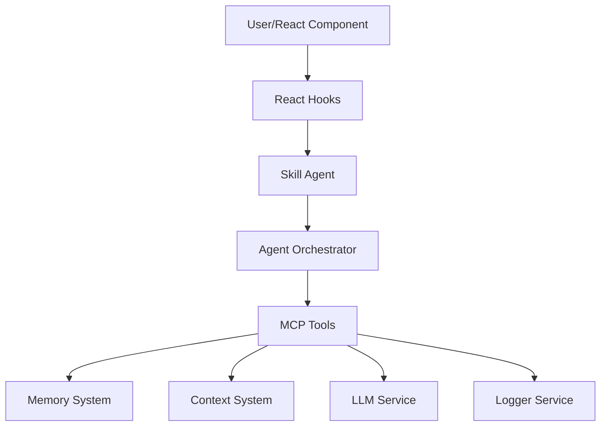

---

## Detailed Architecture

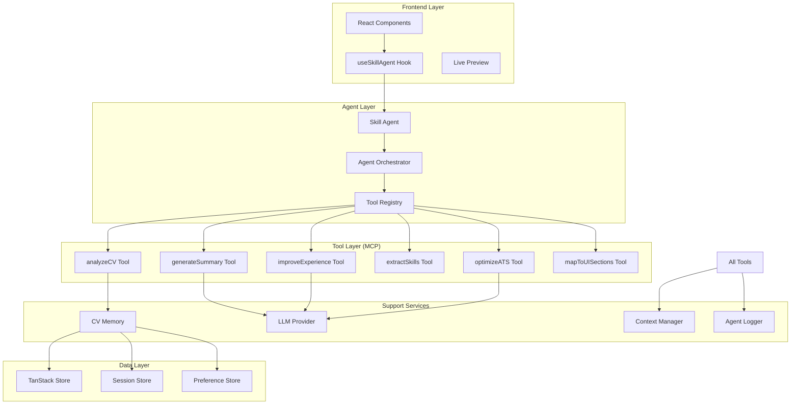

---

## Data Flow

### 1. CV Analysis Flow

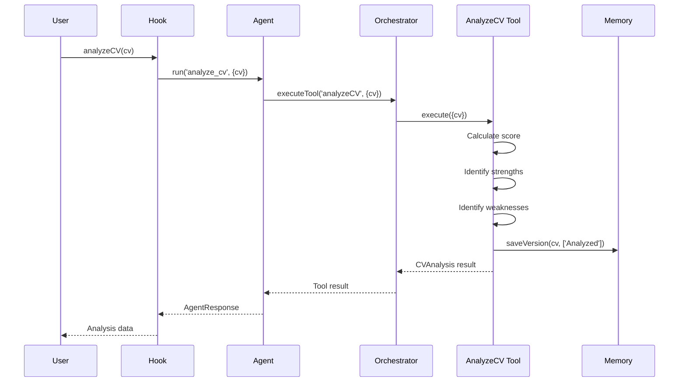

### 2. ATS Optimization Flow

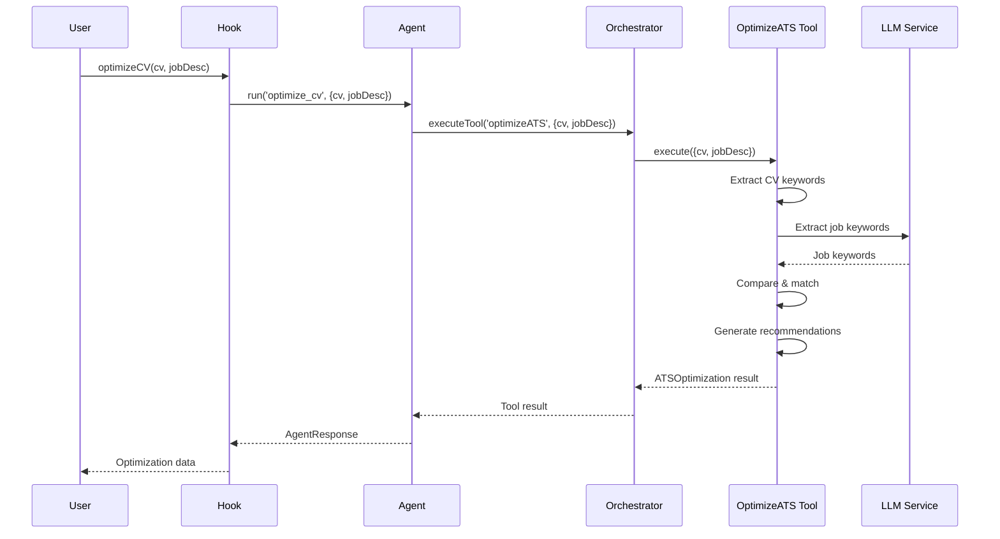

---

## Component Interactions

### Memory System Architecture

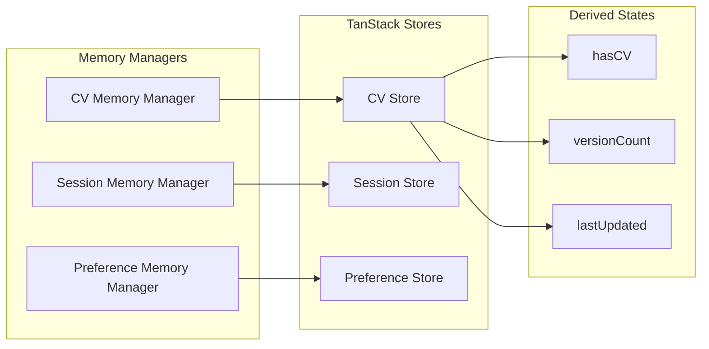

---

## Tool Execution Pipeline

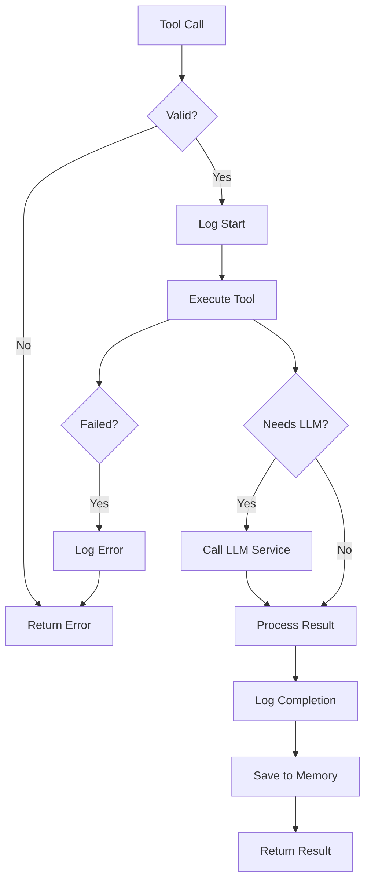

---

## State Management

### TanStack Store Structure

```mermaid
graph TB
    subgraph "CV Memory Store"
        CVState[currentCV]
        Versions[versions Array]
        LastSaved[lastSaved Date]
    end
    
    subgraph "Session Store"
        SessionId[sessionId String]
        ActionLog[actionLog Array]
        StartTime[startTime Date]
    end
    
    subgraph "Preference Store"
        Tone[tone Enum]
        Emphasis[emphasis Array]
        Formatting[formatting Object]
    end
    
    CVState --> Derived1[hasCV: boolean]
    Versions --> Derived2[versionCount: number]
    LastSaved --> Derived3[lastUpdated: Date | null]
```

---

## Context Flow

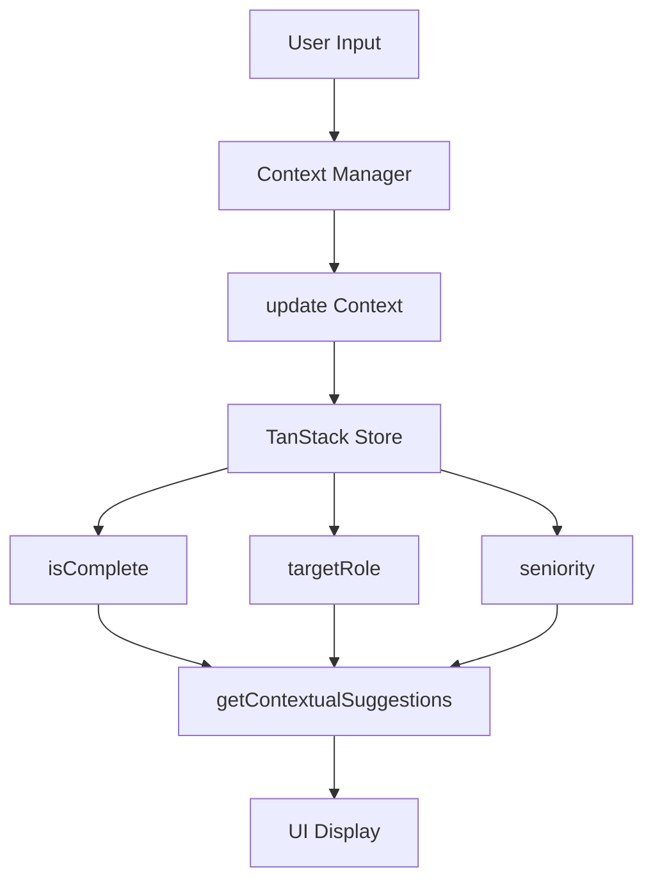

---

## LLM Service Abstraction

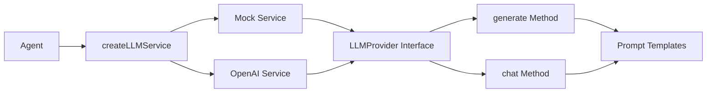

---

## Error Handling Flow

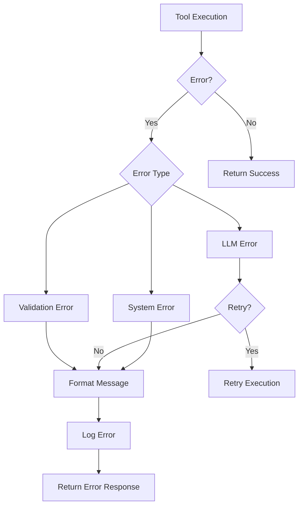

---

## React Hook Architecture

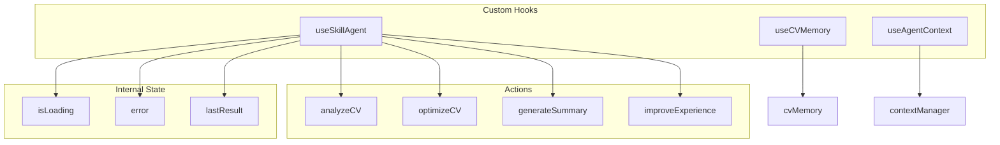

---

## Debug System Architecture

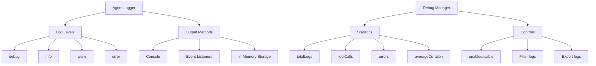

---

## Module Dependencies

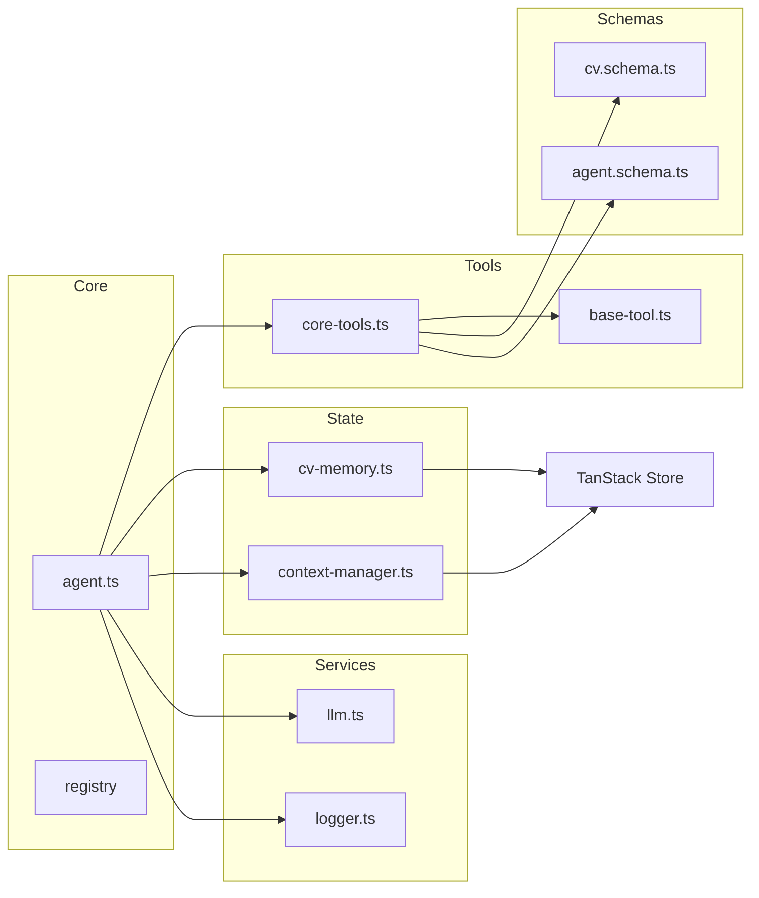

---

## Security Layers

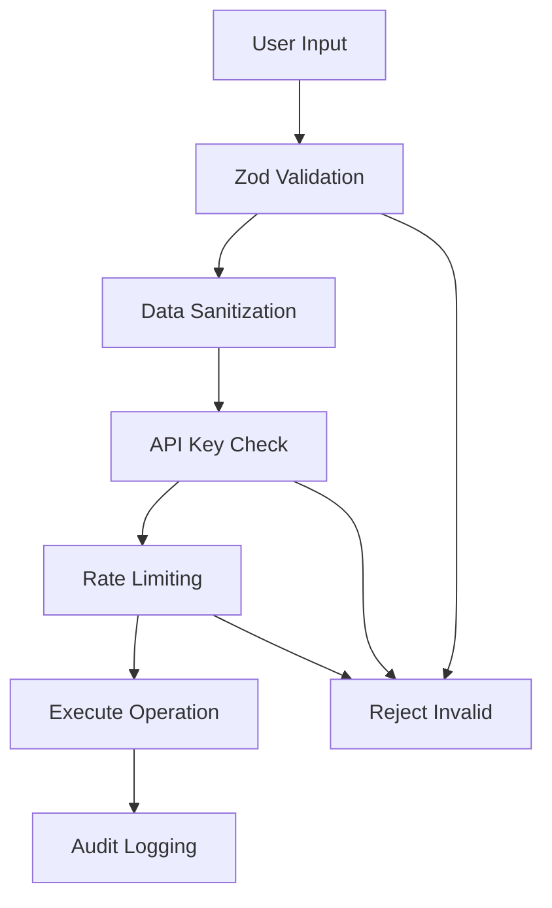

---

## Performance Optimization

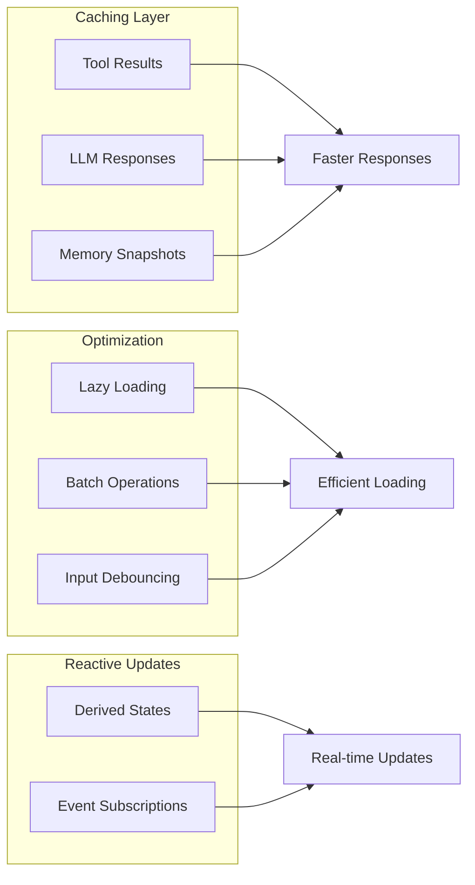

---

**Architecture Documentation | v1.0.0 | March 2025**
